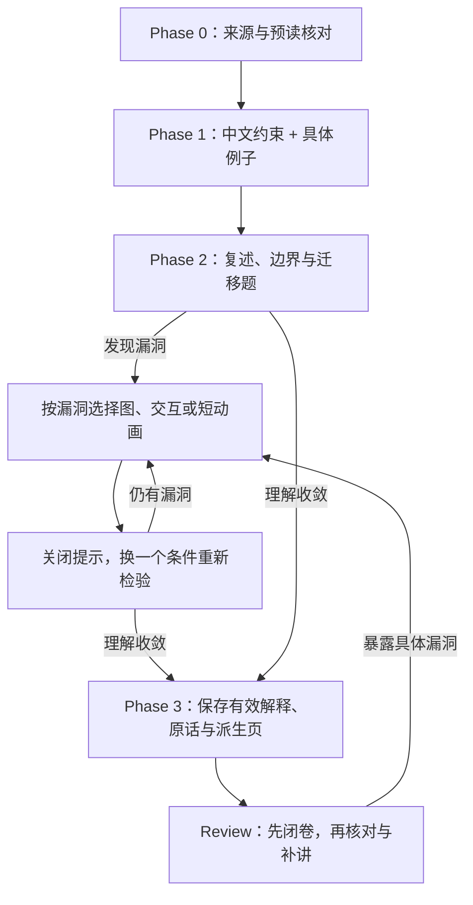
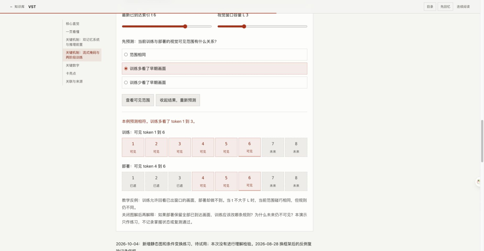

# 理解输出的形式：vault 流程评估与试点方案

日期：2026-10-04  
状态：首轮已实施规则、模板、命令与 VST 交互试点；学习效果待验证。  
定位：维护文档，不计入费曼知识页。依据用户提供的 Karpathy 原文、当前 schema、模板、复测记录和阅读层代码；评估后按用户「执行优化」指令实施；没有启动新材料入库或复测。  
衔接：[当前流程](../../CLAUDE.md)、[阅读改造方案](site-reading-redesign.md)、[专题导读方案](site-topic-hubs.md)、[复测队列](../../review.md)。

## 判断

这套方法适合改善本库的讲解与补漏洞环节。优先采用明确的中文写作约束，以及围绕具体卡壳点制作的图和小交互。视频按需试用。

当前库已经有论文原图、专题关系图、HTML 速览与完整笔记、问答展开和回忆模式。主要增量是让输出形式跟着理解困难变化：术语卡住就重写，结构卡住就画图，过程和边界卡住就改变条件。是否有效，最终仍由脱离提示后的复述和迁移题判断。

这是一项适配判断，尚没有本库内的对照实验支持“换形式能提高长期保持率”。Karpathy 的“文字、图、网页、视频”可以作为候选工具；本库应按问题选用，避免每篇材料固定制作全部形式。

## 现状对照

| 建议 | 当前已有基础 | 值得补的部分 | 建议顺序 |
|---|---|---|---|
| ASD-STE100 写作 | Phase 1 分层讲解、首次解释术语、类比与卡壳点 | 把“大白话”变成可核对的中文写作约束，保留条件和证据强度 | 先试 |
| 图解 | 必须提取论文重点图；专题 SVG 与文字关系表 | 针对用户实际答错的机制重新画图，标清数据流、可见范围、时间尺度或假说 | 先试 |
| HTML | 连续阅读、搜索、问答展开、并排比较、回忆模式 | 增加能改变一个条件、观察后果的机制交互，并要求先预测 | 针对难点试 |
| 视频 | 当前 schema 未要求视频 | 用可暂停的短动画解释确实需要时间展开的过程，脚本先核对 | 暂不设为入库必需品 |

本次核对的是文件与代码，不是新一轮浏览器功能验收。[现有回忆代码](../../site/assets/wiki-slides.js)已实现只见标题、显示问题、逐题展开答案，并明确练习不写入复测记录。

## 中文写作约束

ASD-STE100 包含写作规则和受控英文词典；它不是一条“写简单一点”的提示。[官方 FAQ](https://www.asd-ste100.org/STE_faq.html)说明了固定词义、词性及同义词选择。[Boeing 的说明](https://www.boeing.com/company/simplified-english-checker)列出短句、主动表达和用词一致等特征，也说明检查器不能保证完全合规。

本库中文为主，建议借鉴原则，称为“参考 STE 的中文讲解约束”。“80% STE”可表达写作偏好，但不能当作合规度或质量分数。下面六条是本库建议，不是 ASD-STE100 原文规则：

1. 一句讲清一个主要判断；因果跨多步时，拆开每一步，说明谁做什么、因此改变什么。
2. 同一概念使用同一术语；首次出现给一句具体解释，避免为文风换同义词。
3. 抽象机制给一个可追踪的例子，让读者知道输入、动作和输出；类比随后对应回真实机制。
4. 保留适用条件、代价和不确定性。“在所测基准上”不能被改成“总是”；“可能组合”不能被改成“已经证明”。
5. 最难机制配一个改变条件的反例，说明原结论哪里不再成立。
6. 公式和必要术语保留；用户原话、引用和完整笔记的忠实投影不作风格润色。

例如，依据 [VST 卡壳点](../../wiki/papers/2026-vst.md#卡壳点与解答)，可以这样重讲：

> 在线处理视频时，未来画面还没有到达，模型不能看它们。VST 的推理又只保留最近 L 个视觉 token。训练时也要限制模型只能看这些视觉 token，否则训练允许它回看旧画面，部署时却做不到。两条规则解决不同问题：一条遮住未来，一条让训练可见范围与部署一致。如果推理改成保留所有已到达的视觉 token，训练的窗口限制也应跟着改变；未来画面仍然不可见。

这个例子展开的是现有笔记中的两条规则，不主张通过改写已经改善了记忆。

## 插入现有流程的位置



Phase 1 可以直接使用图，不必等文字讲解失败。是否增加交互，取决于静态表达是否足够以及理解检验暴露了什么。

- **Phase 0**：继续以原文和 AI Butler 预读核对为起点，预读中的错误不能因可视化而变成结论。
- **Phase 1/2**：未通过检验时，生成物是聊天或临时文件中的讲解草稿；不注册正式论文页、站点条目或复测通过状态。
- **Phase 3**：保留真正帮助讲通的例子、图和边界解释。知识内容先写回 Markdown，再同步速览、完整笔记与索引；论文重点原图仍须保留。重讲不能改写用户的原话。
- **Review**：先按现行规则闭卷重讲，再补讲。看动画、点开答案或操作控件都属于学习与练习，不能代替独立复测。

可以在已有“卡壳点与解答”中补一句“本次讲通方式：……”，在 `review.md` 结果栏简记使用过的提示和迁移题表现。无需增加第二份掌握状态数据库。

## 三个适合试点的难点

| 笔记与依据 | 输出怎么做 | 检验什么 |
|---|---|---|
| [VST](../../wiki/papers/2026-vst.md#卡壳点与解答)：历史记录显示流式掩码曾三次漏答，2026-08-28 换框架后复验通过 | 画当前时刻、未来区、过去区与视觉窗口；交互只改变时刻和窗口范围，L 按视觉 token 计。文本记忆单独表示，避免和视觉窗口混为一谈 | 推理改成保留全部已到达画面时，训练要改哪条规则？未来为何仍不可见？ |
| [PPO](../../wiki/papers/2017-ppo.md#关键机制)：正负优势下 min 与 clip 的选择 | 切换优势正负、拖动概率比 r；显示未裁剪项、裁剪项及最终 min 的目标曲线。在不可导边界处不宣称存在唯一导数 | 坏动作的概率被错误提高时，为什么还应有纠偏梯度？ |
| [Open-MOPD](../../wiki/papers/2026-open-mopd.md#关键机制)：三个时间尺度 | 用 batch、训练全程、rollout 内更新三条时间线定位机制；可增加固定 reward 假设下的 token 份额与 loss 加权示意 | 为什么仅把 prompt 数量均分不能保证优化预算均分？ |

VST 的旧记录说明“换框架”值得试，但不意味着截至今天仍未理解。新复测先测当前状态，再决定是否制作额外讲解。

PPO 特别需要控制类比边界。现页“机械限位器”段落写了概率比区间锁死的直觉，制作动画前应核对并改进这段表达。[原论文 §3、式 7 与 Figure 1](https://arxiv.org/pdf/1707.06347)修改的是代理目标函数：有些方向的单样本目标进入平台，另一些方向保留纠偏信号；这不等于把实际策略概率比硬约束在区间内。2026-10-04 已按此边界修正真源、速览、完整笔记与搜索片段，保留用户原话；没有把修正计作用户复测通过。

Open-MOPD 的控件数值应标为教学示意，并说明固定了哪些因素，不能把预算近似画成任意训练设置下的精确性能预测。

## 试点验收与维护成本

先选 VST 的一个难点完成小轮试点，再决定是否扩大。建议记录：

1. 未看提示前，机制复述和一个边界题的表现。
2. 换表达后，关闭图或交互，用不同条件的迁移题复验；记录提示次数和补讲耗时。
3. 在下一次约定的延迟复测中，检验能否独立重建机制；现有复测排期不会因浏览演示自动改动。
4. 生成、核对与同步这个讲解的维护耗时，以及是否发现遗漏条件或表述误导。

单人同题的前后变化受重复学习影响，只能作为是否值得继续使用的线索，不能据此证明某种媒介更有效。视觉满意度和“看起来懂了”可作反馈，独立复述与迁移才是本库验收。

正式 HTML 如实施，沿用 `wiki-slides.css` 与共享脚本，保留无脚本可读说明和静态图；回忆模式应隐藏新增的答案图、动画和解释。动态内容的规则与假说标记也必须来自真源，不能只核对静态文案。维护用检查器可查遗漏、锚点和资源，不能自动认定因果解释正确。

视频先写可审阅脚本和分镜，逐段链接到已核对笔记；最好复用已验证图稿。必须能暂停、回看，并配字幕或文字稿。仅在静态图或小交互仍不足以解释过程、或用户明确需要视频时制作，不设 API key、TTS 或视频工具安装为默认前置条件。

## 可复用的讲解提示

```text
按当前 vault 的费曼流程讲解以下材料。
采用参考 STE 的中文写作约束：一句一个主要判断；明确主语和动作；
同一概念使用同一术语；首次解释术语；抽象机制给具体例子；
保留条件、代价、来源限定和假说标记，不改写我的原话。

讲解后用复述、边界或迁移题检验我。
若回答暴露漏洞，定位到具体机制，选择适合它的图或小交互。
交互让我先预测，再显示结果，并标明教学简化与类比失效的边界。
关闭提示后用不同条件重新检验。
理解收敛前，生成物只作临时讲解；收敛后才按既有流程入库与同步。
```

若后续实施流程规则，应一起更新 `CLAUDE.md`、`.zcode/commands/ingest.md`、`.zcode/commands/review.md` 与适用模板。`AGENTS.md` 是 `CLAUDE.md` 的软链；不需要维护两份 schema。首轮已同步这些入口；`.zcode/commands` 按仓库既有规则仅在本机维护，CLAUDE.md 和模板随知识库版本保存。


## 2026-10-04 首轮实施记录

- 流程与四类笔记模板加入中文写作约束、按难点选形式、关闭提示后的迁移检验，以及独立表现与提示后表现的区分。入库/复测命令和阅读层模板同步。
- VST 的已理解掩码机制增加同源 SVG、四场景规则表和先预测后展开的交互。规则表、参数和解释保存在 Markdown；完整笔记保留静态图与文字规则。状态注明待试用。
- 共享 CSS/JS 实现手机、键盘与回忆模式支持；全站 36 个 HTML 资源版本同步更新。C14 检查真源规则与两层投影、默认参数、迁移问题及静态图引用。
- 验证：现有站点检查与新增 C14 全通过；HTTP 浏览器验证四场景、t/L 边界、错误预测反馈、参数切换清空结果、回忆隐藏与重置，以及 390px 手机无横向溢出。无脚本 HTTP 副本的图和规则表可读。review.md 内容与两篇用户原话核对保持原样。
- 浏览器安全策略禁止 file:// 导航，因此未完成离线浏览器实测；只完成本地资源路径核对，不将 HTTP 验证冒充离线实测。
- 部署脚本支持显式路径，默认仅提交知识库维护范围；可达性健康检查与当前版本同步状态分别报告。
- 部署核验：实施提交 `3141db8` 已推送，VPS 工作区同步到同一提交；登录后重新载入线上 VST 页，确认资源版本 `20261004-1`、新练习与预测结果均已生效。下图取自线上页面。

交互结果验证截图：



## 2026-10-04 静态图黑块修复

VST 静态图依赖 `xml-stylesheet` 加载共享 CSS，但以 `` 嵌入的 SVG 不能加载外部样式。背景矩形和文字都回退到默认黑色，导致整个图像区显示为黑块。此限制见 [MDN：SVG as an image](https://developer.mozilla.org/en-US/docs/Web/SVG/Guides/SVG_as_an_image#restrictions)。上轮只核对图片节点与资源路径，未目视检查静态图，因而漏报。

- 保留 class-only 的 SVG 图稿和共享样式源，用 `scripts/render-mechanism-diagram.mjs` 导出 1400 × 520 PNG；样式直接取共享 CSS 的浅色 token 与 `.demo-svg-*` 规则，无需浏览器额外请求样式。
- Markdown、速览页与完整笔记的图片引用同步到同一 PNG。SVG 或图解样式修改后，重跑 `node scripts/render-mechanism-diagram.mjs site/assets/diagrams/vst-visibility.svg`；维护环境可用 `--modules <node_modules 目录>` 指定已有 sharp。站点阅读不需要这些工具。
- 新增 C15，拒绝把依赖 `xml-stylesheet` 的 SVG 作为 `` 发布；用原失败引用验证检查确实拒绝，再恢复 PNG 引用。
- 本地速览页、完整笔记和无脚本 HTTP 页面已验证 PNG 加载；目视核对文字、边界与强调色正常。全站资源版本同步为 `20261004-2`。知识结论、用户原话与复测状态不变。
