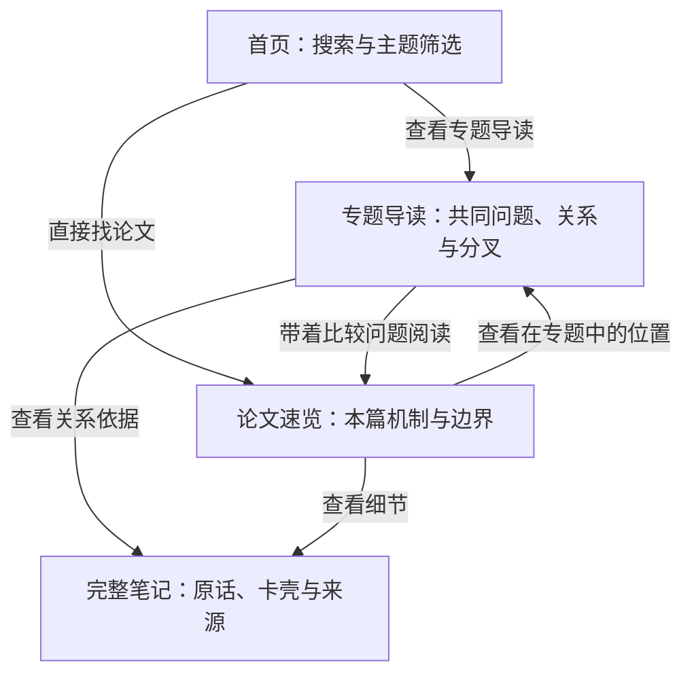
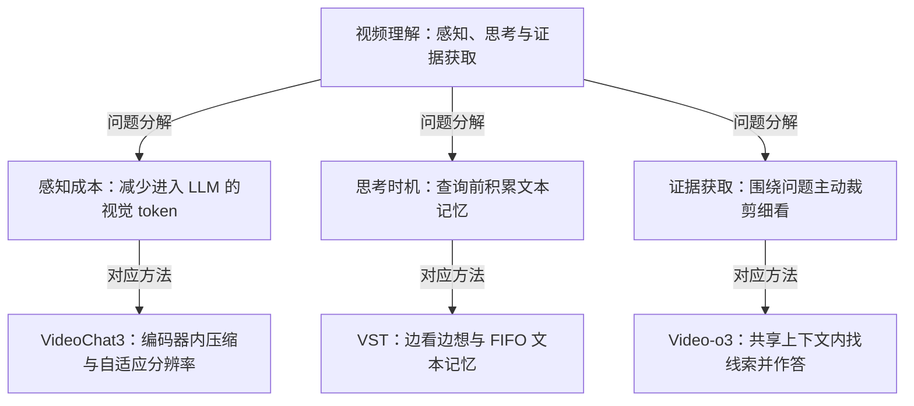
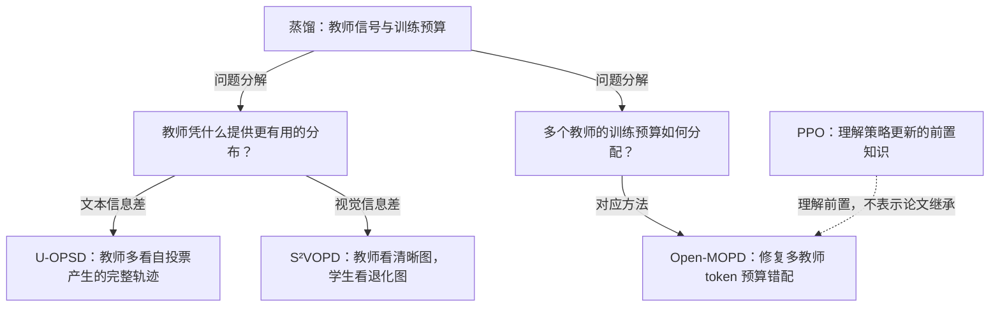

# 站点下一阶段优化方案：专题导读与论文关系

日期：2026-09-09  
状态：待审阅的产品与工程方案；本次仅编写方案，未实施或部署。  
基线：本地提交 `0e1859b`，10 篇论文、5 个受控主题，综合页为空。  
定位：维护文档，不计入费曼知识页；示例为已有笔记的组织草案，不代表新增综合结论已通过检验。  
衔接：[上一版阅读改造方案](site-reading-redesign.md)、[全库地图](../../index.md)、[受控词表](../../taxonomy.md)。

## 1. 核心判断

建议增加独立专题页，让用户从“找到一篇论文”走到“理解这一组论文分别解决哪一部分问题”。每页围绕一个研究问题展开，用关系图建立全局位置，用比较表讲清差别，再把用户带到单篇笔记的具体机制和卡壳点。

验收直觉：离开一个方向三个月后，读专题页五分钟，能说出共同问题、主要分叉、两篇最容易混淆的区别，以及下一篇该读什么。

沿用现有暖灰、朱砂强调色、连续阅读、明暗主题和共享样式。首页保留直接搜索能力；专题页承担较长的跨篇解释。

## 2. 现有基础与缺口

| 现有基础 | 下一步需要补的能力 |
|---|---|
| 首页 `data-topic` 按钮筛选论文 | 每个成熟主题有独立导读地址，解释组内关系 |
| 单篇已有关系卡、比较入口 | 提供主题级全貌，关系卡能回到全貌中的当前位置 |
| `wiki/syntheses/` 已在 schema 中预留，但尚无页面 | 以综合 Markdown 承载专题正文和关系依据 |
| `wiki-index.js` 支持论文元数据与全文片段 | 扩展综合页类型、专题入口、图表对应段落搜索 |
| 5 个主题、10 篇论文已入库 | 入口与数量统一从真源投影；首页静态兜底仍有“9 篇”和四个按钮的旧文本 |
| 索引生成与检查脚本已经存在 | 当前多处写死 `wiki/papers` 与 `notes/papers`，需要支持综合页路径 |

第七轮验收报告针对旧提交 `8d661fe`；当前提交已包含缺失章节拒绝生成等后续修改。本方案不将旧报告中的失败直接视为当前缺陷，也不宣称已完成新的浏览器验收。

## 3. 信息架构与入口



首页保持搜索框和紧凑主题筛选。选择主题后，在论文列表前显示一条导读入口：主题问题、一句范围说明、“查看关系与演进”。没有导读的主题继续显示论文列表。搜索进行中，专题作为标明“专题导读”的结果出现，不让长导读卡把论文命中推到首屏之外。

筛选按钮继续只负责筛选；“查看专题导读”使用独立链接，避免一次点击同时切换筛选和跳页。首页不堆放多张大型关系图。

论文页首部增加紧凑入口“在蒸馏专题中的位置”，打开专题中该论文的稳定锚点，例如 `#paper-2026-u-opsd`。侧栏和文末仍可直接访问其他论文。

返回行为区分两个目的：“返回专题”恢复专题位置，“知识库”恢复最初首页筛选。沿用规范化的首页来源状态，额外保存有限的专题 ID 与锚点，不把完整上一跳 URL 层层嵌套。无脚本时仍提供静态专题、首页和论文链接；筛选状态恢复属于渐进增强。

## 4. 专题页长什么样

```text
← 知识库                     本专题论文列表
蒸馏与训练预算
教师为何能教、多个教师又该怎样分配训练预算？
范围：3 篇主线论文 · 1 篇跨专题前置 · 更新日期

本专题最值得记住的一句话
问题与方法地图                         [文字版关系说明]
主要分叉与已核实的演进
关键维度比较表                         [每项可追溯依据]
带着问题读论文                         [直达论文相关章节]
跨篇最容易混淆的地方                   [问题 → 展开解答]
证据边界、待验证假说与来源
完整专题笔记 / Markdown 源文件
```

| 模块 | 应回答的问题 | 内容约束 |
|---|---|---|
| 主题本质 | 这组论文共同关心什么？ | 一句话，范围明确；全页仅一条最高级强调 |
| 问题地图 | 各篇分别处理哪个瓶颈？ | 首图控制在约 5～8 个节点，边必须说明关系 |
| 分叉与演进 | 改变了哪项假设或机制？ | 阅读顺序、发表先后、方法继承分别标明 |
| 比较表 | 哪些差别决定适用条件？ | 3～5 个有区分度的维度，每格能回查来源 |
| 阅读路径 | 先读哪篇、带着什么问题？ | 建议顺序附原因，不声称是历史路线 |
| 跨篇卡壳 | 哪两种机制最容易混为一谈？ | 复用历史问答，保留日期；新问题标为待讨论 |
| 证据边界 | 哪些是结果、哪些是个人解释？ | 假说就地标“待验证”，不能只在页尾统一声明 |

桌面以正文和紧凑章节目录为主，给图表足够宽度。手机优先纵向图和逐维度比较；宽图仅在图自身容器横滑，不让整页横向溢出。每张图都配可读的文字关系表，图不是唯一入口。

## 5. 首批专题与内容样例

| 优先级 | 主题与候选标题 | 主线论文 | 主要组织轴 |
|---|---|---|---|
| 第一批 | 蒸馏与训练预算：教师信号从哪里来，训练预算怎么分？ | U-OPSD、S²VOPD、Open-MOPD | 信息差来源、直接损失与奖励信号、预算分配 |
| 第一批 | 视频理解与响应：看多少、何时想、怎样找证据？ | VideoChat3、VST、Video-o3 | 感知成本、查询前思考、主动证据获取 |
| 第二批 | 视觉编码器：训练目标与注意力异常 | GenLIP、LaSt-ViT | 预训练目标、异常机制、干预位置 |
| 保留聚合 | 结构化输出与定位；强化学习与对齐 | LocateAnything；PPO | 各只有一篇主专题论文，暂以单篇入口承接 |

专题是否成熟取决于能否提出清楚的跨篇问题，两篇也可以成页。PPO 可作为蒸馏专题理解 Open-MOPD 的跨专题前置，继续保留其强化学习主归属；主线数量和跨专题引用数量分开显示。

### 5.1 视频专题：先看问题分解

下图依据已有三篇笔记组织，连线表示“这篇处理此问题”。三条分支不是一个已验证的组合系统，也不代表三篇按顺序升级。



对应的比较表草案：

| 比较维度 | VideoChat3 | VST | Video-o3 |
|---|---|---|---|
| 本页重点 | 感知压缩与流式响应控制 | 将思考分摊到播放期 | 问题驱动的多轮证据获取 |
| 关键保留或使用的信息 | 压缩后的视频 token 与流式状态 | 近期视觉窗口和累积文本记忆 | 全局视野、局部裁剪和推理历史 |
| 最应记住的边界 | 感知压缩不等同于文本推理记忆 | 文本记忆有损；思考速度须适配流式节奏 | 依赖视频裁剪访问；轮数和上下文有限 |
| 带着什么问题读 | 为什么压缩要尽早发生？ | 为何低查询延迟不等于没有思考成本？ | 为何找到正确线索仍可能答错？ |

依据：[VideoChat3 的大白话讲解、机制与关联](../../wiki/papers/2026-videochat3.md)、[VST 的机制、结果与代价](../../wiki/papers/2026-vst.md)、[Video-o3 的机制与局限](../../wiki/papers/2026-video-o3.md)。落地时每个比较单元挂到对应完整笔记段落，而非仅链接整篇。

建议阅读顺序为 VideoChat3 → VST → Video-o3：先重建感知成本，再比较思考时机，最后理解主动寻找证据。这是学习路径；VST 的在线因果约束与 Video-o3 的视频裁剪访问条件须明确对照。

### 5.2 蒸馏专题：从信号来源走到预算分配



最有价值的跨篇对照：教师和学生分别看到什么；监督来自完整分布还是标量奖励；散度是直接损失还是 PPO 中的奖励信号；多教师预算在哪里失衡。

“U-OPSD 和 S²VOPD 的散度消融选择不同”与“信息可恢复性解释差异”需要分开呈现。前者链接各自实验条件，后者在现有笔记中属于个人假说，必须带“待验证”；不能从图中读出一条普适散度选择定律。

依据：[U-OPSD 机制与关联](../../wiki/papers/2026-u-opsd.md)、[S²VOPD 的散度消融、未解决的疑问与关联](../../wiki/papers/2026-s2vopd.md)、[Open-MOPD](../../wiki/papers/2026-open-mopd.md)、[PPO](../../wiki/papers/2017-ppo.md)。

### 5.3 “演进”如何呈现

每个演进节点使用“原先假设或瓶颈 → 本文改变 → 仍留下什么”的短条目。只有核实论文明确借鉴、替换或扩展了前作机制，才连接方法继承箭头。

发表时间另用简短时间列表，记录首次公开日期及出处；未核实则只显示笔记已有年份，不按入库日期排序冒充学术时间线。方法谱系中的 SFT、OPD、OPSD 等若尚无独立页，可作为有来源说明的背景节点，不能制造未入库论文的阅读卡或死链接。

## 6. 关系的真源与证据

延续上一版方案的关系类型 `compare`、`complement`、`prerequisite`、`possible-combination`、`tension`；确需表达经核实的方法继承时再扩展 `extends`。证据状态独立保留 `reported`、`synthesis`、`hypothesis`，页面显示“原文报告／库内对照／待验证”。

“假说是否得到验证”和“用户是否理解该假说”是两回事：理解检验通过的个人假说仍须显示“待验证”。

每条正式关系至少包含：

| 字段 | 用途 |
|---|---|
| 稳定关系 ID | 图、关系表、搜索和单篇卡片引用同一条解释 |
| 起点、终点、方向与类型 | 区分对照、前置、组合设想和继承 |
| 一句具体主张 | 明确连线到底声称什么 |
| 证据状态与适用条件 | 不把两个不同设置的结果说成相互推翻 |
| 依据页面和段落锚点 | 用户能回到原始笔记核对 |
| 依据版本或内容摘要指纹 | 来源变化时提示复核，而非自动推演新结论 |

专题新增关系记录在综合 Markdown 的结构化关系表中，作为规范记录；图和索引均为投影。已有论文中的关系迁移时逐条核对，确定唯一规范记录，其他入口引用关系 ID。不能让同一主张在论文、专题和 JS 中各维护一个不同版本。

一对论文可以有多条主张：实验对照和组合假说分行存储、分条展示。自动反向链接可以显示“被某专题引用”，不能把“理解前置”自动反转或把组合设想变为实证互补。

## 7. Mermaid 与静态站点的实现方式

建议在专题 Markdown 中保留 Mermaid 代码块作为可编辑图稿，发布到网页时附静态 SVG 投影和 HTML 文字关系表。页面打开时直接读本地资产，维持 `file://`、离线和无脚本可读。

图的语义以正文和规范关系记录为准，Mermaid 代码块是同一 Markdown 内的图稿；渲染产物不能成为另一份知识真源。首版不增加浏览器 Mermaid 依赖、CDN 请求或站点构建工具。渲染仅在内容制作时完成；若需要新增本地工具，实施时先确认能符合现有零构建依赖约定，不能把生成器变成阅读或部署的前置服务。

Mermaid 的默认导出样式不能直接绕过共享样式规则：清除导出 SVG 的内嵌样式与硬编码视觉属性，将节点、文字、连线映射到 `wiki-slides.css` 的 class/token。正文、图形与明暗主题使用同一套视觉来源，制作阶段核对处理后的图形。图稿不使用逐图配色指令。

首版交互以可靠的正文链接为主：图中节点对应稳定论文锚点，图下给出同名可聚焦链接；不用 hover 才能读懂的解释。放大可打开独立图文件，但不把拖拽、缩放编辑器作为首版要求。

## 8. 建议文件结构与数据边界

以下为拟新增路径，本次不创建这些知识页或派生页：

```text
wiki/syntheses/video-understanding.md     # 已理解的专题正文、关系表与 Mermaid
wiki/syntheses/distillation.md
templates/synthesis.md                   # 综合笔记模板
site/_topic-template.html                # 专题导读模板
site/topics/video-understanding.html
site/topics/distillation.html
site/notes/syntheses/<同名>.html          # 完整专题笔记的忠实投影
site/assets/diagrams/<专题>-<图名>.svg    # 静态图稿投影
```

综合页沿用 `id/type/aliases/topic/mechanisms/goals/updated`，其中 `type: synthesis`。候选扩展字段为主线论文 ID 列表 `members`，跨主题前置通过显式关系表达。主专题成员应与论文 `topic` 对账；`members` 用于确定导读覆盖与阅读顺序，不能默默改变论文主归属。覆盖范围可显示“已导读 3/4 篇”，避免新论文出现后旧导读仍暗示覆盖完整主题。

静态索引扩展页面类型和路径，所有消费者读取 `href/noteHref/sourceHref`，不再按 ID 拼接固定的 `papers/`。专题关系说明、图注、比较单元和跨篇问答都进入搜索，目标必须是网页中真实可见的文字段落。搜索专题内容与论文内容分别标注类型；未提供的依据显示“笔记未记录”。

`taxonomy.md` 继续负责主题名称、ID、别名与范围；综合 Markdown 负责导读内容，`review.md` 负责正式复测状态。浏览网页、展开图表和点击答案不更改学习状态。专题练习不能继承成“成员都通过，所以专题已通过”。

新建正式综合页时同步 `index.md`、`log.md`、有关论文互链与派生层。schema 中专题路径、模板、关系记录及检查范围的扩展，应在用户同意实施对应 schema 变更后写入 `CLAUDE.md`；本次不修改 schema。

## 9. 内容准入与后续维护

1. 从已经通过费曼检验的论文中整理共同问题和直接对照，保留各自适用条件。
2. 对此前未讨论过的跨篇解释进行小轮费曼讲解与检验；无法讲清的内容保留在方案草稿，疑问按流程记入 `questions.md`，不发布成正式专题结论。
3. 已入库的用户原话与卡壳点可以引用，并带来源和当时日期。不得编造一份“用户已理解”的专题复述。
4. 内容收敛后才生成正式综合 Markdown、导读页、完整笔记和索引，按流程安排独立专题复测。
5. 后续 ingest 完成时检查主专题覆盖和关联专题；直接对照更新仍以真源为准，新的解释再次讨论。
6. 来源页发生改动时提示检查受影响关系；删除或改名导致成员、关系或依据失效时拒绝发布。旧图不会因来源改动自动获得有效性。

## 10. 实施顺序

| 阶段 | 交付 | 完成判据 |
|---|---|---|
| A：内容与规范 | 两个专题的正文草稿、关系记录、图稿；模板和必要 schema 调整 | 每条关系有依据，新的综合理解已检验；路径与真源责任明确 |
| B：首个完整专题 | 蒸馏专题导读、完整笔记、静态图、首页及三篇论文入口 | 首页 → 专题 → 论文 → 依据 → 返回路径闭环可用 |
| C：复用与回归 | 视频专题、综合页搜索与检查；主页数量和主题入口统一投影 | 两种内容结构都能承载，既有论文搜索、比较和回忆不退化 |
| D：后续扩展 | 视觉编码器对照页，视内容成熟度增加更多专题 | 不产生空专题；关系解释和维护成本仍可控 |

首批上线范围为两个专题。全库可拖拽图谱、跨论文总性能排名、任意组合关系编辑器不在本轮范围。保持现有 GitHub → VPS 部署路径，完成派生层验证后执行已有 `site/deploy.sh`。

## 11. 验收清单

- 内容：每条实质关系和每个比较值都有可读依据；假说在正文、图注、关系表与搜索片段中保持相同限定。
- 演进：发表时间有出处，入库时间不会代替发表时间；学习顺序和方法继承可明确区分。
- 真源：综合页、两份 HTML、SVG 与搜索条目完整对应；图节点、关系 ID、成员 ID、依据锚点有效。
- 失败检查：临时副本中删除一个来源锚点或主线成员后，检查必须失败，生成器不得覆盖原索引或静默删去内容。
- 导航：首页筛选 → 专题 → 论文 → 完整笔记 → 首页能恢复来源；专题返回定位有效，多跳参数不增长。
- 搜索：专题标题、比较中的具体短语、图中文字说明和跨篇问题均能命中实际段落，保留既有 `y+`、`流式 掩码`、`Dataset-S2` 用例。
- 阅读：桌面与 375/390px 手机宽度下图表清楚、整页不横向溢出；图下链接键盘可用；关闭脚本仍可读正文和关系表。
- 回忆：开启回忆时隐藏专题图、摘要、比较答案与关系提示；练习操作不写入复测真源。
- 风格：共用 CSS 与主题 token，所有共享资产引用同步升级版本串；速览与专题导读遵守现有标点规则。
- 离线与部署：`file://` 与本地 HTTP 各走一次完整路径，断网后图表仍可见；线上部署结果单独报告。

本次验证范围仅为方案与本地材料对照、文档链接和补丁检查；不把以上实施验收项写成已经通过。
