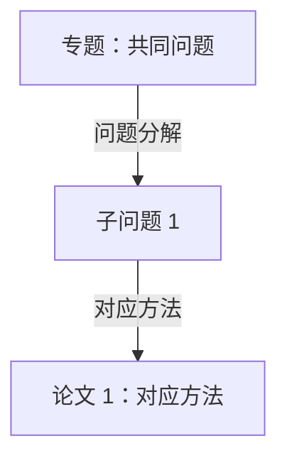

# 专题名：一句话说清这组论文共同关心的问题

> **一句话本质**：这组论文共同关心什么？一句话，范围明确。

> 主线论文：N 篇（members，topic 必须与本专题一致）｜ 跨专题引用：M 篇（只通过关系记录表达，不改变论文主归属）｜ 更新：YYYY-MM-DD

<!-- 综合页不是新论文：所有实质主张必须能回到已通过费曼检验的论文页段落；
     跨篇新解释在检验前只能标「待验证」或「待讨论」，不能写成结论。
     讲解依 CLAUDE.md「讲解输出与补漏洞」：短句、术语一致、具体例子、保留条件。
     图中关系类型与证据状态不可省略；交互规则写回真源，练习不记复测通过。 -->

## 专题本质

<!-- 共同问题、范围、不覆盖什么；导读页全页只有一条最高级强调。
     填入以下学习入口，三步按已有论文的瓶颈/分叉/边界组织；复制到导读页 map 章节，
     保留导读固定七节，PAGE-ID 换为专题 id，不新增知识结论。 -->

  
填入一个具体问题，说明旧方法卡在哪里。

  <ol class="guide-path" aria-label="机制路径">
    <li><h3>输入</h3>
说明方法实际能拿到哪些输入。
</li>
    <li><h3>处理</h3>
说明最关键的一步，术语首次出现要解释。
</li>
    <li><h3>输出</h3>
说明产生什么，以及用在哪里。
</li>
  </ol>
  
<strong>具体例子（教学假设）</strong>：给出一个小例子，区分示意数字与实验结果。

  
<strong>边界</strong>：说明成立条件、失效情形与尚未验证的解释。

  

    <h3>先预测，再展开答案</h3>
    
改变一个条件，问机制会如何变化。

    

查看机制解释

用已理解的机制逐步回答，不新增未经检验的结论。

    
关掉提示后，用一个不同例子重建机制。

  

  
YYYY-MM-DD：讲解与练习待试用，本次未进行理解检验；此处不记录复测通过。

## 问题与方法地图

<!-- Mermaid 代码块是可编辑图稿，网页发布时另附静态 SVG 投影（site/assets/diagrams/<id>-map.svg）
     与 HTML 文字关系表。首图控制在约 5~8 个节点，每条边必须说明关系。 -->

```mermaid
flowchart TB
    root["专题：共同问题"]
    q1["子问题 1"]
    p1["论文 1：对应方法"]
    root -->|问题分解| q1
    q1 -->|对应方法| p1
```

| 边 | 说明 | 证据状态 |
|---|---|---|
| 专题 → 子问题 1 | 这条边到底声称什么 | 库内对照 |

## 关系记录

<!-- 规范记录：图、导读页关系表、静态索引都是它的投影。
     类型：compare / complement / prerequisite / possible-combination / tension / extends（仅核实的方法继承）。
     证据状态：reported（原文报告）/ synthesis（库内对照）/ hypothesis（待验证）。
     依据锚点：空格分隔的 notes/papers/<id>.html#<锚点>；指纹由 scripts/build-wiki-index.mjs 计算（依据段落文字的 FNV-1a），
     来源段落改动后指纹失配，检查会要求复核本条关系后再更新。 -->

| 关系 ID | 起点 | 类型 | 终点 | 一句主张 | 证据状态 | 依据锚点 | 指纹 |
|---|---|---|---|---|---|---|---|
| rel-topic-1 | paper-id-1 | compare | paper-id-2 | 明确这条连线声称什么，以及适用条件 | synthesis | notes/papers/paper-id-1.html#relations | 00000000 |

## 分叉与演进

<!-- 每个节点：原先假设或瓶颈 → 本文改变 → 仍留下什么。
     只有核实论文明确借鉴/替换/扩展前作机制才算方法继承；发表时间列表需有出处（DOI / arXiv ID），
     未核实只写笔记已有年份，不按入库日期冒充学术时间线。 -->

## 关键维度比较

<!-- 3~5 个有区分度的维度；每格标注依据锚点，落地时链接到完整笔记段落而非整篇。 -->

## 带着问题读论文

<!-- 建议顺序 + 原因（这是学习路径，不声称历史路线）；每篇一个「带着什么问题读」 -->

## 跨篇卡壳点

<!-- 复用各论文页历史问答（保留当时日期），新问题标「待讨论」。导读页每条问答带稳定 id（qa-*），与完整专题笔记同名。 -->

## 证据边界与来源

<!-- 哪些是原文结果、哪些是库内对照、哪些是个人解释（就地标待验证）；成员笔记、Zotero 锚点、入库日期 -->
