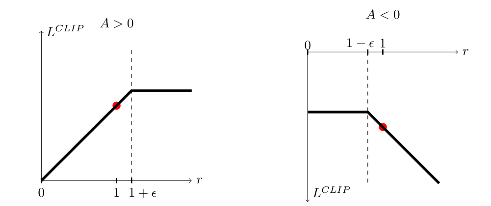
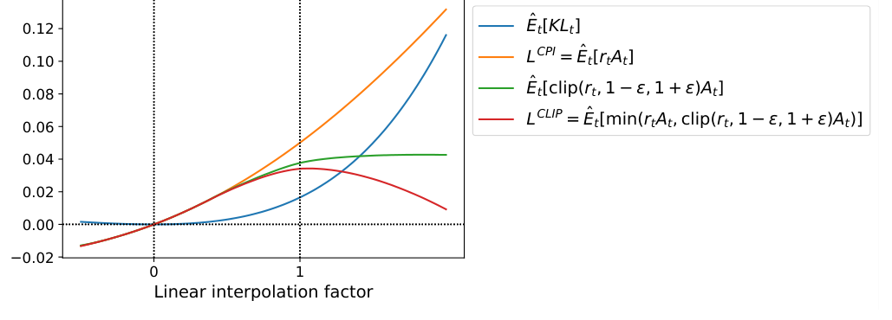

# PPO（全称：Proximal Policy Optimization Algorithms）

> **一句话本质**：PPO-Clip 修改策略更新的评分规则，减弱把采样动作概率继续推远的激励，让一批近期轨迹可以做有限轮更新。

> 作者/机构：John Schulman, Filip Wolski, Prafulla Dhariwal, Alec Radford, Oleg Klimov ｜ OpenAI ｜ 年份：2017 ｜ 原文：Zotero 锚点（见下行）或 [arXiv:1707.06347](http://arxiv.org/abs/1707.06347) ｜ 入库：2026-09-09
> Zotero：[schulmanProximalPolicyOptimization2017](zotero://select/items/@schulmanProximalPolicyOptimization2017) `schulmanProximalPolicyOptimization2017` ｜ [Z6L573AE](zotero://select/items/Z6L573AE) `Z6L573AE` ｜ [DOI](https://doi.org/10.48550/arXiv.1707.06347) `10.48550/arXiv.1707.06347`

## 五分钟重建

  
普通策略梯度每次更新后就改变了采样策略。反复用旧样本训练，会让样本与当前策略越来越不匹配。PPO 用概率比和裁剪目标，让一批新样本可以做有限轮更新。

  <ol class="guide-path" aria-label="机制路径">
    <li><h3>采一批新轨迹</h3>
保存旧策略的动作概率，估计每个动作的优势 A。A 的正负表示这个动作比基线好还是差。
</li>
    <li><h3>比较新旧概率</h3>
比率 r = 新概率 / 旧概率。优化 min(rA, clip(r)A)，裁剪阈值由 epsilon 决定。
</li>
    <li><h3>有限复用后重采</h3>
裁剪取消沿有利方向继续推大的激励。完成几轮更新后，重新用当前策略采样。
</li>
  </ol>
  
<strong>具体例子（教学假设）</strong>：旧策略对一个好动作的概率为 0.20，新策略为 0.30，r=1.5。设 A=1、epsilon=0.2，该样本目标取 min(1.5,1.2)=1.2。目标变平，概率本身仍可以超过 0.24。

  
<strong>边界</strong>：这是单个样本的 surrogate 目标。共享参数、价值损失和熵项仍会影响策略。clip 不能保证整个网络每次都在安全范围内。

  

    <h3>先预测，再展开答案</h3>
    
保持 r=1.5，把 A 改为 -1。目标还会变平吗？先给出 min 两项的数值。

    

查看机制解释

两项为 -1.5 和 -1.2，min 取 -1.5。坏动作概率被错误提高时，未裁剪项保留纠偏信号。超出区间并不总意味着该样本梯度为零。

    
关掉提示后解释：为什么 PPO 可以短期复用一批样本，却不能把任意旧轨迹长期当作当前策略的数据？

  

  
2026-10-04：讲解与练习待试用，本次未进行理解检验；此处不记录复测通过。

## 论文图解

*图 1 费曼图解（论文 Figure 1）：左图的好动作概率提高过多后，目标变平；右图的坏动作概率降低到阈值以下后，目标变平。反方向仍可保留未裁剪项。横轴是概率比，不是被强制限制的概率。*

*图 2 费曼图解（论文 Figure 2）：横轴是在旧参数与一次 PPO 更新结果之间插值。红线是带 min 的裁剪目标，其他线给出对照。它解释局部目标如何改变更新激励，不是对任意后续更新的安全保证。*

## 解决什么问题

强化学习中利用神经网络作为函数拟合器时，长期面临两大互相撕裂的阵营痛点：

1. **经典在线策略梯度（Vanilla PG / A2C）极其脆弱且昂贵**：
   - **单次使用即废**：标准策略梯度定理要求动作采样自当前参数 $\theta$。没有纠偏时，参数一变，旧数据就不再来自当前策略；继续反复更新会引入策略失配，样本利用率极低；
   - **悬崖效应（Cliff-falling）与恶性循环**：如果学习率稍大或单批次优势函数估计方差过高，一次过大的更新就会把策略推入性能断崖。在监督学习中，更新坏了一步后续样本还能纠偏；但在强化学习中，**下一批交互数据完全由当前策略产生**。策略一旦崩溃，采出的全是无效探索垃圾，智能体可能进入难以恢复的低质量采样循环；并非理论上绝不可能恢复。
2. **信任域策略优化（TRPO）理论扎实但工程实现极其笨重**：
   - TRPO 严格约束了策略更新的 KL 散度 $\mathbb{E}[D_{KL}(\pi_{old} \parallel \pi_\theta)] \le \delta$，受信任域理论启发；实际采样与近似优化并不保证每一步真实回报都单调增加；
   - 但求解该约束优化需要构建 Fisher 信息矩阵（涉及 Hessian 矩阵向量积）、依赖共轭梯度算法（Conjugate Gradient）与回溯线搜索（Line Search）；
   - **工程代价惨痛**：代码实现极其繁重复杂，计算开销大，且无法天然兼容带噪声的网络结构（如 Dropout）、循环神经网络（RNN）或 Actor 与 Critic 共享底座参数的现代端到端网络。

PPO 的目标是：**只用最普通的一阶随机梯度优化器（如 Adam/SGD），就能获得 TRPO 的更新稳定性与样本效率，同时极易实现并通用于任意神经网络架构。**

## 大白话讲解

### 核心直觉：教练调整评分，鼓励小步练习

- **Vanilla PG 的学法**：你刚摸索到一点平衡感，突然猛打了一把方向盘，直接摔断了腿。因为腿断了，你以后跨上车都只能直接倒地，彻底断送学习生涯。
- **TRPO 的学法**：请了一位严苛的物理学教练，你每次想调整重心，他都拿出仪器计算全身体重分布和角动量方程，确认绝对安全才准你微调一毫米：稳如泰山，但每迈一步都累死人。
- **PPO 的学法**：教练改变评分规则。对一个好动作，你把它的概率提高到一定程度后，继续提高也不再增加这条样本的分数；对一个坏动作，如果反而提高它的概率，评分仍会变差，保留纠偏信号。评分平台减弱继续把策略推远的激励，让同一批经验能用于多轮小步练习。

类比的边界：Clip 改的是**代理目标中的激励**。它不把车把或实际概率比硬锁在 $[1-\epsilon, 1+\epsilon]$ 内，也不保证不会摔倒。多个样本共享网络参数，整体策略仍可能继续变化，需要结合更新轮数、学习率与 KL 监控判断步幅。2026-10-04 按原论文 §3、式 7 与 Figure 1 核对，替换了此前「机械限位器锁死安全区」的过强类比；用户原话保留。

### 结合 BipedalWalker-v3（连续控制实战场景）

在连续动作任务中，PPO 的稳定优势展现得淋漓尽致：
- **连续扭矩控制**：BipedalWalker 拥有 24 维状态（躯干角、角速度、关节角度、激光雷达测距等），输出 4 维连续动作（双腿髋关节、膝关节扭矩 $\in [-1, 1]$）。策略网络输出高斯分布的均值 $\mu(s)$ 和标准差 $\sigma(s)$，从中采样连续动作，无需任何生硬的离散化；
- **三阶段学习规律**：
  1. **站立阶段（0 ~ 500k 步）**：策略先学“不摔倒”，原地扭动维持平衡以跑满 1600 步避免 -100 摔倒重罚，回报从 -110 回升到 -35 左右；
  2. **挪步阶段（500k ~ 1M 步）**：策略进入高风险过渡期，出现**双模态震荡**（回报标准差高达 73 分），有时走顺拿 100+ 分，有时绊倒跌入 -100 分。此时策略极其脆弱；
  3. **稳定行走阶段（1M ~ 2M 步）**：步态成型，多关节协调流动，1118 步迅速通关，回报稳定突破 280+ 分（环境 solved 线为 300）。
- 如果没有 PPO 的截断保护，在脆弱的挪步期，一次过激的扭矩参数调整就会把刚刚积累的站立与重心平衡先验彻底抹杀，直接让机器人瘫痪。

### 四大监控指标的因果关联体系

下面是既有 BipedalWalker 工程案例的仪表盘。阶段步数与阈值来自该讲解案例，未作为 PPO 论文结论；它们不能当作所有任务的通用健康标准：
- **回合奖励（Episode Reward）**：观察滑动平均趋势，切忌被单回合地形扰动造成的上下震荡带偏；
- **策略熵（Policy Entropy）**：衡量高斯策略的标准差大小（探索活力）。初期高、随训练缓慢下降为健康；若过早塌缩至零，意味着陷入“呆站不动”的局部次优；
- **裁剪比例（Clip Fraction）**：有多少动作比率 $r_t(\theta)$ 撞上了 $[1-\epsilon, 1+\epsilon]$ 边界。该案例关注 0.05 ~ 0.15 的范围；解释高低还需看 epsilon、更新轮数、优势符号与奖励趋势，不能只按一个阈值判定崩盘或收敛；
- **近似 KL 散度（Approximate KL）**：新旧策略的分布距离。本案例把 0.03 与 0.05 用作诊断参考，未核实为普适阈值；应按任务和实现设定目标 KL，再结合回报变化判断。

| 现象 | 回合奖励 | 策略熵 | 裁剪比例 | 近似 KL 散度 | 诊断结论与处置 |
|---|---|---|---|---|---|
| **健康训练** | 稳步上升 | 缓慢平稳下降 | 0.05 ~ 0.15 | 0.01 ~ 0.03 | 策略在安全区内稳步推进 |
| **激进崩盘** | 突然跳水 | 剧烈震荡 | 飙升 $> 0.20$ | 飙升 $> 0.05$ | 步子迈太大，需调小 lr 或增大 n_steps |
| **过早早停** | 停滞不前 | 快速暴跌至 0 | 接近 0 | 接近 0 | 探索坍缩，需调高 ent_coef 强制探索 |
| **训练后期** | 稳定高位 | 维持健康低位 | 稳定偏低 | 维持极低 | 步态收敛，进入微调阶段 |

## 关键机制

### 1. 重要性采样概率比率（Probability Ratio）

定义参数更新时新旧策略的动作概率比：
$$r_t(\theta) = \frac{\pi_\theta(a_t \mid s_t)}{\pi_{\theta_{old}}(a_t \mid s_t)}$$
- 在刚完成交互采样时，$\theta = \theta_{old}$，此时 $r_t(\theta_{old}) = 1$；
- 当我们在同一个数据 Batch 上进行多轮 SGD 更新时，$\theta$ 不断改变，$r_t(\theta)$ 反映了新策略偏离采样策略的程度。
- 未经约束的 Conservative Policy Iteration (CPI) 目标为：$L^{CPI}(\theta) = \hat{\mathbb{E}}_t [ r_t(\theta) \hat{A}_t ]$。若直接对其做多步优化，极易因 $r_t(\theta)$ 极端膨胀或缩小而毁掉策略。

### 2. 截断代理目标与悲观下界（Clipped Surrogate Objective）

PPO-Clip 的核心损失函数定义为：
$$L^{CLIP}(\theta) = \hat{\mathbb{E}}_t \left[ \min\Big( r_t(\theta) \hat{A}_t,\; \text{clip}(r_t(\theta), 1-\epsilon, 1+\epsilon)\hat{A}_t \Big) \right]$$
其中超参数 $\epsilon$ 通常取 0.2。

外层取 $\min$ 构成了对未截断目标的一个**悲观下界（Pessimistic Lower Bound）**，它在正负优势下起到了精妙的不对称约束：

1. **正优势 $\hat{A}_t > 0$（好动作，应当鼓励）**：
   - 我们希望增大该动作概率，即增大 $r_t(\theta)$；
   - 一旦 $r_t(\theta) > 1+\epsilon$（例如 1.2），裁剪项锁死在 $(1+\epsilon)\hat{A}_t$；
   - 此时 $\min(r_t \hat{A}_t, (1+\epsilon)\hat{A}_t) = (1+\epsilon)\hat{A}_t$；
   - **数学结果**：超出上限后目标函数值不再上升，**关于 $\theta$ 的导数直接归零**！算法不再因一次采样的好运而贪婪地把动作概率拉满，保护了探索空间。
2. **负优势 $\hat{A}_t < 0$（坏动作，应当惩罚）**：
   - 我们希望减小该动作概率，即减小 $r_t(\theta)$；
   - 当 $r_t(\theta) < 1-\epsilon$（例如 0.8）时，裁剪项被锁死在 $(1-\epsilon)\hat{A}_t$。因为 $\hat{A}_t < 0$，裁剪后的值为 $-0.8|\hat{A}_t|$，未裁剪值为 $-0.6|\hat{A}_t|$，取 $\min$ 选取了更悲观的值；
   - **至关重要的反向情况**：若在优化过程中，网络犯错**反而大幅增加了坏动作的概率**（例如 $r_t = 2.0$），未裁剪项是 $2.0 \hat{A}_t = -2.0|\hat{A}_t|$；如果只有裁剪项，会被锁在 $1.2 \hat{A}_t = -1.2|\hat{A}_t|$（惩罚被大幅减轻，且导数归零无法纠偏）。
   - 外层 $\min$ 保证此时选取未裁剪项 $2.0 \hat{A}_t$：巨大的负值带来**巨大的纠偏负梯度**，把跑偏的策略强行拉回正轨。

### 3. 自适应 KL 惩罚变体（Adaptive KL Penalty）

作为 PPO 的另一分支（常作为基线或在机器人控制中使用），直接在目标中加入动态权重的 KL 惩罚：
$$L^{KLPEN}(\theta) = \hat{\mathbb{E}}_t \left[ \frac{\pi_\theta(a_t \mid s_t)}{\pi_{\theta_{old}}(a_t \mid s_t)}\hat{A}_t - \beta D_{KL}(\pi_{\theta_{old}}(\cdot \mid s_t) \parallel \pi_\theta(\cdot \mid s_t)) \right]$$
- 每轮迭代后计算平均 KL 散度 $d = \hat{\mathbb{E}}_t[D_{KL}]$；
- 若 $d < d_{targ} / 1.5$，说明更新太保守，$\beta \leftarrow \beta / 2$；
- 若 $d > d_{targ} \times 1.5$，说明更新太激进，$\beta \leftarrow \beta \times 2$；
- 论文实验证实：**Clip 截断目标在各项任务中全面优于自适应 KL 惩罚**。

### 4. GAE（广义优势估计）与联合优化目标

为了降低优势函数 $\hat{A}_t$ 的方差，PPO 结合 GAE（Generalized Advantage Estimation）：
$$\hat{A}_t = \sum_{l=0}^{T-t-1} (\gamma \lambda)^l \delta_{t+l}^V, \quad \text{其中 } \delta_t^V = r_t + \gamma V(s_{t+1}) - V(s_t)$$
$\lambda$ 在 1-步 TD（低方差、高偏差）与全蒙特卡洛回报（零偏差、高方差）之间做平滑插值，通常取 $\lambda = 0.95$。

在 Actor 与 Critic 共享底座参数的现代网络架构中，PPO 的综合优化目标为：
$$L^{CLIP+VF+S}_t(\theta) = \hat{\mathbb{E}}_t \left[ L^{CLIP}_t(\theta) - c_1 \big(V_\theta(s_t) - V_t^{targ}\big)^2 + c_2 S[\pi_\theta](s_t) \right]$$
其中 $c_1$ 是价值损失系数（通常 0.5），$c_2$ 是熵奖励系数（通常 0.01 或 0.005），$S$ 为策略熵 $H(\pi_\theta(\cdot \mid s_t))$。

## 结果与代价

### 实验结果

1. **MuJoCo 7 项连续控制基准（HalfCheetah, Hopper, Walker2d 等）**：
   - 目标函数消融对比（归一化得分，随机策略为 0，最佳为 1）：
     - **无裁剪无惩罚**：$-0.39$（在 HalfCheetah 上直接彻底跑崩，得分远低于初始随机策略）；
     - **PPO-Clip ($\epsilon=0.2$)**：**$0.82$**（全面领先所有变体）；
     - **PPO-Clip ($\epsilon=0.1$ / $\epsilon=0.3$)**：$0.76$ / $0.70$；
     - **自适应 KL 惩罚**：$0.68 \sim 0.74$；
     - **固定 KL 惩罚**：$0.62 \sim 0.72$；
   - 算法横向对比：在全部 7 个连续控制任务上，PPO (Clip) 综合表现一致击败 TRPO、CEM、Cross-Entropy、Vanilla PG (Adaptive Step) 以及 A2C。
2. **高维拟人机器人控制（3D RoboschoolHumanoid）**：
   - 在极高自由度的人形机器人奔跑、变向巡航（Flagrun）、以及**被重物方块砸倒后重新爬起**的严酷控制任务中，PPO 展现出强大的高维连续策略学习能力。
3. **Atari 49 款游戏基准**：
   - 样本复杂度大幅击败 A2C；
   - 在全训练周期平均回报指标上，PPO 在 30 款游戏中战胜 A2C 与复杂的 ACER，以极简的代码架构匹敌最先进的专用算法。

### 代价与局限

- **本质依然是 on-policy**：虽然支持多轮 minibatch 更新，但数据依然是局部近端有效；一旦新旧策略偏离，重要性采样比率失效，数据必须丢弃。其绝对样本效率远低于具备经验回放池的纯 off-policy 算法（如 SAC、TD3）；
- **对实现细节极度敏感**：后续研究（如 Engstrom et al., "Implementation Matters"）指出，PPO 论文标称的优异表现中，相当一部分得益于代码级技巧（如优势值归一化、梯度截断、正交初始化、学习率线性退火等），纯裸 PPO 核心若缺少这些工程包裹容易退化；
- **奖励黑客与奖励函数依赖**：在复杂环境（如行走姿态、LLM 对齐）中，策略极易通过扭曲动作去钻简单标量奖励的空子（Reward Hacking）。

## AI 预读备注

- **底稿来源**：Zotero 库内笔记（itemKey：`382LXMI9`，关于 PPO 论文核心贡献的摘要笔记）。
- **核对与差异补充**：
  - 预读笔记准确定位了 PPO 在连续控制与 Atari 上的基准优势，以及替代 TRPO 的一阶极简特性；
  - 预读底稿未展开剖析核心数学公式中为什么必须同时存在 `clip` 与外层 `min` 的不对称纠偏机制；本页面重点结合 BipedalWalker-v3 连续控制与四大监控指标矩阵，补齐了实操层面的因果闭环。

## 我的复述

<!-- 费曼检验时 用户 自己的回答，保留原话，不润色 -->

> **检验题 1（为什么有外层 min 与悲观下界）**：
> “没有外层的 min 的话，如果是负优势的话说明把坏动作弄的更差了，不加min那么优化方向会被限制住，加了的话可以让巨大的负梯度把它拉回来”

> **检验题 2（BipedalWalker 训练指标异常排查）**：
> “模型训飞了，训得和初始模型太远了，导致 KL 过大，探索空间剧增也就是策略熵变大，同时大部分的 loss 都超过 1+\epsilon范围被截断了”

> **检验题 3（PPO 多轮复用的底气来源）**：
> “它限制了模型和优势的更新幅度，让模型在范围内探索的同时避免把自身搞坏。”

## 卡壳点与解答

  
Q：为什么公式里既要有 clip 又必须有外层的 min？只保留 clip(r, 1-eps, 1+eps) * A 会发生什么？

  

    
如果只有裁剪项，当一个动作的优势为负（$\hat{A}_t < 0$，糟糕动作），且网络在某次更新中错误地**大幅增加了该动作的概率**（例如 $r_t = 2.0$）时，裁剪项会把比率截断在 $1+\epsilon = 1.2$。这会导致两个致命错误：

    <ol>
      <li><strong>惩罚被严重缩小</strong>：损失值从真实的 $2.0 \hat{A}_t$ 变成了 $-1.2|\hat{A}_t|$，对恶性错误的惩罚被人为减轻；</li>
      <li><strong>梯度直接归零</strong>：因为比率被锁定在常数边界 1.2 上，导数变为 0，优化器根本收不到惩罚信号来降低这个危险动作的概率！</li>
    </ol>
    
外层的 $\min$ 取未裁剪项 $r_t \hat{A}_t$ 与截断项的最小值，在负优势且动作概率激增时强行保留了真实的未截断值，保留沿降低坏动作概率方向的纠偏信号；梯度大小和最终更新效果仍取决于参数化、优势与其他样本。

  

  
Q：既然可以在同一批数据上跑多个 Epoch，为什么说 PPO 依然是严格的 on-policy 算法？为什么不能丢进 Replay Buffer 长期复用？

  

    
PPO 每轮通常重新采样，然后对同一批近期开出的轨迹做有限次更新。它因此通常归为 on-policy 方法；在内更新期间，当前策略与采样策略已经有偏移，不能把每个内更新都说成严格同分布。

    
ratio 对动作概率的偏移进行纠偏，但没有把旧状态分布和旧优势估计自动变成当前值。数据长期陈旧时，比率可能有较大方差，状态分布与优势也会失配。clip 不会消除这些误差。

    
对正优势且 r 高于上界，或负优势且 r 低于下界，该样本裁剪目标会变平；相反方向仍可能有梯度。因此不能说长期复用必然让全部梯度归零。常规 PPO 更新几轮后重采样，更多离策略复用需要另外设计和验证。

  

  
Q：在连续控制（如 BipedalWalker）训练中，Clip Fraction 飙升到 0.27、KL 散度飙升到 0.065 伴随奖励跳水，该如何调参排查？

  

    
这是典型的<strong>单步更新幅度过激、策略被推下悬崖</strong>的症状。超过 27% 的样本超出截断范围，新旧策略分布严重脱节（KL 高于该案例此前的水平，不是突破一个通用危险线），原有步态先验被摧毁。

    
工程调参优先顺序：

    <ol>
      <li><strong>调小学习率 <code>learning_rate</code></strong>（最直接的刹车手段，如从 3e-4 降到 1e-4）；</li>
      <li><strong>增大单次采样步数 <code>n_steps</code></strong>（例如增加并行环境数或步数，用更大量的轨迹平滑梯度估计方差）；</li>
      <li><strong>调小更新轮数 <code>n_epochs</code> 或 <code>clip_range</code></strong>（如将 clip 从 0.2 收窄至 0.1，减弱目标中继续推大的激励；仍不硬性保证最大偏离）。</li>
    </ol>
  

## 还没搞懂

（暂无。费曼三题检验完全收敛，核心概念闭环。）

## 关联

- [DeepSeekMath](2024-deepseekmath.md) — GRPO（Group Relative Policy Optimization）的提出者：直接继承了 PPO-Clip 截断代理目标（clipping objective）以减弱过激更新的激励，但彻底丢弃了 Critic 价值模型与 GAE，改用组内采样输出的相对归一化打分估计优势，并将 token 级 KL 散度解耦至外层损失，大幅削减显存开销。
- [DAPO](2025-dapo.md) — 非对称裁剪与长思考链 RL：DAPO 针对 Long-CoT 中对称 Clip 导致的严重熵坍缩，打破了 PPO 的对称区间，提出非对称放宽裁剪上界（Clip-Higher, $\varepsilon_{low}=0.2, \varepsilon_{high}=0.28$），减弱正优势方向的裁剪限制，释放低概率关键探索 token 的增长空间。
- [Open-MOPD](2026-open-mopd.md) — Open-MOPD 揭示的 M-OPD 多教师蒸馏中第三层时序失衡（K 次更新内 Reward 陈旧发霉），其根本物理载体正是 PPO 的 Clip 机制：当学生策略能力在 K 次内大幅提升后仍用旧 Reward 评分，导致概率比 $r_t$ 过冲增大 clip fraction；论文 K=4 报告约 75.8%，不能直接等同于全部网络梯度或算力被冻结。
- [U-OPSD](2026-u-opsd.md) / [S²VOPD](2026-s2vopd.md) — 强化学习稀疏标量 Reward 信号与 On-Policy 蒸馏逐 Token 稠密教师分布信号（KL 散度）的演进对比。
- [GeoAnchor](2026-geoanchor.md) — GRPO（PPO 的组相对变体：组内均值当 baseline、去 value 网络）的下游应用锚点：Stage 4 用 GRPO + pattern reward 学「local-only vs local+global」推理模式的自适应选择，bandit 式奖励「用对模式」而非「答对」。
