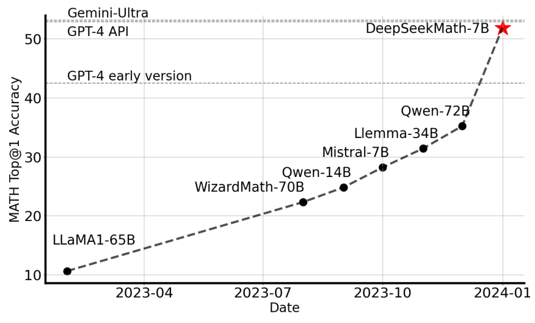
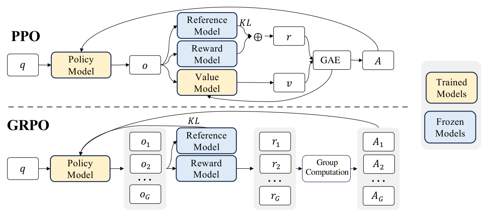
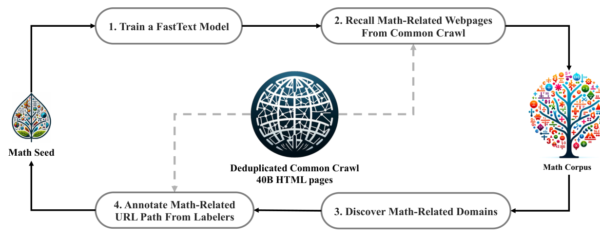
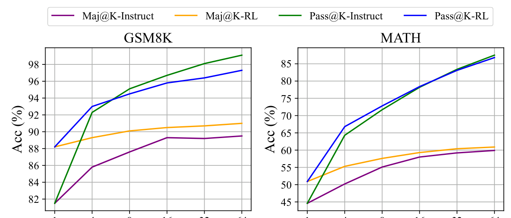

# DeepSeekMath（全称：DeepSeekMath: Pushing the Limits of Mathematical Reasoning in Open Language Models）

> **一句话本质**：不要昂贵的「独立裁判（Critic 价值模型）」，让同一个问题的一组采样解题路径（$G$ 个 rollout）在组内进行相对打分与优势归一化，以省去近半显存的极简架构实现超越传统 PPO 的大模型在线数学强化学习。
>
> 作者/机构：Zhihong Shao, Peiyi Wang, Qihao Zhu, Runxin Xu, Junxiao Song 等 ｜ DeepSeek-AI, 清华大学, 北京大学 ｜ 年份：2024 ｜ 原文：Zotero 锚点（见下行）或 [arXiv:2402.03300](http://arxiv.org/abs/2402.03300) ｜ 入库：2026-09-18
> Zotero：[shaoDeepSeekMathPushingLimits2024](zotero://select/items/@shaoDeepSeekMathPushingLimits2024) `shaoDeepSeekMathPushingLimits2024` ｜ [XQHXBPT7](zotero://select/items/XQHXBPT7) `XQHXBPT7` ｜ [DOI](https://doi.org/10.48550/arXiv.2402.03300) `10.48550/arXiv.2402.03300`

*图 1 费曼图解（论文 Figure 1）：无需外部工具与复杂投票，DeepSeekMath 7B 仅凭模型自身推理在竞赛级 MATH 上达到 51.7%，一举逼近闭源的 Gemini-Ultra 和 GPT-4，大幅拉开与以往开源模型的差距。*

## 解决什么问题

大语言模型在数学与长链逻辑推理上长期面临两大结构性瓶颈：

1. **预训练数据来源的误区与偏见**：
   - 传统观念普遍认为数学推理能力主要来自形式化论文（如 arXiv LaTeX 源码）或高成本合成数据，而通用互联网网页（如 Common Crawl）充满噪声、缺乏深度；
   - 但事实上单纯堆砌 arXiv 论文在 GSM8K、MATH、MMLU-STEM 等测试上提升极小甚至出现能力退化（arXiv 格式高度浓缩、符号繁复且缺少由浅入深的解题推导与讨论）；且现有高质量数学预训练集规模严重受限（如 Minerva 网页数据仅约 17B tokens）。
2. **强化学习（PPO）在大模型推理对齐时的资源与估计瓶颈**：
   - **显存开销巨大**：传统 [PPO](2017-ppo.md) 是典型的 Actor-Critic 结构，除了策略模型（Actor）和参考模型（Ref），还必须在显存中维护一个同等参数量级的价值模型（Critic），导致训练显存占用翻倍，限制了模型尺寸与上下文长度；
   - **稀疏奖励与逐 token 价值估计的矛盾**：数学题通常只有在完整推导结束时才能检验最终答案的对错（Outcome Supervision）。让 Critic 模型去预测长链推理中每一个中间 token 的绝对期望收益 $V(s_t)$，不仅拟合极其困难，而且估计方差巨大、噪声极高；
   - **离线微调（RFT / DPO）缺乏动态探索与惩罚机制**：拒绝采样微调（RFT）只挑选旧模型碰巧做对的样本做 SFT，不仅无法惩罚做错的路径，而且脱离了模型参数更新后的在线探索；DPO 则难以处理多步复杂推理中的动态长轨迹探索。

## 大白话讲解

### 类比：开除特聘名师，改成班级自评

- **传统 PPO 的做法**：请了一位极其昂贵的特聘名师（Critic 价值模型）。学生（Actor）每写下一个公式、每推导一步，名师都必须在旁边打一个绝对预估分（估算当前状态的长期期望回报 $V(s_t)$）。
  - **痛点**：雇名师的开销（显存）跟学生自己一样大；而且题目还没做完前，名师往往也只能瞎猜，打出来的中间分噪声极大，反而带偏了学生。
- **GRPO 的做法**：**把特聘名师直接开除**。面对同一道数学难题，让学生自己连续做 64 遍（生成 $G=64$ 份不同的解题草稿）。
  - 做完后，判卷人（规则或奖励模型）给每份草稿评一个最终分数。
  - 计算这 64 份草稿的**平均分**与**标准差**；
  - 高于平均分的草稿算「优秀变体」，赋予正优势值（向此轨迹学习）；低于平均分的草稿算「劣质变体」，赋予负优势值（抑制该推导路径）；
  - 用组内相对排名代替绝对打分，既砍掉了名师的一半显存，又完全消除了绝对分数的校准偏差。

*图 2 费曼图解（论文 Figure 4）：PPO（左）需要同时加载策略、参考、奖励以及庞大的价值模型（Value Model），通过 GAE 逐 token 计算优势；GRPO（右）彻底丢弃价值模型，同一个问题采样 $G$ 个候选回答，利用组内平均与标准差归一化直接得到相对优势，显存节省近半。*

## 关键机制

### 1. 从 PPO 到 GRPO 的目标函数重构

传统 [PPO](2017-ppo.md) 将 token 级的 KL 散度直接塞入奖励函数中（$r_t - \beta \log \frac{\pi_\theta}{\pi_{ref}}$），导致价值模型还需要额外拟合策略漂移惩罚。GRPO 彻底理清这一结构，将 KL 散度独立移入损失函数外层，形式如下：

$$\mathcal{J}_{GRPO}(\theta) = \mathbb{E}\left[ q \sim \mathcal{P}(Q), \{o_i\}_{i=1}^G \sim \pi_{\theta_{old}}(O|q) \right] \frac{1}{G}\sum_{i=1}^G \frac{1}{|o_i|}\sum_{t=1}^{|o_i|} \left[ \min\left( \frac{\pi_\theta(o_{i,t})}{\pi_{\theta_{old}}(o_{i,t})}\hat{A}_{i,t}, \text{clip}\left(\frac{\pi_\theta(o_{i,t})}{\pi_{\theta_{old}}(o_{i,t})}, 1-\varepsilon, 1+\varepsilon\right)\hat{A}_{i,t} \right) - \beta D_{KL}(\pi_\theta \parallel \pi_{ref}) \right]$$

其中采用 Schulman (2020) 提出的非负无偏 KL 散度估计器：
$$D_{KL}(\pi_\theta \parallel \pi_{ref}) = \frac{\pi_{ref}(o_{i,t})}{\pi_\theta(o_{i,t})} - \log \frac{\pi_{ref}(o_{i,t})}{\pi_\theta(o_{i,t})} - 1$$

### 2. 优势函数估计（Advantage Estimation）

对于输入问题 $q$，采样一组输出 $\{o_1, \dots, o_G\}$，得到各输出的得分 $\{r_1, \dots, r_G\}$：
- **结果监督（Outcome Supervision, OS）**：
  若仅在回答末尾打分（如规则判定最终数值答案对错，对=1，错=0），将整个组内的得分做标准化：
  $$\tilde{r}_i = \frac{r_i - \text{mean}(\mathbf{r})}{\text{std}(\mathbf{r})}$$
  该输出轨迹上的所有 token 共享相同的优势值：$\hat{A}_{i,t} = \tilde{r}_i$。
- **过程监督（Process Supervision, PS）**：
  若配备过程奖励模型（PRM）对推导步骤打分，第 $i$ 个输出的第 $j$ 步得分归一化为 $\tilde{r}_{i}^{(j)}$，则 token $t$ 的优势值为其后续各步骤归一化得分的前向累加：
  $$\hat{A}_{i,t} = \sum_{\text{step } j \ge t} \tilde{r}_{i}^{(j)}$$

### 3. 统一梯度范式：统一理解 SFT、RFT、DPO、PPO 与 GRPO

论文在参数梯度更新的宏观框架下给出了统一表达式：
$$\nabla_\theta \mathcal{J}(\theta) = \mathbb{E}_{(q, o) \sim \mathcal{D}} \left[ \frac{1}{|o|}\sum_{t=1}^{|o|} GC(q, o, t, \pi_{rf}) \cdot \nabla_\theta \log \pi_\theta(o_t | q, o_{<t}) \right]$$

任何对齐算法均由三个要素决定：**数据源 $\mathcal{D}$**（离线 vs 在线）、**奖励函数 $\pi_{rf}$**（规则 vs 模型）、**梯度系数 $GC$**（如何把信号映射为更新步长）。

| 算法 | 数据源 $\mathcal{D}$ | 奖励形式 | 梯度系数 $GC$ 特点 | 本质缺陷 / 优势 |
|---|---|---|---|---|
| **SFT** | 离线人类标注 | 无 | 恒等于 $1$ | 只能盲目拟合演示数据，无探索 |
| **RFT** | 离线 $\pi_{sft}$ 采样 | 规则（答对/错） | 答对为 $1$，答错为 $0$ | 只有正向更新，不惩罚错误，无在线探索 |
| **DPO** | 离线 $\pi_{sft}$ 采样对 | 成对偏好/规则 | 基于隐式奖励的 Sigmoid 权重 | 离线数据，随模型变强后无法产生新分布难例 |
| **Online RFT** | **在线 $\pi_\theta$ 采样** | 规则（答对/错） | 答对为 $1$，答错为 $0$ | 有在线探索，但依然无负向梯度惩罚 |
| **PPO** | **在线 $\pi_\theta$ 采样** | 奖励模型 + Critic | 逐 token GAE 优势值 $A_t$ | 在线探索 + 动态正负梯度，但 Critic 显存沉重 |
| **GRPO** | **在线 $\pi_\theta$ 组采样** | 奖励模型 / 规则 | **组内标准化相对优势 $\hat{A}_{i,t}$** | **在线探索 + 动态正负梯度 + 零 Critic 显存开销** |

*图 3 费曼图解（论文 Figure 2）：DeepSeekMath 数据挖掘引擎——以 OpenWebMath 为种子训练 FastText 分类器，从 40B 去重网页中召回数学候选页，再通过域名与 URL 路径分析迭代扩充高质量域名，最终沉淀出 120B token 的 DeepSeekMath Corpus。*

### 4. 预训练基座与数据发现

- **代码基座的数学迁移力**：以代码模型 DeepSeek-Coder-Base-v1.5 7B 作为初始化，在数学评测上全方位压倒直接以通用语言模型初始化的版本，验证了“代码训练能显著强化结构化逻辑推理”的假说；
- **arXiv 数据迷思破除**：在 1.3B 和 7B 模型上，仅用 arXiv 论文训练均未见数学推理能力提升，甚至轻微下降；而 Common Crawl 中清洗出的论坛讨论（如 MathOverflow）、教学博客、问答等含有更丰富直白的人类思维过程。

## 结果与代价

### 1. 评测表现
- **MATH 基准**：DeepSeekMath 7B 在无外挂代码解释器、无多数投票的单次生成（Top-1）下达到 **51.7%**，超过闭源的 Gemini Pro（32.6%）与 540B 的 Minerva（33.6%），逼近 GPT-4（52.9%）；
- **自一致性投票（Maj@64）**：在 64 次采样投票下，MATH 准确率进一步跃升至 **60.9%**；
- **中文数学泛化**：CMATH 达到 88.8%，大幅领先同期开源模型。

*图 4 费曼图解（论文 Figure 7）：核心洞察——经过 GRPO 强化学习后，Maj@K（多数投票准确率）随着 K 显著上移；但 Pass@K（覆盖上限）曲线几乎与 SFT 模型完全重叠。这证实了强化学习的本质在于重塑采样分布、搬运概率质量，而非拓展知识边界。*

### 2. 强化学习的真相：Pass@K vs Maj@K 的深层启示
论文在第 5.2.2 节给出了极为深刻的实验发现：
- **Pass@K 几乎没变**：这意味着基座模型能够探索到的解空间上限并没有被 RL 凭空扩充；如果 SFT 阶段采 64 遍完全不可能答对的题，RL 后依然答不对；
- **Maj@K 和 Top-1 大幅提升**：RL 将原本隐藏在采样分布长尾里的 1% 正确解法，通过正负相对优势的梯度引导，集中搬运到了 Top 区域，显著收窄了输出方差，消除了逻辑幻觉。

### 3. 代价与局限性
- **零方差失效边界**：若采样组对难题全错（均为 0）或对送分题全对（均为 1），组内标准差 $\text{std}(\mathbf{r}) \to 0$，相对优势归零，无法提供梯度更新信号。训练必须依赖难度匹配且具备区分度的题目集；
- **几何与形式化证明短板**：因纯文本预训练与网页数据偏差，模型在涉及三角形、椭圆等连续空间几何图形的感知与推导上显著弱于通用超大模型；
- **Few-shot 上限受限于 7B 参数量**：相比 GPT-4 随提示词示例数增加准确率明显上升，7B 尺度的 DeepSeekMath 在 Few-shot 与 Zero-shot 之间提升不明显。

## AI 预读备注

Zotero AI Butler 预读笔记 `8CYDI7ER`（AI 总结）与 `RK4Y6U8L`（文献表格）提供了完整的架构提炼与背景梳理。经费曼核验，对 AI 预读补充两处关键盲点：
1. **AI 预读漏检 Pass@K 的本质结论**：AI 总结仅列举了 GSM8K 和 MATH 的绝对涨分，遗漏了论文第 5.2.2 节 Figure 7 揭示的「Pass@K 恒定、Maj@K 飙升」的核心理论发现（RL 究竟改变了能力还是改变了分布）；
2. **统一梯度系数框架的深化**：AI 预读将 GRPO 视作孤立算法，缺少了原论文 Appendix A.1 将 SFT/RFT/DPO/PPO/GRPO 统一为 $GC$ 梯度系数对比的宏观视角。本笔记已予全量补齐。

## 我的复述

*费曼检验时 XinLi 自己的原话：*

> 1. 对同一个问题，rollout G 遍，然后计算他们 reward 的均值和标准差，接着用均值和标准差标准化 reward 得到优势， 高于均值的轨迹得到正优势低于均值的负优势。 LLM 通常只有到最后才能确认对错，仅有末尾奖励的时候对中间 token 绝对期望方差大噪声高。
> 2. 相对优势差为 0，该样本不产生梯度，这意味着 GRPO 极度依赖有区分度的题目；完全不会的题和闭眼都会的题在 RL 阶段不提供有效优化信号。而 PPO 由于有 critic 模型的存在，即使最后结果全对或全错但还是有中间 token 的区分度还是有梯度的。
> 3. 当前的强化学习并没有教模型学会原本在知识盲区里的新定理，而是重塑了输出分布——把分布中那 1% 零星被采到的正确答案推成高概率候选，抑制错误的幻觉路径。

## 卡壳点与解答

### Q1：为什么丢弃 Critic 改用组相对打分，不仅省显存，而且天然契合奖励模型的本质？
- **解答**：
  1. **显存层面**：LLM 的强化学习中，Critic 网络通常需要拥有与策略模型（Actor）相同的参数量与嵌入维度才能准确表征上下文价值，丢弃 Critic 直接削减了一半的显存开销与反向传播图；
  2. **建模稳定性**：在数学等长链推理中，奖励通常是延迟到结尾的稀疏二值信号（对/错）。Critic 强行去预测每个 token 的绝对长期价值 $V(s_t)$，噪声极高且极易过拟合；
  3. **契合 RM 训练范式**：主流奖励模型（Reward Model）是通过成对比较数据（Pairwise Preference，如 Bradley-Terry 目标）训练出来的。它天生擅长的是**在同一个 Prompt 下给不同候选回答排序**（相对大小），而不是输出具有绝对物理意义的校准标量。GRPO 的组内均值中心化与方差标准化，恰好顺应了奖励模型的比较本质。

### Q2：在 Outcome 模式下全对或全错时，GRPO 与传统 PPO 的梯度行为有何不同？
- **解答**：
  1. **GRPO 的行为**：当 64 个回答全为 0 分或全为 1 分时，分子 $(r_i - \text{mean}(\mathbf{r})) = 0$，且标准差 $\text{std}(\mathbf{r}) \to 0$（加微小常数 $\epsilon_{div}$ 防止除零），归一化后的优势值 $\hat{A}_{i,t} \equiv 0$。策略梯度的 surrogate 部分完全消失，只剩下策略与参考模型间的 KL 正则惩罚项。因此，**完全做不对的超级难题或闭眼都能做对的白给题，在 GRPO 阶段几乎不贡献策略探索的有效梯度**；
  2. **传统 PPO 的对比**：PPO 维护了独立的价值网络 $V(s_t)$。即使最终的回报全部为 0，只要每一步的状态估计 $V(s_t)$ 不为 0，就会计算出非零的 TD 误差（$r_t + \gamma V(s_{t+1}) - V(s_t)$），从而强行产生梯度。但由于这种梯度建立在稀疏末端奖励的噪声估计之上，反而容易带来虚假的策略漂移破坏已有能力。

### Q3：如何看待「Pass@K 几乎没变，Maj@K 大幅跃升」这一现象？
- **解答**：
  这一发现揭示了强化学习在大语言模型上的真实机理：
  1. **知识与潜力的边界由预训练与 SFT 划定**：强化学习并没有凭空为模型注入它未曾见过的数学公理或逻辑模式（如果基座在采样 $K$ 次内做出的概率为 0，RL 并不能凭空无中生有）；
  2. **RL 的核心是「概率质量搬运（Probability Mass Re-allocation）」**：在 SFT 模型中，正确的解题路径可能混杂在大量充满逻辑瑕疵的采样中（例如仅占 5% 的概率密度）。GRPO 的正负相对优势就像一把筛子，通过对优质路径的强化和劣质路径的抑制，把散落在长尾中的正确推理模式搬运到了概率分布的主峰，使得贪婪搜索或少量采样（Top-1 / Maj@K）能稳定击中正解。

## 还没搞懂

*费曼检验三题已全部闭环，无残留疑问。*

## 关联

- [DAPO](2025-dapo.md) — GRPO 在长思维链（Long-CoT）下的直接工业级演进：针对朴素 GRPO 在长逻辑场景下暴露的四大病根（对称裁剪导致的熵坍缩、全对/全错样本造成的有效批次萎缩、样本级平均导致的长度被稀释、超长硬截断噪声），提出非对称 Clip-Higher、动态重采样、Token-level 损失与软惩罚，将 Qwen2.5-32B 在 AIME 2024 上拉升至 50 分。
- [PPO](2017-ppo.md) — GRPO 的直接理论前身：继承了重要性采样裁剪目标（Clipped Surrogate Objective）以防止策略过激更新，但 GRPO 彻底剪除了 Critic 模型与 GAE，改用组内相对优势估计，并将 KL 惩罚从奖励解耦到外层损失。
- [GeoAnchor](2026-geoanchor.md) — 空间推理下游应用：GeoAnchor 在第四阶段强化学习中，直接采用了 GRPO + pattern reward 算法来端到端优化模型对不同空间潜变量模式的选择策略。
- [U-OPSD](2026-u-opsd.md) — 自生成监督的另一演进路线：U-OPSD 是在推理阶段通过采样 8 遍做多数投票构建伪解教师进行前向 KL 蒸馏，而 GRPO 是直接在在线采样组内用相对奖励计算优势进行策略梯度强化。
- [S²VOPD](2026-s2vopd.md) — 零特权自对齐：探讨在无外部高阶标注的前提下，如何通过模型自身的多视角/多采样构建不对称信息差进行能力对齐。
