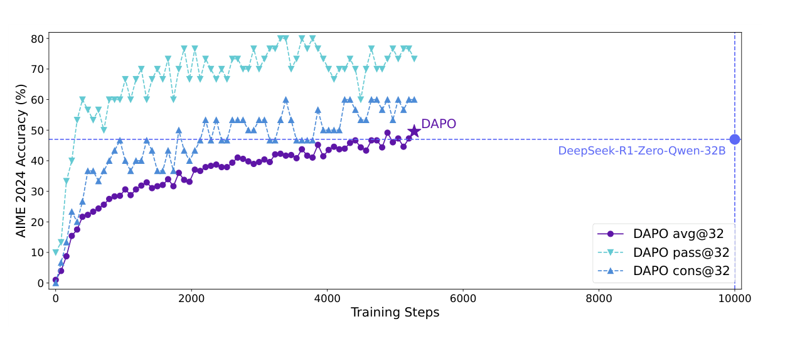
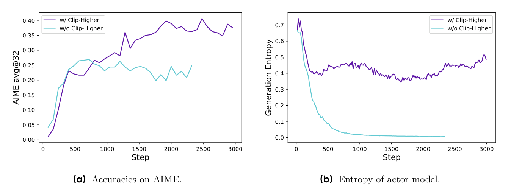
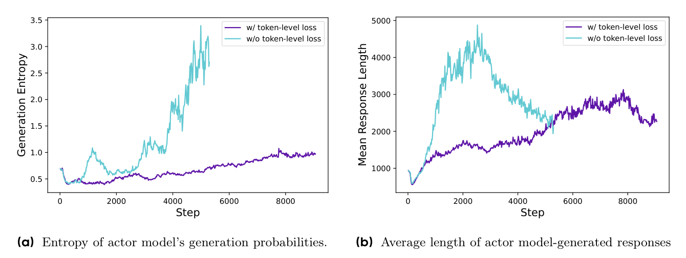
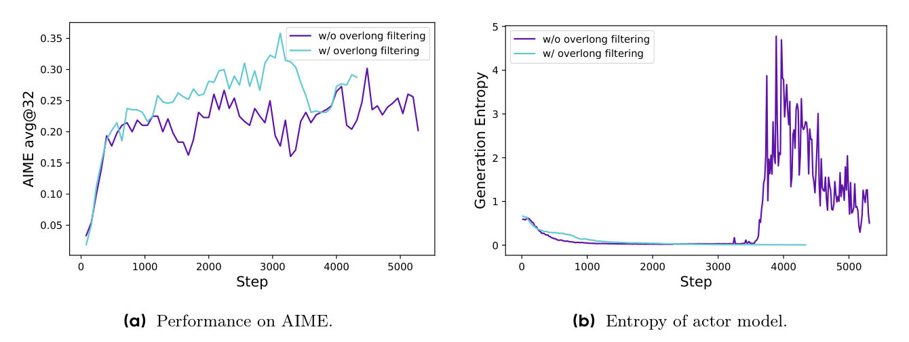

# DAPO（全称：DAPO: An Open-Source LLM Reinforcement Learning System at Scale）

> **一句话本质**：针对大规模长思维链（Long-CoT）强化学习中朴素 GRPO 遭遇的熵坍缩、有效样本萎缩、长推导被稀释与截断噪声四大暗礁，提出「非对称放宽裁剪上界（Clip-Higher）+ 动态剔除零梯度题（Dynamic Sampling）+ 统一逐 Token 损失归约 + 线性软超长缓冲」四大机制，仅用一半步数实现 AIME 2024 突破 50 分的开源大规模 RL 系统。
>
> 作者/机构：Qiying Yu, Zheng Zhang, Ruofei Zhu, Yufeng Yuan, Hao Zhou, Mingxuan Wang 等 ｜ 字节跳动 Seed, 清华大学 AIR, 香港大学 ｜ 年份：2025 ｜ 原文：Zotero 锚点（见下行）或 [arXiv:2503.14476](http://arxiv.org/abs/2503.14476) ｜ 入库：2026-09-19
> Zotero：[yuDAPOOpenSourceLLM2025](zotero://select/items/@yuDAPOOpenSourceLLM2025) `yuDAPOOpenSourceLLM2025` ｜ [QUHVNNHR](zotero://select/items/QUHVNNHR) `QUHVNNHR` ｜ [DOI](https://doi.org/10.48550/arXiv.2503.14476) `10.48550/arXiv.2503.14476`

*图 1 费曼图解（论文 Figure 1）：在 Qwen2.5-32B 基座上，DAPO 仅用 50% 的梯度更新步数就从 0 分跃升至 50 分（avg@32），不仅大幅超越朴素 GRPO 基线的 30 分，亦超越了闭源报告的 DeepSeek-R1-Zero-Qwen-32B（47 分）。*

## 解决什么问题

在 OpenAI o1 与 DeepSeek-R1 引爆推理时间缩放（Test-time Scaling）革命后，开源社区在复现长思考链强化学习（Long-CoT RL）时普遍遭遇断崖式挫败：直接在 Qwen2.5-32B 基座上跑朴素 [GRPO](2024-deepseekmath.md) 仅能取得 30 分，远落后于官方报告的 47 分。深层原因在于开源报告隐藏了关键工程细节，导致大规模长推理 RL 训练深陷四大暗礁：

1. **探索动力快速衰竭：熵坍缩（Entropy Collapse）**：
   - 传统 PPO/GRPO 使用对称的裁剪区间（$\epsilon = 0.2$，即 $r_t \in [0.8, 1.2]$）；
   - 在长思维链探索中，关键的推导转折与创新解法在训练初期概率极低，理应成倍放大其发生概率；但上限锁死在 1.2 严重压制了低概率正确 token 的增长，而下界 0.8 却在不断抑制错误 token，导致策略熵呈断崖式下跌。模型迅速丧失探索新解法的勇气，陷入保守僵化。
2. **有效梯度大幅稀释：全对/全错零优势题目吞噬有效 Batch Size**：
   - [GRPO](2024-deepseekmath.md) 依赖同题组内均值计算优势，若一组 16 个采样回答全部做对或全部做错，组内优势 $\hat{A}_{i,t} \equiv 0$，该题产生的梯度为零；
   - 随着模型变聪明，全对题目的比例从 10% 飙升到 60% 以上。固定 Batch 内绝大多数题目沦为放空炮的“僵尸样本”，有效批次大小急剧缩水，梯度方差与噪声激增。
3. **样本级归一化的长度扭曲：长逻辑被稀释，复读废话却不受罚**：
   - 朴素 GRPO 采用样本级归一化（先在单样本内除以长度 $|o_i|$，再求样本间均值）；
   - 导致一篇长达 16,000 token 的精妙长证明，每个 token 分摊到的梯度权重仅为 500 token 短解法的 $1/32$，优质逻辑无法被充分强化；
   - 反过来，若模型出现病态复读与胡言乱语导致长度激增，负优势同样被庞大的长度分母稀释，模型得不到应有的惩罚，导致输出长度与无意义熵失控膨胀。
4. **超长截断样本的粗暴硬惩罚引入严重假负例噪声**：
   - 为防止显存爆炸通常设有最大生成长度（如 16K）。若对所有未完成截断的样本直接按做错打 $-1$ 惩罚，会误伤那些正在进行正确严密论证、仅差最后一步收尾的高质量思考，混淆策略模型的学习信号。

## 大白话讲解

### 类比：给重装长跑选手打上四块「护手霜」

在只有几百字的短问答里，[GRPO](2024-deepseekmath.md) 就像穿轻便跑鞋在操场慢跑，小修小补就能跑通；但当任务变成 20,000 字竞赛级高强度长跑（Long-CoT 极长推导）时，旧机制的关节就会全部卡死。DAPO 为选手装上了四块关键护具：

- **护具一：向上放开剪刀口（Clip-Higher）**：
  - 过去要求转弯速度无论如何不能超过旧速度的 1.2 倍。现在说：如果遇到了非常冷门但完全正确的全新推理分叉，允许你更大胆地踩油门（放宽到 1.28 倍）；但踩刹车（0.8）依然严格维持。这样模型才敢尝试原本想都不敢想的新思路，策略熵不会快速枯竭。
- **护具二：扔掉没区分度的试卷并动态补齐（Dynamic Sampling）**：
  - 班级自评必须有差异才能学到东西。如果一整组草稿要么全部做对、要么全部瞎蒙做错，这道题大家水平一样，算不出任何排名分（优势恒为零）。以前就把这些白卷硬混在作业本里滥竽充数；现在要求：只要全对或全错，当场把这题扔进废纸篓，重新换新题做，直到凑齐一个**全部都有正负区分度**的黄金题库才开工。
- **护具三：按字算账，取消字数大锅饭（Token-level Loss）**：
  - 以前一篇文章算一份工钱，长文章除以字数后每个字变得极度廉价；短文章每个字极度值钱。现在改成字数统筹：不管写在长篇大作还是简短回答里，每一个好字给相同的正分，每一个废话字给相同的扣分。写得长且严谨就拿大奖，胡言乱语注水就按字重罚。
- **护具四：终点线前设缓冲带（Soft Overlong Punishment）**：
  - 以前到 16,000 字没写完立马当场枪毙（打 -1 判负）。现在在 16K 到 20K 之间铺设一条软垫子，超时越多扣分线性递增，只有冲过 20K 极限才彻底判负，给正规论证的收尾留足喘息时间。

## 关键机制

### 1. 非对称解耦裁剪（Clip-Higher）：抑制熵坍缩

DAPO 打破了强化学习数年来的对称裁剪传统，将上界与下界解耦：
$$\text{clip}(r_t(\theta), 1 - \varepsilon_{low}, 1 + \varepsilon_{high})$$
其中将下界保持为 $\varepsilon_{low} = 0.2$（保护动作空间不被极端压制归零导致采样塌缩），而将上界放宽至 $\varepsilon_{high} = 0.28$。

*图 2 费曼图解（论文 Figure 2）：(a) AIME 准确率随训练显著提升；(b) 策略模型生成熵对比——无 Clip-Higher 时熵在 1000 步内急剧暴跌（熵坍缩），而引入 Clip-Higher 后策略熵平稳保持在健康区间，模型探索活力得以持续维系。*

### 2. 动态采样（Dynamic Sampling）：剔除零梯度样本

在训练流程中设立动态缓冲池（Dynamic Sampling Buffer）。对于每个采样题目 $q$ 生成的 $G$ 个候选回答 $\{o_i\}_{i=1}^G$，只有满足以下非平凡条件的题目才被允许进入反向传播批次：
$$0 < \sum_{i=1}^G \mathbb{I}(\text{is\_equivalent}(a, o_i)) < G$$
- **机制逻辑**：若准确率为 0（全错）或 1（全对），在相对优势公式 $\hat{A}_{i,t} = \frac{R_i - \text{mean}(\mathbf{R})}{\text{std}(\mathbf{R})}$ 中分子或标准差归零，整道题产生零有效梯度。
- **动态补满**：系统持续异步采样，直到批次完全由具备正负对比信号的有效题目填满后才执行参数更新。虽然采样量增加，但由于并行 rollout 耗时通常被最长长尾样本阻塞，且每个更新步均为 $100\%$ 高质量信息更新，总收敛步数减少一半，实际墙钟训练时间反而更短。

### 3. 逐 Token 策略梯度损失（Token-Level Policy Gradient Loss）

重构多样本与多步骤的累加归约顺序：
- **朴素 GRPO（样本级归约）**：$\mathbb{E}\left[ \frac{1}{G}\sum_{i=1}^G \frac{1}{|o_i|}\sum_{t=1}^{|o_i|} L_{clip} \right]$（各样本权重平等，长样本 token 被除以更大分母 $|o_i|$）；
- **DAPO（Token 级归约）**：
  $$\mathcal{J}_{DAPO}(\theta) = \mathbb{E}\left[ \frac{1}{\sum_{i=1}^G |o_i|} \sum_{i=1}^G \sum_{t=1}^{|o_i|} \min\left( r_{i,t}(\theta)\hat{A}_{i,t}, \text{clip}(r_{i,t}(\theta), 1-\varepsilon_{low}, 1+\varepsilon_{high})\hat{A}_{i,t} \right) \right]$$

*图 3 费曼图解（论文 Figure 4）：无 Token-level 损失时，样本级归一化对长篇复读废话惩罚不足，导致生成熵畸高（异常混乱）且输出长度恶性膨胀；Token-level 损失通过字字均等计责，使策略熵维持在正常收敛轨迹，响应长度以健康节奏平稳增长。*

### 4. 软超长奖励塑形（Soft Overlong Punishment）

在预设的目标最大长度 $L_{max} - L_{cache} = 16,384$ 与显存硬截断上限 $L_{max} = 20,480$ 之间引入线性衰减惩罚函数：
$$R_{length}(y) = \begin{cases} 
0, & |y| \le L_{max} - L_{cache} \\ 
\frac{(L_{max} - L_{cache}) - |y|}{L_{cache}}, & L_{max} - L_{cache} < |y| \le L_{max} \\ 
-1, & L_{max} < |y| 
\end{cases}$$
最终奖励由正确性奖励与长度软惩罚相加：$R = R_{rule} + R_{length}$。平滑过渡带消除了截断假负例噪声对高质量长思考的无端打击。

*图 4 费曼图解（论文 Figure 5）：对比超长直接打 -1 带来的训练剧烈震荡，过滤/软化截断样本使 AIME 2024 得分稳步拉升至 35%+，彻底消除了假负例噪声引发的认知混乱。*

### 5. 整数标准化数据集：DAPO-Math-17K

数学答案的形式多样（如分数、根号、代数式 $a+\frac{\sqrt{b}}{c}$）极易导致规则判卷器出现解析误判（Reward Hacking 或假错判）。DAPO 启发自 AIME 竞赛规范，通过 CoT 提示词指导 LLM 将题目重新改写为要求输出整数（例如将求 $a+\frac{\sqrt{b}}{c}$ 改写为求 $a+b+c$），构建了包含 17K 题目且完全由纯整数答案验证的 `DAPO-Math-17K`，确保规则奖励信号绝对纯净。

## 结果与代价

### 1. 递进消融实验数据（Qwen2.5-32B 基座）

在竞赛级 AIME 2024 测试基准（avg@32）上的技术叠加贡献：

| 算法与技术配置 | AIME 2024 得分 (avg@32) | 相比上一步增益 | 解决的核心痛点 |
|---|---|---|---|
| 朴素 GRPO 基线 | 30.0 | - | 存在严重熵坍缩与样本衰减 |
| + Overlong Filtering（超长截断过滤） | 36.0 | +6.0 | 消除未写完高质量样本的假惩罚噪声 |
| + Clip-Higher（解耦裁剪上界 0.28） | 38.0 | +2.0 | 遏制策略熵暴跌，维持长期探索活力 |
| + Soft Overlong Punishment（软过渡惩罚） | 41.0 | +3.0 | 线性惩罚代替硬切断，兼顾长度控制与完整性 |
| + Token-level Loss（逐 token 损失归约） | 42.0 | +1.0 | 提高长逻辑学习权重，压制复读膨胀 |
| **+ Dynamic Sampling（DAPO 全套系统）** | **50.0** | **+8.0** | **剔除全对/全错零梯度题，每步均为高信噪比有效更新** |
| *参考对比：DeepSeek-R1-Zero-Qwen-32B* | 47.0 | - | 官方闭源报告成绩（DAPO 步数仅需其 50%） |

### 2. 涌现能力与反思行为
在经过充足步数的强化学习后，模型在不依赖任何 SFT 人类反思演示的前提下，自发涌现出了自主反思（Self-reflection）与多角度重算行为（如在四面体几何求体积中途出现：“*Wait a moment, let's rethink about the dihedral angle involving planes in a more thoughtful geometric way...*”），验证了纯规则 RL 在大模型长思维链上的自主演进力量。

### 3. 代价与局限性
- **Rollout 采样算力开销略增**：动态采样需要过滤掉全对/全错样本，在训练后期（模型变聪明后）需要比静态批次采样更多的环境生成交互，对推理引擎（如 vLLM / SGLang）的高并发与批处理吞吐提出了更高要求；
- **任务形式依赖纯净的规则判定**：DAPO-Math-17K 的成功高度依赖“将复杂数学改写为整数答案”的数据工程，在难以自动化精准判对错的开放式任务（如创意写作、代码架构设计）中较难直接套用。

## AI 预读备注

Zotero AI Butler 预读笔记 `NXVAD9J7` 提取了长篇目录和分段概述。经费曼校验，对 AI 预读提炼并补齐三处核心技术深度：
1. **明确 Dynamic Sampling 的收敛效率反直觉因果**：AI 笔记仅描述了动态采样的流程，遗漏了“为什么额外采样了样本，整体训练反而因梯度方差减小而收敛更快（墙钟时间更短）”的系统级深层因果；
2. **公式维度的损失归约重构**：将 Sample-level 与 Token-level Loss 的分母位置改变（将除以 $|o_i|$ 移至外层除以总 token 数 $\sum |o_i|$）彻底公式化呈现；
3. **Clip-Higher 解决熵坍缩的非对称机制**：清晰梳理为何只抬高上界（$\epsilon_{high}=0.28$）而不放松下界（保持 $\epsilon_{low}=0.2$）的保护逻辑。

## 我的复述

*费曼检验时 XinLi 自己的原话：*

> 1. 训练后期原本概率极低的长尾 token（通常和创新推导有关）需要成倍增加概率，但是上限被锁死在了 1.2，同时下限 0.8 不断在压低负动作，导致模型变得极度保守，不敢探索新解法。 DAPO 的 Clip-Higher 解耦了上下界，下界不变提高了上界，下界不变防止动作概率过度压低，同时放宽上界给冷门但是至关重要的 低概率正确 token 留出更大的概率增长空间；
> 2. 在长推理场景下，按 token 长度平均的话精妙的长输出被更大的分母平均后可能获取的正向激励还不如一个更短的普通的输出，另外如果模型陷入低质量复读，由于长度很长，受到的惩罚被平均后也会很小。DAPO 的做法是把平均的分母移动到组累加和样本累加外面，组内所有 token 整体取均值，这样就和单样本的长度无关了。
> 3. 因为移除的是不带来优势的样本加入训练也没有梯度对模型来说是没有意义的，移除之后每次的样本都是有效的，代价只是增加一点 rollout 时间甚至不增加，因为并行 rollout 本身就会被最长的那条阻塞。

## 卡壳点与解答

### Q1：为什么朴素对称 Clip 会引发熵坍缩？Clip-Higher 如何对症下药？
- **解答**：
  1. **对称 Clip 的非对称压制效应**：在概率较小时，想要提升一个优秀探索 token 的出现率，通常需要跨越数倍的相对增长幅度（例如从 0.01 提升到 0.05 是 5 倍增长）；但 $1+\varepsilon = 1.2$ 的严格上限直接切断了这种指数级跃迁的梯度可能；而反观下限 $1-\varepsilon = 0.8$，对错误 token 的单步压低比例已足够巨大。随着多轮更新，抑制错误动作的力量远远强于拉升创新动作的力量，导致动作分布急剧尖锐化、策略熵跌入深渊；
  2. **Clip-Higher 的巧妙权衡**：仅将上界放宽到 $1.28$（$\varepsilon_{high}=0.28$），给低概率优秀 token 留出成长的容差空间；而下界严格维持在 $0.8$ 不变（若下界也同步放宽至更大范围，容易直接将 token 概率压至 0 彻底破坏生成分布的平滑性）。

### Q2：样本级平均（Sample-level）与 Token 级平均（Token-level）在长思考链下的根本分歧是什么？
- **解答**：
  1. **样本级平均的病态**：将每个样本内部除以 $|o_i|$，本质上是假设“每个完整回答的整体价值权重是等同的”。但在 16K 的长推理中，一个包含丰富中间反思的长解法被除以了 16,000，其关键证明 token 的梯度权重被极其严重地稀释；反之，当模型陷入死循环复读时，单 token 的负惩罚被除以了巨额长度，惩罚软弱无力，反而纵容了复读；
  2. **Token 级平均的拨乱反正**：将归一化分母提取到最外层（除以当前批次的所有有效 token 总数 $\sum |o_i|$）。从单个 token 视角看，不论它身处短回答还是长回答中，只要产生了正优势，它获得的奖励提升权重完全相同；只要产生了负优势，复读或废话越多，累积的反向惩罚梯度总量就越大，从数学上根治了无惩罚水长度的顽疾。

### Q3：动态采样额外生成了数据，为什么整体训练时间反而减少？
- **解答**：
  1. **无效梯度的隐形杀手**：在朴素批次中，随着模型变聪明，全对题目的比例高达 60% 以上。这些题目在 GRPO 中优势恒为零，占用显存和反向传播算力却贡献零梯度，导致实际“有效 Batch Size”萎缩了 60% 以上，参数更新在极小样本集上剧烈震荡、收敛极慢；
  2. **高信噪比更新驱动快速收敛**：动态采样确保送入反向传播的每一个题目都具备绝对的对比度，每个训练 step 都是全额有效的高信噪比优化，梯度更新步数直接削减了 50%；
  3. **并行推理的木桶效应**：在大规模分布式 RL 系统中，单批次 Rollout 的等待时间本身就是由极少数生成最慢的长尾样本决定的。在等待长尾样本生成的空档中，异步多跑几次短题目的采样并不会显著拉长系统墙钟时间。

## 还没搞懂

*费曼检验三题已全部闭环，无残留疑问。*

## 关联

- [DeepSeekMath](2024-deepseekmath.md) — 理论演进与痛点定向修复：DeepSeekMath 首创了丢弃 Critic 的 GRPO 算法，但在长思维链（Long-CoT，上万 token）场景下暴露了四大暗礁（熵坍缩、零梯度样本萎缩、长度被稀释、超长假负例）；DAPO 则是针对 GRPO 在大规模长推理落地时的直接升级演进版。
- [PPO](2017-ppo.md) — 裁剪边界的非对称改造：PPO 确立了重要的对称截断代理目标（$1\pm\varepsilon$），DAPO 首次针对长生成探索证明了非对称解耦裁剪（Clip-Higher, $\varepsilon_{low}=0.2, \varepsilon_{high}=0.28$）在防范策略熵崩溃上的关键价值。
- [Open-MOPD](2026-open-mopd.md) — 训练预算与长度失衡的同源对照：Open-MOPD 揭示了在多教师蒸馏中，25× 的长短回答长度差会导致短域 token 梯度被严重剥夺；DAPO 的 Token-level Loss 同样也是在处理长短序列之间 token 梯度的公正分配与防稀释问题。
- [GeoAnchor](2026-geoanchor.md) — GRPO 落地演进对照：GeoAnchor 在 3D 潜变量模式选择中直接套用 GRPO + pattern reward，而 DAPO 则代表了纯语言符号长思维链在极高推理难度（AIME 竞赛级）下的工业级对齐前沿。
