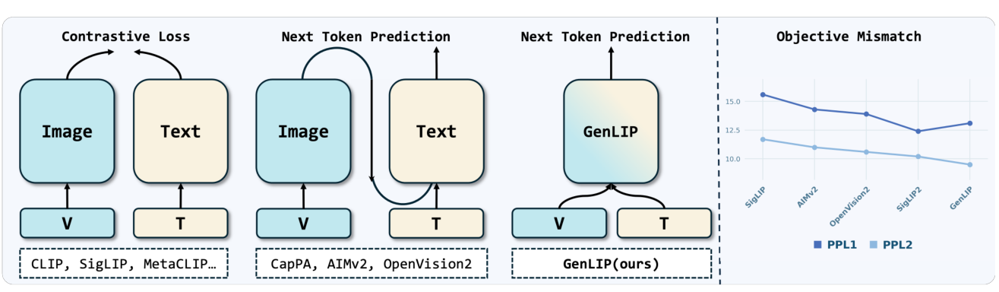
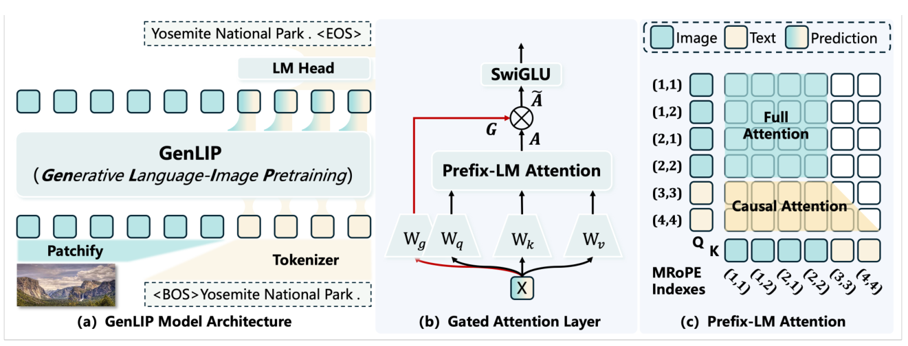
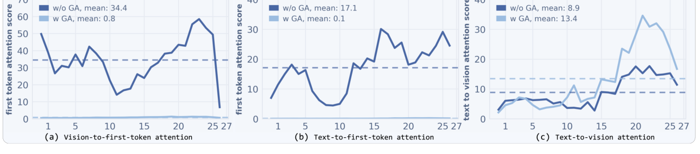

# GenLIP（全称：Let ViT Speak: Generative Language-Image Pre-training）

> **一句话本质**：GenLIP 让同一个 Transformer 看图并生成描述，用下一词预测训练视觉表示，之后取出它作为视觉编码器。

> 作者/机构：北交大 + ByteDance + NTU（Fang, Lan et al.）｜ 年份：2026 ｜ 原文：Zotero 锚点（见下行） ｜ 入库：2026-08-17

> Zotero：[citekey](zotero://select/items/@fangLetViTSpeak2026) `fangLetViTSpeak2026` ｜ [itemKey](zotero://select/items/EAKWJXT8) `EAKWJXT8` ｜ [DOI](https://doi.org/10.48550/arXiv.2605.00809) `10.48550/arXiv.2605.00809`

## 五分钟重建

  
图像检索预训练与下游语言生成的目标不同。GenLIP 让同一个 Transformer 在预训练时看图、生成描述，用语言损失训练视觉表示。

  <ol class="guide-path" aria-label="机制路径">
    <li><h3>拼接图像与文本</h3>
图像 token 在前，文本 token 在后。图像之间双向可见；文本看全部图像和已有文本，不能看未来文本。
</li>
    <li><h3>预测下一个词</h3>
损失只算在文本位置。可学习门控乘在 attention 输出上，论文观察到它减轻了首 token 的 attention sink。
</li>
    <li><h3>取出视觉编码器</h3>
下游只输入图像，丢弃语言头与分词器。视觉输出经 connector 接到下游 LLM。
</li>
  </ol>
  
<strong>具体例子（教学假设）</strong>：输入两块图像 token 和描述“猫 在 睡觉”。预测“睡觉”时可看全部图像与“猫 在”；图像 token 看不到训练描述。否则下游只输入图像时，视觉特征会缺少训练时偷看的信息。

  
<strong>边界</strong>：独立解码器路线同样能把梯度传回 ViT。GenLIP 的区别是共享单个 Transformer。池化不保证各 token 梯度均匀，门控也不是自动识别坏 token 的硬开关。

  

    <h3>先预测，再展开答案</h3>
    
训练结束后删掉 LM head，图像 token 还能互相看吗？为什么不需要生成描述才能得到视觉特征？

    

查看机制解释

还能。只剩图像前缀时，图像之间本来就是双向注意力。语言损失已在训练时更新了共享权重，推理时可直接读视觉表示。

    
关掉提示后画四格可见性表：图像到图像、图像到文本、文本到图像、文本到文本。

  

  
2026-10-04：讲解与练习待试用，本次未进行理解检验；此处不记录复测通过。

## 论文图解

*图 1 费曼图解（论文 Figure 1）：先看左侧：双塔比较图文表示，编码器解码器把生成分给独立模块，GenLIP 用一个 Transformer 处理图像和文本。右侧比较接到 LLM 后的语言目标适配情况；曲线结论限于该测试设置。*

*图 2 费曼图解（论文 Figure 2）：左侧是图像前缀与文本后缀；中间的门控逐元素调节 attention 输出；右侧是可见性表。图像互看，文本看图像和已有文本，图像不看文本。生成描述是训练方式，下游可以只取视觉表示。*

*图 3 费曼图解（论文 Figure 3）：前两幅看视觉和文本分给首 token 的注意力，第三幅看文本分给视觉 token 的注意力。加入门控后，首 token 集中现象减轻；这是模型消融证据，不是池化保证均匀梯度的证明。*

## 解决什么问题

给 MLLM 训视觉编码器，三条旧路各有死穴：

| 路线 | 代表 | 做什么 | 痛在哪 |
|------|------|--------|--------|
| **双塔对比学习** | CLIP、SigLIP | 图像和文本分开编码，映射到同一空间做对比 | **目标错位**：学的是判别式特征（擅长检索/分类），但 MLLM 是生成式（next token prediction），接入 LLM 后困惑度更高 |
| **编码器-解码器生成式** | AIMv2、CapPa | ViT 编码器 + 独立文本解码器，解码器上算语言建模损失 | **架构冗余 + 间接优化**：ViT 的梯度通过独立解码器传回；GenLIP 改为共享一个 Transformer，减少额外文本模块 |
| **多目标混合** | SigLIP2、CoCa | 对比 + 生成 + 密集特征多个损失一起上 | **多目标权衡**：超参难调、训练不稳，需要 40B 样本才出好效果 |

GenLIP 的洞察：既然下游是生成式，预训练也该直接是生成式，而且别绕弯子——**让 ViT 本体直接承担生成任务**，不挂额外解码器。

> ⚠️ 防混淆（2026-08-24 复测暴露）：表中第二条路线的"独立文本解码器"是**预训练时**的组件（AIMv2 式），别和下游 MLLM 的"ViT + MLP connector + LLM"推理接法搞混——后者是 GenLIP 自己推理时也在用的接法（2 层 MLP 投影给 LLM），不是预训练对比路线。

## 大白话讲解

### 类比：看图写话考试

- **CLIP 式**：给学生看一堆图和标题，让他判断"哪个标题配哪张图"（选择题）——学会了配对，但不会自己写描述。
- **AIMv2 式**：让学生看图，把图描述交给另一个"代笔"去写，学生只负责"看"，代笔负责"写"——学生收到的反馈是间接的。
- **GenLIP 式**：直接让学生**看图写话**——自己看、自己写、自己被打分。一个学生端到端学会"看懂图并用语言表达"。

训完之后，考试时（当 MLLM 的视觉编码器用），把"写作文"的部分（语言头）扔掉，只留"看图"的能力——但这个能力是**被生成式目标直接优化过的**，和下游 LLM 的 next token prediction 天然对齐。

> 🔧 **最容易卡住的点①**：单个 Transformer 怎么同时当编码器和解码器？
> 靠 **Prefix-LM Attention**——图像 token 排前面当"前缀"，文本 token 排后面，一个 Transformer 同时干了编码器（图像部分，双向）和解码器（文本部分，因果）的活，ViT 本体直接收到语言建模的梯度。

## 关键机制

### ① Prefix-LM Attention：一塔两用

序列 = `[图像 token × M] + [文本 token × L]`，注意力掩码四条规则：

| 方向 | 模式 |
|------|------|
| 图像↔图像 | 双向全注意力（编码器模式，充分交互形成好的视觉表示） |
| 文本→文本+图像 | 因果（看全部图像 token + 已生成的文本 token，标准自回归） |
| 图像→文本 | 不可见（图像在前，因果约束下看不到后面的文本） |
| 文本→图像 | 可见 |

损失只在文本部分算（next token prediction），图像 token 不计损。位置编码用 MRoPE（多模态旋转位置编码）处理拼接序列的相对位置。

### ② Gated Attention：防注意力陷阱（attention sink）

> 🔧 **最容易卡住的点②**：attention sink 是什么，本文怎样解释它？
> 论文 §3.2 与附录 D 观察到：首个视觉 token 吸收了过多注意力。图像前缀可以双向聚合全局信息，后面的文本又可读取这个前缀。模型因此可能把生成所需的信息集中到少数视觉 token，损害其他位置的视觉表示。
> 这不是「对比学习保证没有 sink」。池化不保证所有 token 贡献相同，也不保证梯度均匀。不同结构和注意力模式会改变 sink 的表现。

**门控注意力**：计算可学习门 `G = σ(XW_g + b_g)`，再逐元素乘 attention 输出 `Ã = G ⊙ A`。门控由训练学习信息流量，不显式检测某个 token 是不是 sink。Figure 3 与消融表显示，该设置中的注意力集中和表征退化得到缓解。

### ③ 两阶段训练

- **阶段一**：低分辨率（224²）固定分辨率预训练，1B 图文对（Dataset-S1），大规模学基础视觉表征，算力高效。
- **阶段二**：原生宽高比适配，37M 高质量长描述数据（Dataset-S2），不强制裁剪成正方形，视觉 token 数约束在 [16, 1024]，只训 1 epoch，快速注入 OCR/图表等细节能力。

### ④ 推理：退化回标准 ViT

当视觉编码器用时：丢掉文本分词器和语言头 → 只输入图像 → Prefix-LM Attention 退化为标准全注意力（没有文本，所有视觉 token 自由双向交互）→ 取最后 LN 层输出 → 2 层 MLP 投影到 LLM 空间。

## 结果与代价

- **数据效率极高**：仅用 8B 预训练样本（SigLIP2 的 1/5），所有规模全面超越 SigLIP2。g/16 + 7B LLM：ALL AVG 73.6 vs SigLIP2 68.9（+4.7）。
- **OCR 统治力**：第二阶段原生宽高比适配后，ChartQA +9.9、OCRBench +10.3、DocVQA +12.7（vs SigLIP2，7B LLM）。
- **可扩展性**：L→So→g 规模稳步提升，SigLIP2 的 So→g 几乎无收益。
- **消融**：同等数据量（2B）下对比 SigLIP（对比式）、OpenVision2（编-解码生成式）、GenLIP，GenLIP 全类别领先，支持该数据量与模型设置中单塔生成式方案的优势，不能据此断言所有生成式架构都更优。
- **代价/局限**：
  - 依赖高质量描述数据（生成式方法的固有依赖）。
  - 无零样本检索的天然优势（没显式对比目标）。
  - 验证限于学术规模 MLLM，更大规模前沿模型泛化性待验。

## AI 预读备注

来自 Zotero AI Butler 子笔记（deepseek-v4-pro 生成），作为费曼 Phase 1 预读底稿，校验后与最终讲解**无重大差异**。AI 笔记更细处可回查原文：

- 摘要笔记（itemKey `7MFX8GUA`，task=summary）：含完整方法动机表（三类旧方法缺陷）、Prefix-LM Attention 四规则表、Gated Attention 公式与直觉、伪代码、训练超参全表、对比表。
- 表格笔记（itemKey `LW7H5ZBM`，task=table）：结构化字段速查（研究问题/方法/发现/创新点/局限性）。

## 我的复述

> 费曼检验时的原话，保留原味不润色。

**Q1（为什么对比学习训的特征和 MLLM 不兼容，GenLIP 怎么消除错位）**：

> clip/siglip 训练的是嵌入检索等任务而在下游 MLLM 需要处理生成任务，这导致任务的不兼容。genlip 通过给 vit 一个简单的 lmhead 让 vit 同时负责图像的编码和文本的解码生成，从而使任务统一，消除错位。

**Q2（Prefix-LM Attention 四规则）**：

> 图像token之间可以互相看到，文本之间是因果注意力、它可以看到图像以及前序文本、图像看不到文本、文本可以看到图像。

**Q3（attention sink + Gated Attention + 拿掉后的退化）**：

> attention sink 指的是 vit 倾向于将视觉信息编码进少数几个 token，使其他 token 变得无用；生成式容易触发它的原因我确实没有get到，请告诉我。gated attention 的方式是在注意力输出上加一个门控机制，然后把门控输出乘上去，如果倾向于只用少数token这个门控信号会把它的激活压低。如果把它拿掉，我觉得会在OCR等细粒度感知任务上看到退化，因为少数几个token容纳的信息量有限，主要存全局信息，细粒度信息可能被压缩掉。

## 卡壳点与解答

**Q：为什么生成式预训练更容易触发 attention sink（对比学习反而不容易）？**（Q3 漏掉的半问）
A：本文的关键是**共享图像前缀的注意力结构**。图像 token 可以聚合全局信息，后续文本可以反复读取前缀，模型便可能走「少数 token 承载全局信息」的捷径。原文 §3.2、附录 D 和 Figure 3 支持这个解释。对比学习并不保证各 token 梯度均匀，也不是 sink 的免疫机制。门控是学习到的信息流调节；消融显示它缓解了本模型的 sink，不能把它说成识别坏 token 后逐个压制的硬规则。

2026-10-04：按原文修正此前「池化逼所有 token 均匀贡献」与「门自动识别 sink」的过强解释，历史复述原话保留。

## 还没搞懂

（三道检验题都已补齐，无残留漏洞。若日后复测发现新问题，再回填此处并同步 `questions.md`。）

## 关联

- [VideoChat3](2026-videochat3.md) — **正交**。VideoChat3 回答「视频 ViT 怎么处理时空冗余」，GenLIP 回答「这个 ViT 怎么预训练」。把 GenLIP 的 ViT 接入 VideoChat3 是可能的组合方向（待验证），本库没有该替换实验。
- [LaSt-ViT](2026-last-vit.md) — **直接对接**。同为 ViT attention artifact，机制和阶段不同：GenLIP 在**生成式**预训练发现 attention sink（少数 token 吸走信息）用 Gated Attention 压制；LaSt-ViT 在**判别式**预训练发现 lazy aggregation（背景抢 CLS）用频域选择性聚合纠正。组合设想（待验证）：Gated Attention 管信息分布，LaSt-ViT 管 CLS 聚合；本库没有联合实验。
- 同领域可对比：CLIP、SigLIP、SigLIP2（对比式 baseline）、AIMv2、OpenVision2、CapPa（编-解码生成式 baseline）、CoCa（多目标混合）。
- 待建概念页：`ViT` / `contrastive learning` / `next token prediction` / `Prefix-LM` / `attention sink` / `gated attention` / `MRoPE`
