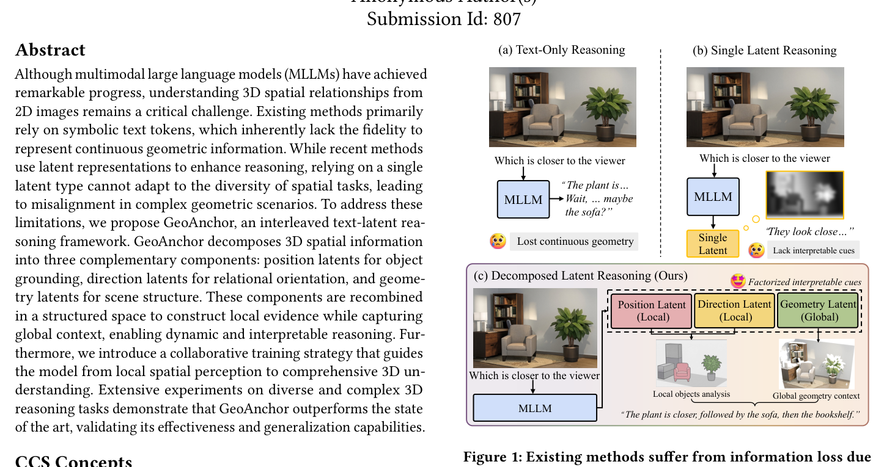
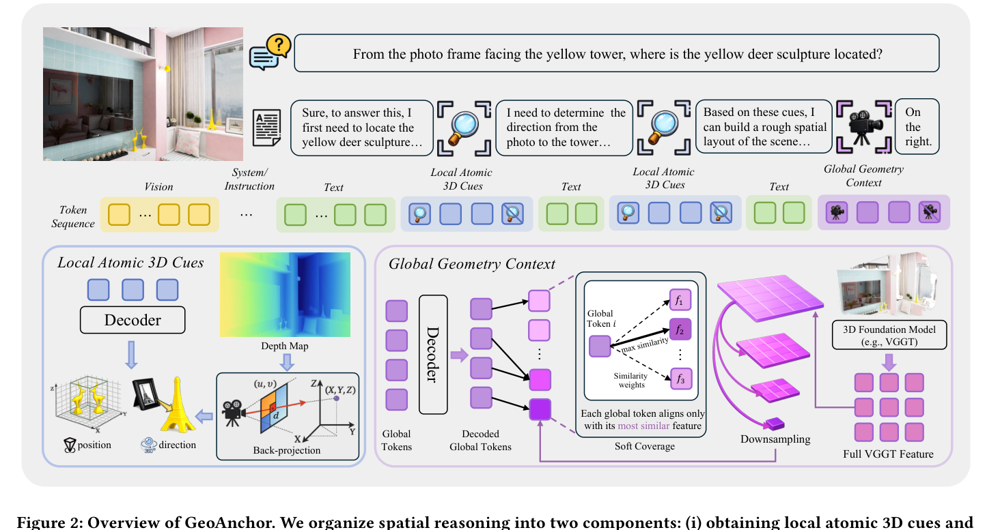
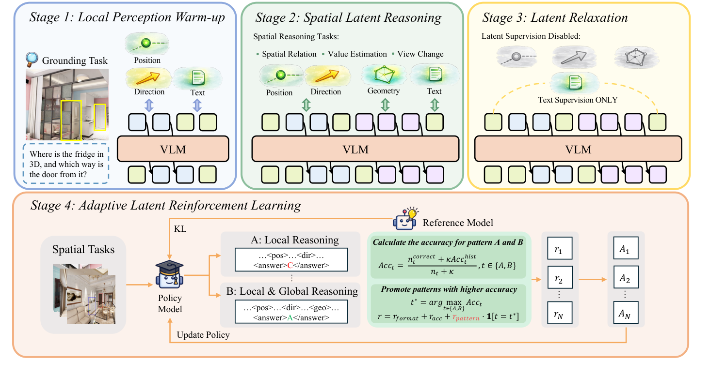

# GeoAnchor（全称：GeoAnchor: Collaborative Reasoning via Latent Decomposition for 3D Spatial Understanding）

> **一句话本质**：与其逼模型把「物体在 (1.2, 0.5, 3.4)」这种连续几何量写成文字再自己读回来，不如允许它推理中途「闭嘴想一想」——把 3D 信息存成三类有明确分工的连续潜变量（position 在哪、direction 朝哪、geometry 场景什么样），文本与潜变量交错推理，最后再开口给答案。

> 作者/机构：Anonymous Author(s)（ACM MM'26 双盲投稿，Submission Id: 807）｜ 年份：2026 ｜ 原文：Zotero 锚点（见下行） ｜ 入库：2026-09-14
> Zotero：citekey `2026`（条目无作者，BetterBibTeX 生成无效 citekey，如实登记）｜ [itemKey](zotero://select/items/GENIEJ93) `GENIEJ93` ｜ DOI：无（双盲投稿，原文 DOI 为占位符 XXXXXXX）

## 解决什么问题

MLLM 看单张 2D 图回答「冰箱在 3D 空间哪里」「相框到鹿雕塑哪个方向」这类问题时，两条旧路都痛：

1. **verbalization（言语化）损失**：生成文本 token 每步都从词表挑一个离散符号，连续几何量（坐标、方向、距离）写成文字必经「连续 → 离散」的量化压缩，精度没了。更糟的是推理全程在文本里走，模型用**语言先验**代替几何证据答题。证据有两件：Fig. 5 里 text CoT 生成最终答案时注意力 top token 是 `.` `>` `0` `answer` 这类标点和弱语义符号（各 ~6%），真正的空间信息排后面——离散化不只丢精度，还**稀释了空间语义在注意力里的权重**；Table 2 里 text CoT SFT 并不稳定优于 vanilla SFT（SPBench 52.9 持平、三基准平均 51.7 vs 51.8 反而略降）。
2. **单 latent 包打天下**：latent reasoning 先驱（Aurora、SSR，深度导向的单潜变量）一种潜变量覆盖不了多样空间任务——深度只回答「谁近谁远」，答不了「两点绝对距离」这种需要局部物体证据的问题；且单一全局 latent 把几何搅在一起，不可解释。Table 2 的硬数字：text CoT 60.1 → 单 latent 62.4（+2.3），单 latent → 分解 67.5（再 +5.1，SPAR 列）——**分解本身的贡献大于「用不用 latent」**。

本文之答：GeoAnchor，text–latent interleaved（文本-潜变量交错）框架，把 3D 信息分解为三类互补 latent + 四阶段协同训练，底座 Qwen3-VL-2B。

*图 1 费曼图解（论文 Figure 1）：(a) text-only 推理把连续几何说成文字，模型在「植物…沙发…」间摇摆；(b) 单 latent 只有一个黑盒向量，缺可解释线索；(c) GeoAnchor 分解为局部 position/direction（钉锚与箭头）加全局 geometry（轮廓图），每个因子可单独追溯。*

## 大白话讲解

### 类比一：不许念出声的心算

让人心算 3.7×4.9，不许纸笔、不许念叨：中间只能保留「大概 18 上下」的连续感觉，最后才报数。**text CoT 是强迫你每一步都把中间数说出口**（一说出口就被四舍五入、丢精度，还容易被「18 是个吉利数」这类语言直觉带偏）；**latent 推理允许中间步骤留在「感觉层面」，只在最后 verbalize 一次**。

### 类比二：陌生房间里的两个锚

有人问你「相框在鹿雕塑的哪个方向」：

- **纯文本 CoT**：强迫每步小声说「相框大概……在东边？」每说一次，模糊方位就被压成一个不精确的词。
- **GeoAnchor**：先在心里给两个东西各钉一个**锚**（position latent，名字里的 Anchor 由此而来），两个锚之间拉一根**箭头**（direction latent），脑中同时保留房间的**整体轮廓图**（geometry latent）；中间全在感觉层面处理，最后才说结论。

钉锚（局部证据）+ 轮廓图（全局上下文），这就是 latent decomposition 的全部直觉。

## 关键机制

*图 2 费曼图解（论文 Figure 2）：GeoAnchor 总览。文本段做语义规划；局部 token 编码物体位置与相互方向；全局 geometry token 经 soft coverage 对齐 VGGT 场景结构（每个全局 token 只认领与自己最相似的特征，8 个 token 合起来覆盖整张特征网格）。*

### ① latent token 与 projector：模型自己生成的连续思考

**latent token** 不从词表查表，而是模型自己生成的连续 hidden state：在推理轨迹的规定位置划出「潜变量区」，模型在区内每个内部步产出一个 hidden state，position/direction 各 2 步、geometry 8 步。整条轨迹形如 `O = t₁ ⊕ z₁ ⊕ … ⊕ z_{k-1} ⊕ t_k`（文本段与潜变量段交错）：文本负责语义规划，潜变量承载连续几何。

> 🔧 **最容易卡住的点①**：生成的 hidden state 属于模型**输出空间**，下一步要吃的 embedding 属于**输入空间**，两个空间的向量分布（流形）不同。直接把输出塞回输入会发生 **latent drift**（潜变量漂移），自回归一步错步步错。解法是 **projector**：`LayerNorm(h + MLP(LayerNorm(h)))`，带残差的轻量变换，把输出向量「翻译」回输入空间再喂回去。这是稳定性的命门，不是装饰。

### ② 三类分解与三种监督

- **position latent（局部）**：内部 hidden states 取平均 → 线性头 → 解码 3D 坐标 p̂ ∈ R³，用 **Smooth L1** 监督（小误差平方、大误差线性，比纯 L2 抗离群——GT 本身来自深度估计，有噪声）。
- **direction latent（局部）**：同结构解码方向向量 d̂ ∈ R³，用 **cosine similarity loss**（只管箭头朝向不管长度）。
- **geometry latent（全局）**：与 **VGGT**（前馈式 3D foundation model，单图出 3D 点云，最后一层特征天然编码场景全局结构）的末层特征对齐。

> 🔧 **最容易卡住的点②：为什么是 soft coverage 而不是 dense 对齐？** VGGT 特征是高分辨率网格（一大堆向量），geometry token 只有 8 个。严格一一配对等于强迫 8 个值班员每人包干固定一片工单，紧凑表示被撕碎。soft coverage 只要求「每个 VGGT 特征至少被某个 geometry token 认领」（覆盖项）+「8 个 token 工作量均衡」（平衡项，防**表示坍缩**——所有特征挤认同一个 token，容量退化成 1 个）。Table 5：soft coverage 三基准平均 61.7，dense 的 mean pooling 57.4 / adaptive pooling 59.3，设计不是过度工程。

### ③ 四阶段协同训练

| 阶段 | 数据 | Loss | 在干嘛 |
|------|------|------|--------|
| S1 局部感知热身 | 550k 3D grounding | NTP + L_pos + L_dir | 只练两类局部 token，给 latent 打「接地」底子（Fig. 5：无 S1 答案对 latent 注意力 ~6%，有 S1 涨到 ~15%） |
| S2 空间潜推理 | 105k 多样空间推理 | NTP + L_pos + L_dir + **L_geo** | 联合局部+全局，学按问题动态选用 token |
| S3 latent 松弛 | 同上 | **只留 NTP**（λ_l=λ_g=0） | 见卡点③ |
| S4 自适应模式 RL | 同上 | GRPO + pattern reward | 学「够用的局部就别拉全局」 |

*图 3 费曼图解（论文 Figure 3）：四阶段协同训练。S1 局部 grounding 热身 → S2 联合局部+全局推理 → S3 撤掉全部显式监督只留文本 loss（latent 弹回语言流形）→ S4 GRPO + pattern reward，按两种模式各自的历史准确率学会「够用的局部就别拉全局」。*

> 🔧 **最容易卡住的点③：Stage 3 撤掉全部几何监督，为什么性能反而大涨、又不会把几何忘光？** S2 的强监督把 latent 拉向「几何流形」，离「语言流形」太远，后续文本推理受阻；S3 撤监督只留文本 loss，让 latent 弹回两个世界的兼容位置。不会忘光，因为几何信息已写进权重，文本 loss 只淘汰对答题无用的部分——有用的 latent 内容因贡献文本 loss 被梯度保留。双证据：Fig. 4 显示 S3 的收益远超「把 S2 多训一轮」的对照（ViewSpatial 46.3 vs 36.8/40.2），增益来自**撤监督这个动作本身**；Fig. 7 的 t-SNE 显示训后 global token 恰落在 VGGT 特征与 text token 之间——两头都沾。

### ④ Stage 4：GRPO + pattern reward

前三阶段每个问题都固定调用 local+global 全套，但「谁近谁远」根本不需要全局信息。S4 用 **GRPO**（Group Relative Policy Optimization：PPO 家族变体，每题采样一组回答、组内相对优势当 baseline，省掉 value 网络）做 RL。奖励 = 格式 + 准确率 + **pattern reward**：维护 local-only 与 local+global 两种模式各自的 EMA 历史准确率（κ 平滑），谁历史更准，选谁就额外 +0.5。本质是 **bandit 式模式选择**：奖励「用对模式」而不是「答对」。Table 4：无 pattern reward 的裸 GRPO 在分布外 ViewSpatial 上掉点（46.2 vs 46.3），加了才全面涨——固定模式强行拉全局信息反而引入冗余干扰。

### ⑤ 数据构建（监督信号的来源）

S1 数据：ScanNet 采 10k 场景 → Qwen3-VL-32B 认物体（≤5 个 + 描述 + 2D bbox）→ **Depth Anything v3** 估深度和位姿 → 反投影得 3D 坐标，坐标差得方向 → 550k 样本。S2 数据：SPAR 采 100k + SpatialLadder-26k 掺 5k = 105k，每图另提 VGGT 特征做全局监督。**注意：局部监督是伪标签（单目深度估计，非真值），且论文没解释 ScanNet 自带传感器深度为何不用**（猜测是为对 SPAR 的 ScanNet++/Structured3D 统一 pipeline，或与推理时不依赖深度输入保持一致，但这是推测不是论文说法）。

## 结果与代价

**主结果**（Table 1，2B 参数）：SPAR-Bench 32.4→68.4（+36.0）、SPBench 52.9→69.7（+16.8）、ViewSpatial 36.3→47.0（+10.7，两项子任务全场第一）；超 GPT-4o、Gemini-2.5-Flash 与 8B~38B 开源模型，也超全部 specialized 模型。

**要打折的地方**：

1. **In-domain 同源**：训练采 SPAR 100k、评测 SPAR-Bench；训练掺 SpatialLadder-26k、评测 SPBench。作者自己承认前两个是 in-domain。+36.0 的头条数字有数据同源加成，跨域 ViewSpatial +10.7 才是更干净的泛化证据。
2. **绝对距离是短板**：SPBench Abs. 58.7，远低于 SpatialLadder 的 81.6——连续量进了 latent ≠ 绝对数值估计解决了。
3. **局部监督是伪标签**（见机制⑤）。
4. **原文数字瑕疵**：Table 5 的 Linear Interpolation 行三列 53.7/60.2/37.3 均值应为 50.4，表中 avg 写 37.8，疑为笔误，引用以三列原始数为准；Intro「超 GPT-4o 18.0%」按 Table 1 三基准均差算只有 16.0，口径对不上，引用直接用表格数。
5. **复现信息缺口**：VGGT 是否冻结、backbone 是否全参微调、优化器、硬件、代码开源与否均未报告。近似复现可行，精确复现困难。

## AI 预读备注

来自 Zotero AI Butler 子笔记，作为费曼 Phase 1 预读底稿，校验后与最终讲解**无重大差异**：

- 摘要笔记（itemKey `QLX4CM58`，task=summary，deepseek-v4.1-flash）：方法/公式/超参/实验/消融全量分析，含复现性评估（中）与陷阱清单（latent drift、λ_g 过大、数据污染等）。
- 表格笔记（itemKey `U6UXJRXK`，task=table，gemini-3.8-flash）：结构化字段速查。

在预读之上人工补校的四点（AI 笔记漏检）：Table 5 avg 数字笔误；Intro「超 GPT-4o 18.0%」口径对不上；ScanNet 有原生传感器深度却用估计值的未解释疑问；GRPO pattern reward 的「奖励用对模式而非答对」本质。

## 我的复述

> 费曼检验时的原话，保留原味不润色。

**Q1（坐标写文字损失了什么）**：

> 坐标转文字相当于是连续信息变离散信息，损失了连续空间信息以及会稀释空间语义在注意力中的权重；论文统计了 text cot 模式下生成最终答案时，注意力 top token 是标点和弱语义符号，真正的空间信息 token 反而排后面。

**Q2（soft coverage vs dense、去平衡项会怎样）**：

> dense alignment 等于强迫 8 个人每人认领固定的一片任务，紧凑表示会被撕碎。去掉平衡项的话可能某些 geometry 会分配过多其他的会分配过少的 token，导致不均衡浪费了有效表示空间。

**Q3（Stage 3 为什么不会忘光）**：

> 因为已经把几何知识学到模型权重里了。这一步主要是修复经过 stage 2 后模型靠近几何流型而远离文本流型，把它拉回去。

**Q4（vs Video-o3 路线取舍）**：

> video-o3 把中间推理外化到外部工具，代价是需要跨出模型边界且依赖工具质量，geoanchor 把中间推理内化成潜变量，保连续性代价是中间过程不可读。我会选择 video-o3 的路线，因为 o3 的外化工具调用可见可审核并且工具可以更换适合动态场景。

## 卡壳点与解答

**Q：verbalization 除了丢精度、稀释注意力权重，还损失了什么？**（Q1 补齐）
A：**语言先验主导**——推理全程在文本里走，模型用语言直觉代替几何证据答题。表格证据：text CoT SFT 不稳定优于 vanilla SFT（三基准平均 51.7 vs 51.8 略降）。

**Q：去掉 soft coverage 平衡项的极端形态是什么？**（Q2 点透）
A：不是「有的多有的少」的一般不均衡，而是**表示坍缩**：所有 VGGT 特征挤着认领同一个 geometry token，其余 7 个闲置，8 个 token 的容量退化成 1 个。平衡项（本质是分配均匀度的正则）防的就是这个病。

**Q：Stage 3 为什么不会把几何「忘光」？机制层怎么讲？**（Q3 补齐）
A：几何已在权重里；文本 loss 只淘汰对答题无用的 latent 内容（留着它们不降 loss、梯度不保留），有用的部分因贡献文本 loss 被梯度留下。证据双件套：Fig. 4（S3 远超「多训一轮 S2」对照）+ Fig. 7（t-SNE 上 global token 落在 VGGT 与 text 之间）。

**Q：Video-o3 vs GeoAnchor 还有一层更深的分叉是什么？**（Q4 加深）
A：**工具演化成本**——Video-o3 的工具是可插拔的（换更好的裁剪/生成工具不用重训模型），GeoAnchor 的「工具」（VGGT、Depth Anything）是训练时烧进权重的，换几何教师等于重训。GeoAnchor 论文自己列的适用边界（静态图像、室内场景）也支持动态场景选 Video-o3 路线。

## 还没搞懂

_无_——四道检验题全部通过（两处点透、两处补半句即收敛），无残留漏洞。论文自身的未解释疑问（ScanNet 有原生传感器深度为何用 Depth Anything v3 估计值做监督）记录在「结果与代价」第 3 条，属论文边界而非理解漏洞，不进 questions.md。

## 关联

- [Video-o3](2026-video-o3.md) — **同打破「纯文本 CoT」但方向相反**：Video-o3 把中间推理**外化**成工具调用（裁剪放大，可见可读可人工审计，代价是跨模型边界 + 依赖工具质量 + 工具可插拔），GeoAnchor 把中间推理**内化**成潜变量（保连续性、零外部依赖，代价是中间过程不可读、几何教师烧进权重换教师等于重训）。本文 Related Works 2.2 自己把这两条路线对立。一条换可解释性、一条换保真度；适用分界：动态场景/需人工审计选 o3 路线，静态图/连续几何精度选 latent 路线。
- [PPO](2017-ppo.md) — Stage 4 的 GRPO 是 PPO 家族的组相对变体（组内均值当 baseline、去 value 网络），本文是 PPO 页「下游应用」的又一锚点（另一处见 Video-o3 的 VTGR）。
- [LocateAnything](2026-locateanything.md) — 同一问题「坐标该不该言语化」在输出侧的另一面：LocateAnything 仍把框坐标写成离散 token 块（整块并行解码换效率），GeoAnchor 干脆让几何量不经过词表进连续潜空间（换保真度）。两条路线都认为逐 token 蹦坐标不行，分歧在留在词表里还是离开词表。
- 未来入库钩子：① 本文是库内第一篇 **3D 空间推理**论文，开新专题线；② 单 latent 先驱 Aurora（CVPR'25）/ SSR 入库时回链本页对照「分解 vs 单潜变量」；③ Spatial-MLLM（NeurIPS'25，frozen VGGT 当输入侧编码器）入库时对照「VGGT 当输入 vs 当监督教师」；④ SpatialLadder（ICLR'26，课程式 SFT，Abs. 距离 81.6 远超本文）入库时补「绝对距离为何 text 路线反强」这问。
