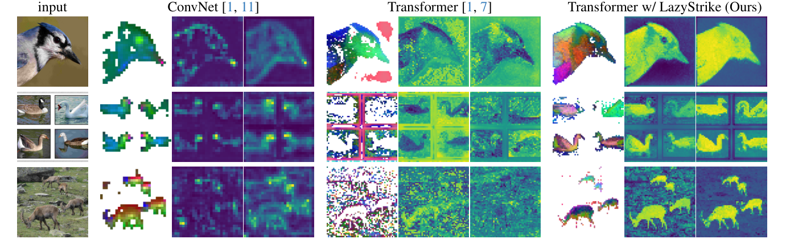
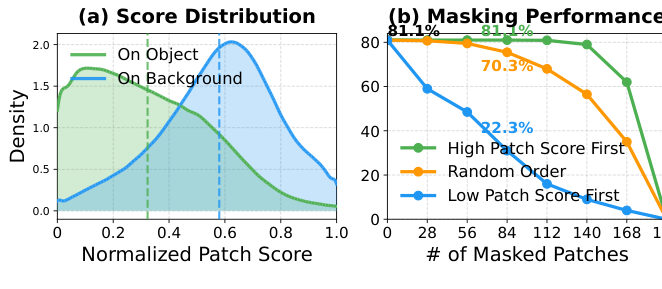
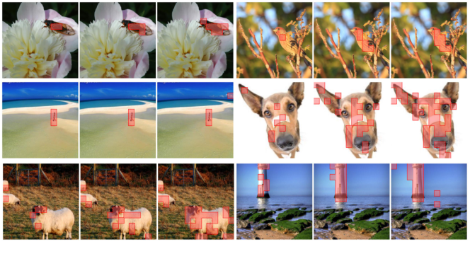

# LaSt-ViT（全称：Vision Transformers Need More Than Registers）

> **一句话本质**：LaSt-ViT 按特征通道的频域稳定性选择 patch 来构成 CLS，减轻背景聚合造成的定位偏差。

> 作者/机构：港大 + 中山大学（Shi, Yu, Yang）｜ 年份：2026（CVPR 2026）｜ 原文：Zotero 锚点（见下行） ｜ 入库：2026-08-17

> Zotero：[citekey](zotero://select/items/@shiVisionTransformersNeed2026) `shiVisionTransformersNeed2026` ｜ [itemKey](zotero://select/items/XNL46XIR) `XNL46XIR` ｜ [DOI](https://doi.org/10.48550/arXiv.2602.22394) `10.48550/arXiv.2602.22394`

## 五分钟重建

  
图像级分类做对，不保证 patch 特征能定位前景。论文提出 lazy aggregation 假说：全局注意力会把语义传播到背景，CLS 因而可能靠背景聚合完成分类。

  <ol class="guide-path" aria-label="机制路径">
    <li><h3>沿通道做滤波</h3>
对每个 patch 的特征向量做 FFT、低通滤波和 IFFT。这里的频率沿特征通道，不沿图片的横纵坐标。
</li>
    <li><h3>计算稳定性</h3>
比较滤波前后的特征，用论文的稳定性评分选择候选 patch。它是前景的经验线索，不是前景真值。
</li>
    <li><h3>逐通道选 Top-K</h3>
每个通道独立选分数最高的 K 个 patch，取原特征均值，组成 CLS。不同通道可以选不同区域。
</li>
  </ol>
  
<strong>具体例子（教学假设）</strong>：四个 patch 有两个通道。通道一选 patch 1、3，通道二选 patch 2、3。最终 CLS 的两个分量分别来自两组均值，而不是选一个完整 patch 充当 CLS。

  
<strong>边界</strong>：Top-K 的离散索引本身不可微；选中的特征值可收到梯度。频域稳定不保证就是前景，K 过小也会丢信息。Register 在该实验中未修好定位问题，不等于所有场景都无用。

  

    <h3>先预测，再展开答案</h3>
    
若 K 等于全部 patch 数，选择性聚合还保留筛选作用吗？

    

查看机制解释

不保留。每个通道都平均全部 patch，退化为全局平均池化。FFT 和评分虽可计算，但已不能改变参与聚合的 patch 集合。

    
关掉提示后解释：为什么“图像看起来平滑”不能直接代替这里的“通道频域稳定”？

  

  
2026-10-04：讲解与练习待试用，本次未进行理解检验；此处不记录复测通过。

## 论文图解

*图 1 费曼图解（论文 Figure 1）：同一图像下比较 patch score 与特征可视化。普通 ViT 的高分区域可能落在背景，加入 LazyStrike 后更贴近物体。颜色反映表示或分数，不等于像素级真值。*

*图 2 费曼图解（论文 Figure 2）：左图比较前景与背景的 score 分布；右图依次遮掉不同分数的 patch。遮掉高分 patch 对分类影响较小，提醒我们 CLS 相似度高不等于该输入位置是分类证据。*

*图 5 费曼图解（论文 Figure 5）：红框来自各 patch 在不同通道被选中的次数，三列使用不同票数阈值。它让我们看到选择性聚合更常选物体区域；方法本身的 FFT 与评分步骤见上方机制路径。*

## 解决什么问题

ViT 当通用特征提取器时，密集预测任务（分割、检测、对象发现）不如 ConvNet——CLS token 关注背景而非前景，patch 特征与语义错位。三种旧解法各有死穴：

| 路线 | 代表 | 做什么 | 痛在哪 |
|------|------|--------|--------|
| **Register tokens** | Darcet et al. | 加额外 token 吸走高范数特征 | **治标不治本**：高范数是症状非根因，PiB 没升反降（42.7→41.5） |
| **事后修正** | MaskCLIP、CLIPSelf、SCLIP | 改最后层注意力或后训练对齐 | 不从根源阻止，且一种方法只适用一种监督范式 |
| **削弱全局依赖** | 窗口注意力 | 限制注意力范围 | **拆东补西**：PiB 升了但分类精度掉 ~8% |

更关键的是没人搞清楚 artifact 到底为什么产生。LaSt-ViT 先诊断再开药。

> 🔧 **最容易卡住的点①**：为什么 Register tokens 没用？
> Register 把高范数 token 挪走了，看起来"artifact 消失了"。但 Tab.1 实测：加 Register 后 PiB 从 42.7 **掉到** 41.5（更差）。高范数只是 lazy aggregation 的**晚期症状**，不是病因——病因是 CLS 往背景跑，你把高范数 token 挪走，CLS 照样往背景跑。"ViT needs more than registers"——标题就是在说这个。

## 大白话讲解

### 核心发现：懒惰聚合假说

两个诊断工具：
- **Patch Score** = CLS token 与各 patch 的余弦相似度——看 CLS 到底"看"哪。
- **Point-in-Box (PiB)** = 最高 patch score 落在前景框内的比例——量化 artifact 严重程度。

发现：ViT 的 CLS token 大量关注**背景** patch（PiB 只有 42.7%，ConvNet 68.4%），而且：
1. **从一开始就有**：训练初期 PiB 就低，全程不改善（不是后期才崩的）。
2. **去掉高分 patch 不影响分类**：遮掉 score 最高的 50% patch，ImageNet 精度几乎不掉甚至略升——该遮挡实验说明高分位置不等于分类所必需的输入证据；不能据此证明每个背景 patch 的因果贡献都为零。

### 类比：偷懒的考官

想象考试只看总分不看过过程：
- **ConvNet**：每个学生（感受野）只能看局部，必须认真看前景才能答对——笨但靠谱。
- **ViT**：所有学生能看全图，发现"背景占大部分、背景跟类别有统计相关"，于是集体抄背景答案——总分很高但你问具体哪是猫，全指向背景。

LaSt-ViT：**强制 CLS 只从"靠谱"的 patch 取信息**——用频域稳定性判断哪些是前景。

## 关键机制

### ① 懒惰聚合根因 = 粗粒度监督 + 全局注意力

- **粗粒度监督**（驱动1）：只有图像级标签 → 没有空间指导告诉模型"前景在哪"。自然图背景 patch 远多于前景 → 模型发现"靠背景投票"就能最小化分类 loss。
- **全局注意力**（驱动2）：给前景语义扩散到背景的通道。验证：把全局注意力换成窗口注意力，PiB 升（50.1→59.8）但分类掉（-8%），证明全局注意力是帮凶，但简单砍掉得不偿失。
- 这是论文提出的根因假说。相关消融支持粗粒度监督与全局依赖共同影响该现象，未证明它们是所有 artifact 的必要且充分条件。

### ② 频域稳定性评分

直觉：前景在深层**通道维**上语义一致（低频主导），背景混杂多结构（频谱丰富、高频多）。

- 对每个 patch 的 D 维特征做 1D FFT（沿通道维）→ 高斯低通滤波 → IFFT，得滤波后特征 $\hat{x}$。
- 稳定性分数：$S_{i,j} = \frac{\hat{x}[i,j]}{|\hat{x}[i,j] - x[i,j]| + \varepsilon}$。
- 分数高 = 滤波后变化小 = 低频主导 = 大概率前景。

> 🔧 **最容易卡住的点②**：为什么"频域稳定"能区分前景背景？
> 不是空间连续性，而是**通道维频域特性**。前景物体在深层特征的通道维度上语义一致（同一类内的颜色/纹理/形状在通道维是低频的）；背景包含多种混杂结构，频谱丰富，低通滤波后能量损失大 → 分数低。

### ③ 通道级 Top-K 选择性聚合

对每个通道 $j$ 独立选稳定性最高的 K 个 patch，取均值作为该通道的 CLS 值：
$$\mathcal{Q}_{CLS}[j] = \frac{1}{K}\sum_{i \in \mathcal{I}_K(j)} x_{patch}[i,j]$$

不同通道可选不同 patch 组合——不同语义维度（颜色/纹理/形状）的前景区域可能不同。

### ④ 无额外参数、无额外损失

- 聚合模块**零可学习参数**（FFT 和 Top-K 都是确定性操作）。
- 不改损失函数——原有分类/对比/DINO 损失不变，只是 CLS 的构成方式变了。
- Top-K 的离散选择索引不可微；聚合使用的已选特征值可传梯度。未选值在这条聚合路径上没有直接梯度，不代表网络其他路径也没有梯度。

## 结果与代价

- **PiB 大幅提升**：全监督 42.7→55.1（+12.4）；DINO 44.5→69.7（+25.2）；CLIP 39.8→50.1（+10.3）。
- **零样本分割暴涨**：CLIP ViT-L VOC 17.1→72.4（+55.3）；EVA-CLIP ViT-B COCO-Obj 15.0→26.2。
- **12 个基准一致提升**，且分类精度不掉（甚至略升）。
- **涌现分割**：全监督 ViT 粗分割 mIoU 22.3→32.8，接近 DINO 自监督的 47.7——涌现属性不再自监督专属。
- **代价/局限**：
  - K 值敏感（过大退化成平均池化、lazy aggregation 回来；过小信息不足；推荐约 50% patch 数）。
  - 无明确前景的图（风景、群体）稳定性准则可能选均匀背景。
  - 前景纹理极复杂时频域稳定性可能失效。

## AI 预读备注

来自 Zotero AI Butler 子笔记（deepseek-v4-pro 生成），作为费曼 Phase 1 预读底稿，校验后与最终讲解**无重大差异**。AI 笔记更细处可回查原文：

- 摘要笔记（itemKey `VRCS23SC`，task=summary）：含完整方法动机表（四类旧方法缺陷）、逐公式拆解（式4-8）、LazyStrikeAggregator 伪代码、K 值消融全表、训练超参、复现步骤。
- 表格笔记（itemKey `PX2ZD5PZ`，task=table）：结构化字段速查（研究问题/方法/发现/创新点）。

## 我的复述

> 费曼检验时的原话，保留原味不润色。

**Q1（懒惰聚合 + 两驱动 + Register 为何没用）**：

> 懒惰聚合指的是传统ViT训完之后模型倾向于通过背景 token 信息来猜测前景信息；原因1是图片中背景 patch 占比明显多于前景，导致 vit 倾向于通过背景统计信息去猜测答案而不是真正看前景；原因2我想不起来了；register tokens 方法只是把高范数特征吸收到额外 token，但是高范数不是根因，根因是前述的 ViT 懒惰问题。

**Q2（频域稳定性 + K=全）**：

> D 维特征做傅立叶变换，然后过低通滤波器后反傅立叶变换回来，计算这个值与变换前后差值的绝对值作为频域稳定性评分。同类别的对象在特征图中是连续、接近的，所以低通滤波后变化小。把 K 设成全部 patch 数，相当于全局池化了，信息会丢失。

**Q3（GenLIP vs LaSt-ViT 对比）**：

> genlip 是说在生成式学习中，视觉信息会倾向于汇集到少数几个 token，大量 token的表达能力会被浪费，它的做法是增加一个门控机制，当出现汇集现象是通过门控来抑制；last-vit 是在对比学习范式中发现 ViT 存在视觉懒惰现象，会倾向于通过背景 patch 对应的 token 信息来解题，前景没有得到应有的关注，这会导致模型在细粒度感知任务上比较差，last-vit 的解法是计算特征图的变化，认为变化快的背景变化慢的是前景，强制让模型关注前景。

## 卡壳点与解答

**Q：懒惰聚合的两个驱动因素是什么？**（Q1 漏掉的半问）
A：驱动1 = **粗粒度监督**（只有图像级标签，没有 patch 级空间指导）；驱动2 = **全局注意力**（给前景语义扩散到背景的通道）。它们是论文假说中的两个驱动，不能当作所有模型的必要且充分条件。验证：窗口注意力限制全局依赖后 PiB 升但分类掉 8%，证明全局注意力是帮凶。

**Q：Register tokens 为什么没用？靠什么实验证据推翻？**（Q1 漏掉的半问）
A：Tab.1 实测——加 Register 后 PiB 从 42.7 **掉到** 41.5（更差，不是"没提升"而是"反降"）。高范数只是 lazy aggregation 的**晚期症状**，Register 把症状挪走但病因（CLS 往背景跑）还在。

**Q：频域稳定性区分前景背景的真正机制是什么？**（Q2 精化）
A：不是"空间连续性"，而是**通道维频域特性**——前景物体在深层特征的通道维度上语义一致（低频主导），低通滤波后变化小；背景混杂多种结构（频谱丰富、高频多），低通后能量损失大。是深层特征的统计规律。

> （2026-08-24 复测补充，复述时自生成的类比，比原文表述更直观）反向论证：空间维的低频=墙壁等平滑区域，恰恰是背景，不能当前景判据；通道维低频的直观图像 ≈ **语义分割的输出图**——同一类别同一颜色，同类语义在通道维上变化小。

**Q：LaSt-ViT 适用于什么预训练范式？**（Q3 纠偏）
A：用户答"对比学习"范围窄了。LaSt-ViT **跨三种**判别式预训练范式通用：标签监督（分类）、文本监督（CLIP 对比）、自监督（DINO 自蒸馏）。对比学习只是其中一种。准确叫法是"判别式预训练"（对应 GenLIP 的"生成式"）。

**Q：两者的解法能否组合？**（Q3 漏掉的半问）
A：组合设想（待验证），本库没有联合实验。Gated Attention 管"信息**分布**"（防少数 token 吸走），LaSt-ViT 管"CLS **聚合**"（逼 CLS 从前景取），作用在 ViT 不同环节，正交可叠加。

## 还没搞懂

（四道检验题都已补齐，无残留漏洞。若日后复测发现新问题，再回填此处并同步 `questions.md`。）

## 关联

- [GenLIP](2026-genlip.md) — **直接对接**。同为 ViT attention artifact，机制和阶段不同：GenLIP 在**生成式**预训练发现 attention sink（少数 token 吸走信息）用 Gated Attention 压制；LaSt-ViT 在**判别式**预训练发现 lazy aggregation（背景抢 CLS）用频域选择性聚合纠正。可能的组合（待验证）：Gated Attention 管信息分布，LaSt-ViT 管 CLS 聚合。
- [VideoChat3](2026-videochat3.md) — 间接相关。可研究把该聚合用于 VideoChat3 的 I3D-ViT；效果与接法尚待验证。
- 同领域可对比：Register tokens（Darcet et al.，治标不治本）、MaskCLIP/CLIPSelf/SCLIP（事后修正）、窗口注意力（拆东补西）、LOST（对象发现 baseline）。
- 待建概念页：`ViT` / `CLS token` / `attention sink` / `lazy aggregation` / `Patch Score` / `Point-in-Box` / `frequency domain analysis` / `FFT`
