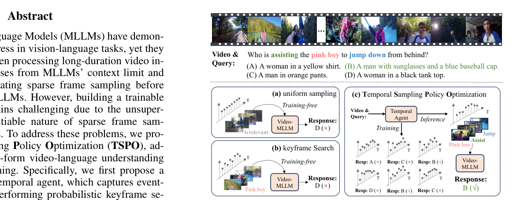
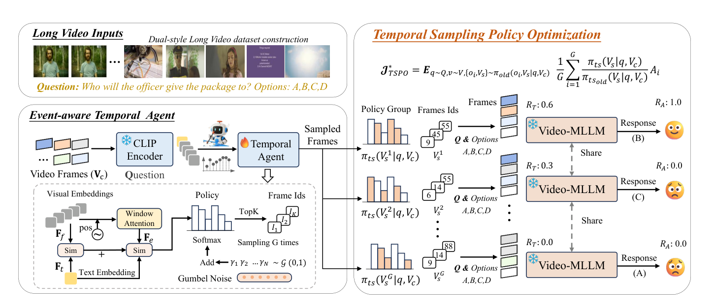
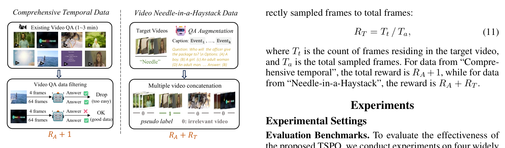

# TSPO（全称：TSPO: Temporal Sampling Policy Optimization for Long-form Video Language Understanding）

> **一句话本质**：让长视频模型用「答题是否正确」反过来教会一个轻量 temporal agent 选择 query 相关的关键帧，再把「选帧」与「生成答案」放进同一个联合策略里用 GRPO 式强化学习优化。
>
> 作者/机构：Canhui Tang、Zifan Han、Hongbo Sun、Sanping Zhou、Xuchong Zhang、Xin Wei、Ye Yuan、Huayu Zhang、Jinglin Xu、Hao Sun（西安交通大学、中国电信 TeleAI、北京科技大学）｜年份：2026（arXiv 首发 2025）｜原文：Zotero 锚点（见下行）｜入库：2026-09-14
> Zotero：[citekey](zotero://select/items/@tangTSPOTemporalSampling2025) `tangTSPOTemporalSampling2025` ｜ [itemKey](zotero://select/items/QXMPGWGR) `QXMPGWGR` ｜ [DOI](https://doi.org/10.48550/arXiv.2508.04369) `10.48550/arXiv.2508.04369`

## 解决什么问题

长视频不能把所有帧都交给 Video-MLLM：上下文长度和计算成本都会爆炸，所以现有方法通常先稀疏采样，例如均匀抽取 64 帧。问题是，真正能回答 query 的证据可能只出现在很短的时间段里，均匀采样会直接漏掉它。

要学习一个更聪明的采样器又有两个根本障碍：

1. 普通视频 QA 数据通常只有问题和答案，没有「正确帧位于哪一秒」的帧级监督。
2. 选帧是离散的 Top-K 子集选择，不能直接把普通 SFT 的梯度穿过帧索引反向传播。

TSPO 的目标是：在不训练帧级标注、也不必重新训练整个 Video-MLLM 的情况下，让采样器学会根据 query 选择少量、真正有用的关键帧。

它与 [Video-o3](2026-video-o3.md) 都处理「稀疏证据被均匀采样淹没」，但控制方式不同：TSPO 训练一个 query-aware temporal agent，一次性选帧后再回答；Video-o3 则在拿到问题后，边推理边多轮调用工具回看和裁剪视频。

*图 1 费曼图解（论文 Figure 1）：三类采样方法对比。均匀采样按固定间隔抽帧、与问题无关（关键瞬间可能恰好漏掉）；training-free 检索用现成相似度找帧但不会因答错而改进；TSPO 把「选哪些帧」当策略，用最终答案对错反向训练采样器。*

## 大白话讲解

### 先想象一次错误的监控回放

你要回答「短发女生进博物馆后最先看了什么」。如果 10 分钟视频只均匀抽 64 帧，可能刚好没有抽到她第一次进入展厅的片段。后面的 MLLM 再强，也不能从没有看到的画面里恢复答案。

TSPO 先用 1 FPS 的方式得到候选帧，再根据问题给候选帧打分。它不只看「这一帧里有没有短发女生」，还用局部窗口注意力看「这几帧合起来是不是一个进入博物馆的事件」。选出的帧交给一个冻结的 Video-MLLM 回答。

训练时，同一个问题会随机产生多组候选帧。哪一组让 MLLM 答对，哪一组的采样策略就得到更高的组内相对奖励。这样，答案本身就成了采样器的弱监督，不需要人工逐帧标注。

但「答对」只说明一组帧足够，不说明其中每一帧都不可替代。一组帧可能很精简，另一组可能包含大量无关帧，却都能让 MLLM 答对。为此，论文另外构造了长视频 needle-in-a-haystack 数据，知道目标视频片段在哪里，并用选中帧落入目标片段的比例提供更细的定位信号。

### 类比：给侦探配一个会学习的取证助手

- 均匀采样：助手每隔固定时间拍一张照片，不管问题问什么。
- training-free 搜索：助手用现成相似度规则找照片，但不会因为最后答错而改变策略。
- TSPO：助手每次提出几套取证方案，侦探根据照片回答问题；答对且照片集中在目标事件上的方案得到更高评价，助手逐步学会「什么问题该去视频哪里取证」。

最容易卡住的点是：论文说「端到端」，并不表示整个 MLLM 都被训练。端到端指的是最终语言任务奖励能够优化选帧策略；实际训练中 CLIP 和 Video-MLLM 都冻结，只更新约 3.5M 个 temporal agent 参数。

## 关键机制

*图 2 费曼图解（论文 Figure 2）：TSPO 框架。长视频按 1 FPS 出候选帧，temporal agent 结合帧级与事件级相似度打分，Gumbel Top-K 采样多组关键帧分别交给冻结 MLLM 回答；组内按答案对错与目标片段命中比例算相对奖励，只更新约 3.5M 参数的采样策略。*

### 1. Event-aware Temporal Agent

对长视频先按 1 FPS 得到候选帧 $V_c$。冻结的 CLIP-Large 分别提取帧特征 $F_f$ 和 query 特征 $F_t$。Temporal Agent 对帧特征施加长度为 12 的局部窗口注意力、正弦位置编码和 MLP，得到带局部事件上下文的 $F_e$。

它把两种相似度相加：

$$S = \operatorname{Sim}_{event}(F_e,F_t) + \operatorname{Sim}_{frame}(F_f,F_t)$$

帧级相似度更像是在问「画面里有没有 query 提到的人或物」，事件级相似度则尝试回答「这段局部时间上下文是否对应 query 描述的事件关系」。

### 2. Gumbel-Softmax Top-K 选帧

训练时在分数上加入 Gumbel 噪声：

$$P,I = \operatorname{TopK}\left(\operatorname{Softmax}(S/\tau + \gamma)\right), \quad \gamma \sim \operatorname{Gumbel}(0,1)$$

其中 $I$ 是被选中的帧索引，$P$ 是相应概率。噪声让训练可以探索不同的帧组合；温度 $	au$ 从 0.025 退火到 0.01，代表从「多探索」逐渐转向「更确定地选高分帧」。推理时去掉 Gumbel 噪声，得到确定性的选帧结果。

### 3. 把选帧和回答建模成联合决策

对一个问题 $q$，训练时采样 $G$ 组关键帧，分别送入冻结的 LLaVA-Video-7B，得到 $G$ 个回答。联合策略可以写成：

$$\pi(o,V_s\mid q,V_c)=\pi_l(o\mid q,V_s,V_c)\,\pi_{ts}(V_s\mid q,V_c)$$

这比普通 GRPO 多了一层「选哪些视觉输入」的动作。由于语言模型冻结，论文令语言策略的新旧概率比为 1，最终只用组内相对优势更新 temporal sampling policy：

$$J^*_{tspo} \propto \sum_i \frac{\pi_{ts}(V_{s_i}\mid q,V_c)}{\pi_{ts,old}(V_{s_i}\mid q,V_c)}A_i$$

因此，TSPO 不是先固定帧再优化语言模型，而是让语言任务的奖励反过来筛选和塑造帧选择策略。

### 4. 双风格数据与双奖励

*图 3 费曼图解（论文 Figure 4）：双风格训练数据。Comprehensive Temporal Data 过滤过易/过难样本、保留需要多帧联合理解的问答；Video Needle-in-a-Haystack 把目标片段与无关视频拼接打乱，保留目标片段伪标签，为 R_T（选中帧落入目标片段的比例）提供粗粒度定位信号。*

论文构造 TSPO-10K：

- **Comprehensive Temporal Data**：从已有 1 到 3 分钟视频 QA 中过滤掉 4 帧就能答对的过易样本，以及 64 帧仍答不出的过难样本，保留需要多帧联合理解的样本。
- **Video Needle-in-a-Haystack Data**：把目标视频与无关视频按片段拼接、打乱，形成 10 到 60 分钟的长视频，并保留目标片段的伪标签，用来训练长程定位。

答案奖励为：

$$R_A=\mathbb{1}(\hat y=y)$$

needle 数据额外使用时间定位奖励：

$$R_T=\frac{T_t}{T_a}$$

$T_t$ 是选中且落在目标视频片段内的帧数，$T_a$ 是总选帧数。它更接近「选中帧的目标片段 precision」，不是完整的 IoU，也不是精确事件边界标注。

Comprehensive 数据的总奖励是 $R_A+1$，needle 数据的总奖励是 $R_A+R_T$。前者让采样器学会服务于最终回答，后者进一步区分「同样答对但冗余更多」和「答对且集中命中目标片段」的采样方案。

### 5. 为什么冻结 MLLM

论文依赖一个前提：LLaVA-Video 已经用均匀 32 帧做过 SFT，模型本身有足够强的语言和视频问答能力；只要选到正确关键帧，它就有机会答对。

冻结 MLLM 有三个直接好处：保留语言模型的强先验，避免 RL 同时改变回答器和采样器导致奖励难以归因，并把训练显存与可学习参数压到很小。代价是，如果 MLLM 即使看到了正确帧也答不对，$R_A$ 就不再是可靠的选帧监督。

## 结果与代价

在 LLaVA-Video-7B 的 64 帧复现设置下，TSPO 相比均匀采样基线的结果为：

| 基准 | 均匀采样 | TSPO | 绝对提升 |
|---|---:|---:|---:|
| LongVideoBench | 58.9 | 63.9 | +5.0 |
| MLVU | 70.3 | 76.3 | +6.0 |
| Video-MME | 53.6 | 54.7 | +1.1 |
| LVBench | 40.2 | 45.3 | +5.1 |

Video-MME 提升较小，因为它更强调整体视频理解，而 TSPO 最擅长的是围绕 query 定位局部关键事件。这个结果是方法边界，不是所有长视频问题都适合压缩成 query 相关的少数帧。

同一个训练好的 temporal agent 不需要额外训练，就能迁移到 Qwen2VL、Qwen2.5-VL 和 LLaVA-Video-72B。推理时 128 个候选帧选 32 帧，可以把视觉 token 从 13,440 降到 6,720，LLM 时间从 2.7s 降到 1.3s；关键帧提取时间约 1.1s，明显低于 CoS 的 28.4s。

主要代价和限制：

- 需要一个已经足够强的冻结 Video-MLLM，弱回答器会产生噪声奖励。
- 时间定位奖励依赖 needle 数据的目标片段伪标签，监督是粗粒度的。
- 选择题式训练数据更容易定义规则奖励，开放式回答的奖励设计没有被充分解决。
- agent 只能从 1 FPS 候选中选择；候选阶段已经漏掉的瞬间，后续策略无法挽回。
- 训练阶段每个样本要让冻结 MLLM 处理多组帧，推理便宜，训练成本仍不低。
- 论文展示了跨模型迁移，但没有验证它与 Video-o3、VideoChat3 等系统组合后的控制流和计算预算。

## AI 预读备注

Zotero 中有 AI Butler 预读底稿：摘要笔记 itemKey `5VABB854`（task=summary，provider/model：zhipu / glm-5.3）和表格笔记 itemKey `N822M3VZ`（task=table，provider/model：zhipu / glm-5.3）。预读正确抓住了「事件感知 agent、联合决策、TSPO-10K、双奖励」四条主线；与全文核对后补充了两个限定：$R_T$ 是目标片段内选帧比例而非 IoU，且 Video-MME 的小幅提升说明方法更偏 query-localization 而非整体理解。

## 我的复述

> 费曼检验时保留原话，不润色。

**Q1（为什么答案奖励可以监督选帧）**：

> Video-MLLM 最终答对了说明它看到了回答问题需要的帧片段，选择了某些帧回答对了但是不选回答错误说明这些帧是有用的也就有了选择正确性的信号。但是这个逻辑对于 Video-MME 这种偏向于视频整体理解的就会失效。

**Q2（两种数据和奖励）**：

> Comprehensive Temporal 数据解决的是回答正确的问题，Needle in a haystack 解决的是回答的时间区间和 gt 时间区间重合度评估的问题，只使用答案正确奖励，采样器只直到答对了，但是不知道应该定位到哪段，而是只使用时间奖励可能能找到目标片段，但是会选入很多无关帧。

**Q3（相比普通 GRPO 与冻结 MLLM）**：

> 相比于普通 GRPO 是引入了一个采样的 agent 整个训练过程 MLLM 和 CLIP 都是冻结的只训练这个 agent ，冻结 VIdeo-MLLM 的好处是训练稳定、显存成本低，限制是它假设冻结的 MLLM 已经足够强，只要看到正确帧就能答对，在 MLLM 不满足条件的情况下效果可能不会好。

**Q4（答案奖励为什么只是组级偏好信号）**：

> 进一步根据 R_T 排序，更加偏好 IoU 大的选帧；说明多个采样如果都囊括了需要关注的帧，他们都能到正确性得分，但是里面有的采样是包括了大量无关的帧有的很精简刚好只要需要的帧，只用正确性得分无法区分采样间的好坏。

## 卡壳点与解答

**Q：答对的那组帧是否就意味着每一帧都真正有用？（2026-09-14 首测）**

A：不意味着。$R_A$ 只说明这组帧整体足以让冻结 MLLM 答对，而且不同帧组合可能都包含了足够证据。组内相对奖励只能偏好「更容易得到正确答案」的采样方案，不能把功劳精确分配到某一帧。needle 数据的 $R_T$ 用目标片段内选帧比例进一步偏好更集中的方案，但它是粗粒度的 precision-like 信号，不是 IoU。

**Q：Video-MME 上 TSPO 是否失效？**

A：不是完全失效，而是收益较小。Video-MME 更偏整体视频理解，问题不一定对应一个很窄的关键片段；TSPO 的 query-aware 局部采样优势因此不容易发挥。

## 还没搞懂

（费曼检验已通过，暂无待补理解漏洞。组合 TSPO 与 Video-o3、VideoChat3 的调度和计算预算仍是库内待验证问题，不冒充论文结论。）

## 关联

- [Video-o3](2026-video-o3.md) — **同一证据获取问题的两种时机**。TSPO 在回答前用训练好的 temporal agent 一次性选帧，推理路径短但依赖训练好的 selector；Video-o3 拿到问题后在共享上下文里多轮裁剪、推理和收网，test-time 搜索更灵活但延迟更高。两者的组合可行性和调度方式尚无实验，属于待验证问题。
- [VideoChat3](2026-videochat3.md) — **选择时间点与压缩视觉 token 的不同维度**。VideoChat3 在视觉编码器内压缩时空冗余并控制像素预算，TSPO 决定哪些时间点值得交给 Video-MLLM；二者看起来互补，但论文没有验证组合。
- [VST](2026-vst.md) — **查询前文本记忆与查询后关键帧选择的对照**。VST 把推理前置到视频播放期，TSPO 需要 query 才能选择帧；前者主要解决实时响应，后者主要解决 query 相关证据获取。

来源：[arXiv:2508.04369](https://arxiv.org/abs/2508.04369)；Zotero itemKey `QXMPGWGR`，citekey `tangTSPOTemporalSampling2025`；入库日期 2026-09-14。
