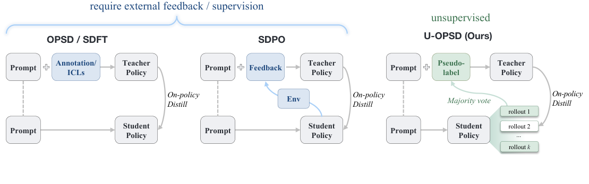
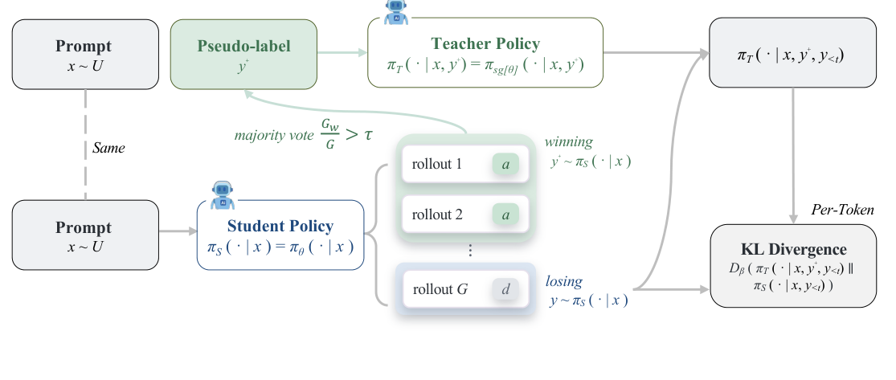

# U-OPSD（全称：On-Policy Self-Distillation without Any Supervision）

> **一句话本质**：U-OPSD 用模型自己投票形成的完整解题轨迹给教师增加上下文，再沿学生的反对轨迹做分布蒸馏。

> 作者/机构：Yijiang Li, Bingyang Wang, Yijun Liang, Yunjie Tian, Di Fu, Nuno Vasconcelos ｜ UC San Diego / Georgia Tech / UMD / ByteDance ｜ 原文：Zotero 锚点（见下行）或 URL ｜ 入库：2026-08-19

> Zotero：[Li2026](zotero://select/items/@Li2026) `Li2026` ｜ [JD4RZABE](zotero://select/items/JD4RZABE) `JD4RZABE` ｜ [DOI](https://doi.org/10.48550/arXiv.2608.06296) `10.48550/arXiv.2608.06296`

## 五分钟重建

<div class="learning-guide" id="guide-2026-u-opsd">
  <p class="guide-problem">普通自蒸馏仍可能给教师提供真实解题轨迹。U-OPSD 用模型自己的多次作答形成共识，选一条完整共识轨迹作为教师的额外上下文。</p>
  <ol class="guide-path" aria-label="机制路径">
    <li><h3>采样与投票</h3><p>同题生成 8 条轨迹，规范化最终答案后投票。共识置信度用获胜票数除以全部 8 条，包含无效轨迹。</p></li>
    <li><h3>门控并选参考</h3><p>置信度达到阈值、且存在不同答案的轨迹时才训练。y+ 是通向共识答案的一整条轨迹，不只是答案值。</p></li>
    <li><h3>在学生前缀上蒸馏</h3><p>教师看题目、完整 y+ 和 y⁻ 前缀；学生只看题目与同一个 y⁻ 前缀。逐 token 用 forward KL 对齐完整分布。</p></li>
  </ol>
  <p class="guide-example"><strong>具体例子（教学假设）</strong>：8 条中，5 条答案为 42、1 条为 17、2 条无效。共识置信度是 5/8，不是 5/6。教师多看的，是一条答案为 42 的完整推理；训练目标不是把一个“42”复制给学生。</p>
  <p class="guide-boundary"><strong>边界</strong>：高共识可能一致答错。论文所测伪标签错误率为 13.3%，这是监督噪声风险，不是最终准确率的数学硬上界。散度消融只说明该设置里 forward KL 更稳。</p>
  <div class="guide-case">
    <h3>换个条件看机制</h3>
    <p>如果 8 条有效回答全是同一个答案，这道题是否还提供反对轨迹供本方法训练？</p>
    <p class="guide-explanation">不提供。没有与共识不同的 y⁻，会跳过。共识只描述模型之间的一致性，不证明答案是真值。</p>
  </div>
  <aside class="guide-selftest"><h3>可选自测</h3><p class="guide-transfer">关掉提示后写出师生输入各包含什么，并解释为什么给学生也加入 y+ 会改变学习信号。</p></aside>
  <p class="guide-status">2026-10-04：讲解与练习待试用，本次未进行理解检验；此处不记录复测通过。</p>
</div>

## 论文图解



*图 1 费曼图解（论文 Figure 1）：左侧给教师真实解或示例，中间给环境反馈，右侧用模型自己的投票结果。比较的是额外信息从哪里来；无外部答案监督不等于没有预训练知识或没有输入题目。*



*图 2 费曼图解（论文 Figure 2）：学生先生成多条轨迹，投票选共识，并取一条完整获胜轨迹给教师。教师与学生在反对轨迹的相同前缀上预测下一 token，再对齐分布。答案值只用于分组，不代替完整参考轨迹。*

## 解决什么问题

LLM 后训练方法谱系，每往右一步去掉一类外部依赖：

```
SFT ──► OPD ──► OPSD ──► U-OPSD
要GT解+教师强制  要强教师   要GT解    啥都不要(GT解也不要)
```

- **SFT**：要标好的答案，且 teacher-forcing 导致训练-推理失配（train-inference mismatch）+ 灾难性遗忘（catastrophic forgetting）。
- **GRPO**：要 GT 答案做可验证奖励；奖励稀疏——一整条 rollout 一个 0/1 序列级 advantage，组内全对/全错梯度归零。
- **OPD**：要一个**外部更强教师**的逐 token 分布；依赖外部模型。
- **OPSD**：参数自共享（同模型当教师和学生），但教师比学生多看 **GT 解 y\***——让教师更强的信息**仍来自模型之外**。论文原话：这是"只在参数共享意义上的 self，信息仍外部"。

U-OPSD 把最后这层 GT 解也去掉，用模型自己投票出来的"伪解 y+"替代 y\*，是**首个完全无外部监督的 on-policy 自蒸馏**。痛点：GT 标注的成本与稀缺是 RLVR/OPSD 规模化的瓶颈；许多领域监督昂贵/不可靠/不可得。

## 大白话讲解

想象一个学生考前自学，但有"看过答案的自己"在旁边。OPSD 是：**你偷偷看了标准答案**，让"已看答案的你"在每个步骤上指导"没看答案的你"。U-OPSD 是：**没有标准答案**，你把同一题独立做 8 遍，8 次里 5 次都算出 42，那大概率 42 是对的；于是把"算出 42 的完整过程"当"看过答案的你"的参考，专门去纠正"算成别的数的那 3 次过程"里每一步的偏差。

关键：**只纠正答错的 rollout，不直接模仿答对的那条**（否则就成了 SFT teacher-forcing）。蒸馏沿答错 rollout 的前缀做，让"不知道答案的学生"在每个 token 上向"知道答案的教师"的下一 token 分布靠拢，纠正信号正好戳在"自信但错"的地方。

## 关键机制

对每道**无答案**题 x：

**① Sample（采样）**：冻结梯度策略 π̄（stop-gradient）独立采样 G=8 条 rollout，训练温度 1.1 + top-p 0.95 + top-k 20。

**② Vote（投票）**：从每条 rollout 抽 `\boxed{}` 答案并规范化，多数票赢的当伪答案 ã(x)。自一致性分数 `c(x) = 同意票数 / G`——**分母是 G 不是有效答案数**，截断的废 rollout 直接拉低 c(x)，天然惩罚"模型说不清"的题。

**③ Gate（门控，关键）**：两道筛子都不过的训练步直接跳过、不产生梯度：
- `c(x) < τ`（τ=0.5，绝对多数）→ 投票不可靠 → 不学。
- `Y⁻ = ∅`（所有有效 rollout 一致）→ 没有分歧可纠正 → 也不学。

这一步**自动挑训练样本**——只学"模型能形成稳定共识、但仍时不时跑偏"的题（能力边界 / competence frontier / 自发课程 self-curriculum）。太难的（投不出票）和太简单的（全对）自动跳过，不需人工排课程。

**④ Distill（蒸馏）**：

| | 输入上下文 | 看 y+（伪解） | 看 y⁻<t（错答前缀） |
|---|---|---|---|
| **教师** π̄ | `x + y+ + y⁻<t` | ✅ | ✅ |
| **学生** πθ | `x + y⁻<t` | ❌ | ✅ |

两者**共享** `x + y⁻<t`（错答前缀）；教师比学生**多出来**的是伪解 y+。如果学生也看了 y+，教师=学生，KL 散度恒 0，无学习信号——学习信号正是从"教师知道答案、学生不知道"这个差里长出来的。

逐 token 算前向 KL（forward KL，`KL(教师‖学生)`，β=0），全词表，逐 token 点裁剪（point-wise clipping）。教师/学生选哪条：消融最优 = **最长**同意 rollout 当 y+，**最长**反对 rollout 当 y⁻。

主目标（Eq 1/5）：

```
L_U-OPSD(θ) = E_x E_{y(g)~π̄}
  [ 1{Y⁻≠∅} · (1/|B⁻|) Σ_{y⁻∈B⁻} (1/|y⁻|) Σ_{n=1}^{|y⁻|}
    Dβ( π̄(·|x, y+, y⁻<n) ‖ πθ(·|x, y⁻<n) ) ]
```

蒸馏的正是"知道答案"这个信息增量对每步决策的影响——且只在模型实际会走偏的前缀上施加。

## 结果与代价

**Non-thinking 模式**：Qwen3-4B/8B 比基座 +8.5%/+10.7%，**无 GT 反而超过有 GT 的 OPSD**（+3.2%/+2.3%），也超过 SFT/GRPO。对比无标签 RL（TTRL/RENT/Intuitor）领先 7.0–11.3%——"共识当条件上下文做稠密蒸馏"远胜"共识当标量奖励做 RL"。

**Thinking 模式**：+2.2%/+1.9%，与 OPSD 打平/略胜。增益小因基座已强（74.9/76.1）headroom 小 + rollout 太长同 token 预算下完成投票少。

**Instruct 模型**：30B-A3B-Instruct 75.77→77.46，配方免调优迁移到 MoE 大模型。

**代价/局限**：
- **伪标签 13.3% 是错的**——监督噪声风险，可能强化多数错误；不是最终准确率的数学硬上界；未测故意污染投票的训练动态。
- 只在**可抽取、可规范化最终答案**的任务（竞赛数学）上验证；开放式生成需把精确匹配换软共识（如 embedding 相似度投票）。
- 增益**依赖基座能力**：太弱投票乱、太强没 headroom，中等偏强最典型。
- 缺 seed 重复误差棒。
- τ 默认 0.5 非最优——扫描里 τ=0.3 最好（58.59 vs 57.10，跨度 14.2%）。

**三个关键设计取舍（消融）**：
1. **教师必须看完整推理轨迹，不能只看 boxed 答案**——label-only 掉 10.3–15.8%，甚至低于基座（光知道"答案是 42"无法引导中间步骤）。
2. **必须 forward KL，不能 reverse KL / JSD**——reverse KL 训练崩了（生成长度 2.7k→99k 字符爆炸，boxed 率 99%→33%，丧失终止能力，无限重复短语直到预算耗尽）；JSD 掉 13.8% 回到基座。forward KL 有 mode-covering 倾向，reverse KL 有 mode-seeking 倾向；塌缩是本文实验结果，不是该散度必然的结局。
3. **必须全词表分布蒸馏，不能 sampled-token**——student-token-only 掉 13.7%；且该差距在伪标签下比 GT 下更大（AIME25 领先 17.8% vs 2.0%）。好消息：top-100 截断反而最好（59.01），实用降本。

## AI 预读备注

Zotero AI Butler 两份子笔记（task=summary/table，zhipu/glm-5.3 生成，2026-08-19）做预读底稿。

AI-Butler 摘要笔记 itemKey：`2ZRTZGPX`（task=summary），provider/model：zhipu/glm-5.3

glm-5.3 的复现级摘要笔记质量很高，已覆盖方法 pipeline 全八步、消融全表、failure case、伪代码与常见坑，与原文交叉核对一致。本文讲解在其基础上做了三点提炼：(a) 把"为什么只蒸馏 disagreeing rollout 而非模仿 agreeing"讲清（SFT teacher-forcing vs on-policy 条件蒸馏的本质区别）；(b) 梳理含 13.3% 错标签时仍有净收益的设计；这些设计不构成抗噪保证；(c) 明确"全词表蒸馏在伪标签下比 GT 下更重要"（noise 放大效应）。

## 我的复述

（费曼检验时原话保留）

> 训练 step：1. 学生模型 rollout G 条轨迹；2. 统计 G 条轨迹共识最大的那条占总轨迹数比例是否大于 τ，如果小于则扔掉，如果大于则留下，全对全错的情形则这条样本直接丢掉；3. 然后取共识轨迹作为 y+，与共识轨迹相反结论的一条轨迹为 y⁻，给教师 `x y+ y⁻<t`，给学生 `x y⁻<t`，然后逐 token 算前向 KL，共享的上下文为问题和 y⁻，教师多看了共识轨迹 y+，为什么变强的原因是对于已经训练充分的模型，很多问题是他大部分时间能答对偶尔打不对，通过 U-OPSD 让他强化这类的信息从而提升模型的能力。

## 卡壳点与解答

**Q：Q1 上下文谁看 y+/y⁻，最初答反了"学生看到 y+"。**
A：纠正后——教师 `x + y+ + y⁻<t`（看 y+），学生 `x + y⁻<t`（**不看 y+**）。两者共享 `x + y⁻<t`，教师多出的只有 y+。学生若也看 y+，则教师=学生 KL 恒 0 无信号；学习信号正是从"教师知答案、学生不知"的差里长出来。后确认是手误打反（原意为学生见 y⁻）。

**Q：13.3% 的错标签为什么没把模型带偏？**
A：错共识仍会提供误导监督。论文抽查中，过门后的伪标签有 13.3% 错误；实验总体仍提升，说明这份噪声没有抵消该设置的全部收益。门控、自发课程和稠密分布信号是方法设计，但原文没有证明「正确梯度必然盖过错误梯度」或「噪声 token 必然被平均掉」。13.3% 也不是最终准确率的硬上界。稳定地多数答错仍是失败情形。

**Q：Q3"共识被用作上下文"不确定对不对。**
A：对，就是这一句话。TTRL/RENT/Intuitor 把多数投票/置信度当**标量奖励**（整条 rollout 一个数，稀疏，信息被压成 scalar）；U-OPSD 把共识当**教师的特权上下文**（y+ 拼进教师输入，每个 token 都有教师完整下一 token 分布，稠密）。同样 rollout 预算领先 7–11 个点的本质原因。

**Q：thinking 模式为什么增益小？**
A：三层原因（原文均给出）：① 基座已强（74.9/76.1）headroom 小；② thinking rollout 太长，同 token 预算下完成投票少；③ 长 rollout 截断多，截断是无效 rollout 拉低 c(x)（分母是 G 不是有效数）。

**Q：为什么必须前向 KL，反向 KL 会崩？（散度方向的直觉）**
A：先区分公式方向。forward KL 是 `KL(教师‖学生)`，按教师概率加权，学生漏掉教师有概率的项会付出代价；reverse KL 是 `KL(学生‖教师)`，按学生概率加权，学生把概率放在教师不支持的项上会付出代价。常说的 mode-covering 与 mode-seeking 是拟合受限时的倾向，不是每次必然覆盖全部峰或只留一座峰。若能精确匹配教师，两种 KL 都在分布相同时取零。

本文消融的事实：reverse KL 出现复读塌缩（长度 2.7k→99k 字符、boxed 率 99%→33%），JSD 掉 13.8 个点，forward KL 更稳。这个结果支持本设置采用 forward KL，不构成所有逐 token 蒸馏的普适定律。

> 2026-08-24 的历史复测提醒保留：反向 KL 按学生分布加权；本文实测失败是复读和丧失终止能力。2026-10-04 收紧了「必然单峰塌缩」的解释，未进行新的复测。

**Q：y+ 是单个 token 还是多个 token？`<t` 为什么只在 y⁻ 上不在 y+ 上？**
A：**y+ 是多个 token——一整条完整的解题轨迹，不是单个 token，也不是单个答案值。** 把符号对齐：

| 符号 | 是什么 | 几个 token | 有无 `<t` |
|---|---|---|---|
| y+ | 一条完整的**同意** rollout（整个解题过程，结尾 `\boxed{共识答案}`） | 多个（几百~上千） | 无——整条喂教师，不截断 |
| y⁻ | 一条完整的**反对** rollout（整个解题过程） | 多个（几百~上千） | 无——也是整条 |
| y⁻<t | y⁻ 的**前 t 个 token**（前缀） | t 个，逐步增长 | 有——随 t 推进前缀变长 |

`<t` 是"截到第 t 个位置为止"的意思，只在 y⁻ 上出现、不在 y+ 上出现，因为**蒸馏是沿 y⁻（答错那条）逐 token 往前走的**——t 从 1 走到 y⁻ 全长，前缀一格格变长；而 y+ 这条"参考答案"是整条一起拼进教师输入当背景知识，不需截断。

一个 token 位置 t 的画面：
```
教师输入: [题目 x] + [完整参考解 y+ ........boxed] + [y⁻ 的前 t 个 token ...]
学生输入: [题目 x] +                                    [y⁻ 的前 t 个 token ...]
                      ↑                                       ↑
                 教师多看这一整条                          两者共享的前缀
                  (完整,不截断)                          (随 t 一格格变长)
```
y+ 是"心里有数的完整答案"，y⁻<t 是"学生正在解题、走到第 t 步"的状态模拟。t 每加 1，在新位置算一次教师/学生下一 token 分布的 KL，产生一个梯度，沿 y⁻ 走完全长累计成总损失。

[这里最容易卡住] 别把 y+ 误当成共识答案值 ã(x) 本身（即 `\boxed{42}` 这个单值）。**ã(x) 是单值，用来投票和分组；y+ 是通向 ã(x) 的整条推理轨迹，用来喂教师当上下文。** 这正是消融"label-only（只给教师看 boxed 答案）掉 10.3–15.8%"的来由——只给一个答案值没用，教师不知道"怎么走到这个答案"，没法在每个 token 上给出"已知这条路的我现在该怎么走"的指引。y+ 必须是完整轨迹。

## 还没搞懂

_无_——检验题全部补齐，无残留漏洞。

## 关联

- [S²VOPD](2026-s2vopd.md) — 兑现本文预留的 on-policy distillation 钩子（视觉域）。同作者线（Yijiang Li 一作 + Vasconcelos 组）的域互补：本文教师多看"伪解 y+"（文本特权上下文），S²VOPD 教师多看"清晰像素"（把学生的输入图退化来构造不对称，方向倒转：不减教师加的信息，而减学生的信息）。**散度冲突注记（重要）**：本文实验中 forward KL 更稳（reverse 复读塌缩、JSD 掉 13.8），S²VOPD 却是 JSD 最好 > reverse KL > forward KL 最差，排序完全颠倒——一种统一解释（待验证）是"教师多出的信息可否恢复"：本文的解题思路学生原则上能自己推出来（可恢复→全面模仿对），S²VOPD 的清晰像素永远拿不回来（不可恢复→模仿不可及细节有害）。两组结果不能推出普适散度规则；是否由信息类型解释仍待验证。
- [Open-MOPD](2026-open-mopd.md) — 兑现本文预留的 on-policy distillation 钩子。OPD 家族两个**正交切片**：本文管"单教师的信号从哪来"（无 GT 自蒸馏），Open-MOPD 管"多教师信号之间怎么分账"（token 数量/reward 幅度/新鲜度三层预算失衡，35.6%→83.4% 回收率）。组合设想（待验证）：多个自蒸馏伪教师 + Open-MOPD 三机制；本库没有联合实验。散度注记：本文前向 KL 直接当 loss（本文 reverse KL 实验出现复读塌缩）；Open-MOPD 的 reverse-KL 式 dense reward 是 PPO 的 reward 信号（sg 停梯度 + PPO 裁剪目标）而非直接损失——同方向不同框架，不矛盾。

未来入库钩子：若 ingest on-policy distillation（DistiLLM 系列）、self-consistency（Wang et al. 2023）、推理路由/预算控制（Thinkless、BudgetThinker）相关论文，应回链本页——U-OPSD 把无监督蒸馏三条线交汇成一个方法。
