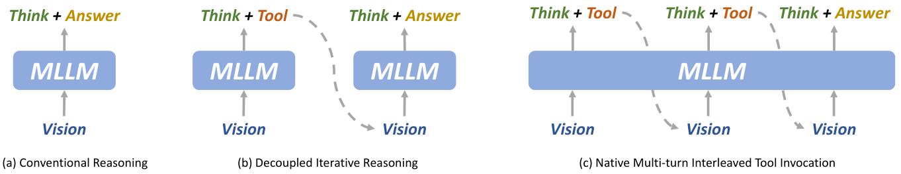
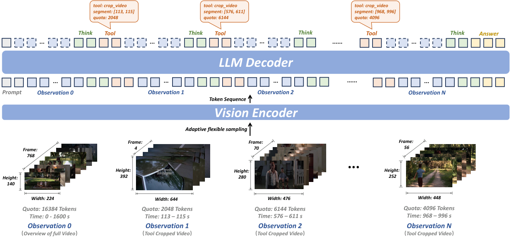
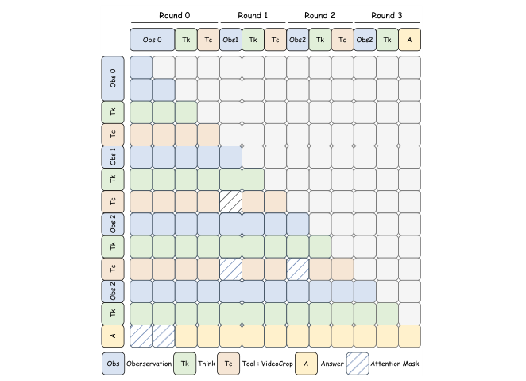

# Video-o3（全称：Video-o3: Native Interleaved Clue Seeking for Long Video Multi-Hop Reasoning）

> **一句话本质**：Video-o3 拿到问题后，在同一上下文里交替推理与裁剪视频，让新找到的证据继续参与回答。

> 作者/机构：南京大学 + 上海 AI Lab（Zeng, Zhang et al.）｜ 年份：2026（ICML 2026）｜ 原文：Zotero 锚点（见下行） ｜ 入库：2026-08-17

> Zotero：[citekey](zotero://select/items/@zengVideoo3NativeInterleaved2026) `zengVideoo3NativeInterleaved2026` ｜ [itemKey](zotero://select/items/FG746LWN) `FG746LWN` ｜ [DOI](https://doi.org/10.48550/ARXIV.2601.23224) `10.48550/ARXIV.2601.23224`

## 五分钟重建

  
长视频中的关键证据可能只出现几秒。均匀抽帧会漏掉它，把找线索与回答拆成两套流程又会丢上下文。Video-o3 把工具调用、证据与推理写在同一个上下文里。

  <ol class="guide-path" aria-label="机制路径">
    <li><h3>先看全局概览</h3>
拿到问题后读低分辨率全局视频，判断缺少什么证据。
</li>
    <li><h3>按需调用 VideoCrop</h3>
生成时间范围与视觉预算，裁剪结果加入当前上下文。模型再决定继续找还是回答。
</li>
    <li><h3>训练分工与效率</h3>
SFT 对 10% 工具数据施加 TDAM；RL 用答案奖励、线索得分与轮数衰减约束轨迹。
</li>
  </ol>
  
<strong>具体例子（教学假设）</strong>：问“谁先拿起钥匙”。概览只看到两人走动，模型可请求查看桌边那几秒，再结合新证据回答。若裁剪仍没显示关键动作，可以继续调用，但受轮数与上下文预算限制。

  
<strong>边界</strong>：TDAM 是训练期分工：工具规划阶段遮局部裁剪，回答阶段遮全局。它只用于部分数据，不是要求推理时永远禁看全局。找到线索也不保证推理正确。

  

    <h3>先预测，再展开答案</h3>
    
删除轮数衰减，是否只会得到更好的答案？

    

查看机制解释

论文消融中工具调用更多，准确率反而下降。更多探索会增加成本，也可能使上下文碎片化。这个观察不表示每个问题都应只调用一次。

    
关掉提示后解释：共享上下文为什么既能帮助联合证据，也会产生注意力分散和 Fake Thinking？

  

  
2026-10-04：讲解与练习待试用，本次未进行理解检验；此处不记录复测通过。

## 论文图解

*图 2 费曼图解（论文 Figure 2）：左侧直接从初始视频答；中间把找线索与回答拆开；右侧把思考、调工具和回答放在同一条上下文中。本文采用右侧，让后续搜索能利用已有推理与证据。*

*图 3 费曼图解（论文 Figure 3）：下方的全局与局部视频被编码，上方的推理决定下一次时间范围和视觉预算。裁剪结果加入历史，再选择继续调用或作答。多轮搜索受工具轮数与上下文上限约束。*

*图 4 费曼图解（论文 Figure 4）：每行是当前 token，每列是可读取的历史信息。工具规划与回答阶段被分工：前者遮局部裁剪，后者遮全局概览。该掩码只用于部分 SFT 数据，不是所有推理步骤永久使用的规则。*

## 解决什么问题

长视频理解两个老毛病：

1. **均匀采样把稀疏关键证据淹没在冗余里**——关键 2 秒在 10 分钟视频里只占极少数帧。
2. **已有"找线索+答题"方案把两阶段割裂**——各自单独训练、上下文不共享、靠手工规则控制时机，没法做多线索联合推理。

三种旧范式各有死穴：

| 范式 | 代表 | 痛在哪 |
|------|------|--------|
| **常规推理** | Qwen2.5-VL | 关键证据被冗余稀释，稀疏线索找不到 |
| **解耦迭代推理** | VideoChat-R1.5、Video-RTS | 上下文不共享→多线索没法联合推理；手工规则僵硬 |
| **文本 CoT** | Video-R1 | 不会主动"放大看某段"，视觉输入一开始就固定了 |

## 大白话讲解

### 类比：侦探破案 vs 一次性看监控

- **常规推理**：把整栋楼监控一次性快进看完直接下结论——关键 2 秒可能完全错过。
- **解耦迭代**：派不同侦探分别看不同时段，各看各的不交流——没法把"3 楼的人后来去了 5 楼"串起来。
- **Video-o3**：一个侦探先快进扫全片标疑点 → 放大 3 楼某段确认人 → 再放大 5 楼确认行为 → 把多线索串起来下结论——全程同一个侦探、同一个记忆。

> 🔧 **最容易卡住的点①**："原生"（native）是什么意思？
> 工具调用不是外部脚本触发的，而是**模型自己生成的文本**——模型在推理过程中自己写出 `<grounding>{"temporal_segment": [97, 102], "sampling_strategy": "coarse"}</grounding>`，系统执行后把裁剪结果拼回对话。模型必须学会"何时调、调哪里、用多少分辨率、何时停"。

## 关键机制

### ① 整体架构：回合制循环

输入 = 工具说明 + 用户问题 + 全局低分辨率视频。模型进入循环：
1. **思考**（`<think>`）：分解问题、评估当前证据够不够。
2. 不够 → **调工具**（`<grounding>`）：指定时间区间 + 分辨率配额（coarse/medium/fine）。
3. 系统 `VideoCrop` 执行裁剪 → 局部高分辨率片段拼回上下文。
4. 回到步骤 1，或直接 `<answer>` 终止。

评估上限 8 轮，视觉上下文上限 32k token。

### ② Task-Decoupled Attention Masking（TDAM）：防注意力分散 + 防 Fake Thinking

共享上下文的问题：全局视频、局部裁剪、推理文本混在一起，注意力互相干扰。更严重的是 **Fake Thinking**——模型通过工具找到了正确证据，最终答案却和中间推理矛盾（"推理对了却答错了"），因为答题时被全局模糊印象带跑了。

TDAM 在 SFT 阶段加硬性掩码：
- **生成工具调用时**：禁止看局部裁剪片段 → 逼模型只靠全局视野做定位规划。
- **生成最终答案时**：禁止看全局视频 → 逼模型只靠工具获取的局部证据作答。

关键细节：只对 **10%** 的工具使用数据加掩码（90% 保持全可见），避免丧失全局+局部综合能力。消融显示掩码比例从 10% 提到 20%/30% 性能反降。

> 🔧 **最容易卡住的点②**：为什么只对 10% 加掩码？
> 全加掩码会让模型丧失"同时参考全局+局部"的能力——有些问题确实需要两者结合。10% 是"缓解注意力分散"和"保留综合推理"的平衡点。

### ③ Verifiable Trajectory-Guided Reward（VTGR）：RL 阶段控效率

$$R = r_a \cdot (1 + \beta) + r_f$$

- $r_a$：答案对错（0/1）。
- $r_f$：格式分。
- $\beta = (b_0 + w_g \cdot S_{clue}) \cdot \gamma$：轨迹引导乘子。
  - $S_{clue}$（Hybrid Clue Score）：裁剪区间和真实证据区间的 IoU/IoP/IoG 对齐度 → 奖励"找得准"。
  - $\gamma$（Turn Decay Factor）：轮数衰减 → 鼓励"找得快"，证据够了就停。

逻辑：答对只拿基础分；裁得准+轮数少则 $\beta$ 大放大奖励；答错 $\beta$ 不生效。用 GRPO 优化，加 over-turn masking（超轮数轨迹不产梯度）。

### ④ Seeker-173K 数据集

四阶段合成：线索定位 → 有效性验证 → 轨迹生成 → 逻辑一致性检查。分 free（自由探索，无轨迹标注）和 tg（轨迹引导，有参考轮数 $k_{ref}$）两类。

## 结果与代价

- **SOTA**：MLVU 72.1%（超 VideoZoomer 65.2），Video-Holmes 46.5%（7B 显著领先），LVBench 47.6%。
- **效率**：MLVU 推理 10.2s，比解耦方法 VideoChat-R1.5（18.9s）快 46%——共享上下文支持 KV Cache 增量计算，不用每轮重新编码。
- **消融**：Hybrid Clue Score 删了→工具调用率和准确率同时暴跌；Turn Decay 删了→调用率升但准确率降（过度探索碎片化上下文）；SFT 冷启动省了→RL 出现"dip-and-recover"。
- **代价/局限**：
  - 8 轮上限对极长电影/深度多跳可能不够。
  - 工具单一（只有 VideoCrop），扩展 OCR/音频需大量工程。
  - Fake Thinking 未根治（TDAM 只在 10% 数据上用）。
  - 盲目探索风险：微妙线索可能在错误区间反复调工具浪费预算。

## AI 预读备注

来自 Zotero AI Butler 子笔记，作为费曼 Phase 1 预读底稿，校验后与最终讲解**无重大差异**。AI 笔记更细处可回查原文：

- DeepRead 笔记（itemKey `7R3CXS5H`，task=deepread）：逐章导读（引言/相关工作/方法论/数据集/实验/结论），含 TDAM 公式逐条解释、VTGR 奖励公式拆解、消融逻辑链、失败案例定性分析。
- 摘要笔记（itemKey `MT7328F2`，task=summary）：方法动机+pipeline+公式+对比表+实验数据+培训建议。
- 表格笔记（itemKey `3BIVY2LN`，task=table）：结构化字段速查。

## 我的复述

> 费曼检验时的原话，保留原味不润色。

**Q1（原生 vs 解耦 + 两核心问题）**：

> 原生和解耦迭代推理的本质区别是原生的工具调用是由模型自己产生、触发的；共享上下文会带来信息过多、全局局部混杂等问题，video-o3 的办法是给部分（10%）的视频加上了片段mask，生成工具调用时禁止看到局部裁剪片段，让模型只靠全局视野做定位规划，生成最终答案时，禁止看全局视频，让模型只能通过工具获取的局部证据作答。

**Q2（TDAM + Fake Thinking）**：

> TDAM 在生成工具调用时对局部片段加了掩码，强制模型通过全局视频生成调用，生成答案阶段对全局视频加编码，强制模型通过片段证据生成答案；对 10% 的数据而不是全部加掩码是因为有些任务确实需要同时关注全局和局部信息才能解答；fake thinking 指的是模型的思考过程中实际上已经找到证据链了，但是回答的时候给出相反的结论，原因是共享上下文把全局推理、局部片段等各种信息都混杂在一起，把模型带偏了。

**Q3（VST vs Video-o3 对比）**：

> VST 用的方式是在处理片段的同时把关键信息通过文本记录下来，然后下一个片段来时把这些信息也作为上下文的一部分。推理时机分别放在哪里这一点我可能没有明白。两者结合可以获取额外局部文本证据和局部片段证据的收益，引入新问题是文本证据和局部片段证据相互排斥时后不知道采信哪个。

## 卡壳点与解答

**Q：共享上下文带来的两个核心问题分别是什么？各对应什么解法？**（Q1 漏掉的半问）
A：(1) **注意力分散**（全局/局部混杂 + Fake Thinking）→ TDAM（10% 掩码）。(2) **上下文效率**（每调一次工具 token 膨胀 + 不知何时停）→ VTGR（$S_{clue}$ 奖励裁得准 + $\gamma$ 惩罚轮数多）。两个问题两个解法是配对的。

**Q：VST 和 Video-o3 的推理时机分别放在哪里？**（Q3 漏掉的半问）
A：VST = **查询前**（播放期边看边想写笔记，查询到直接读笔记秒答）；Video-o3 = **查询后**（拿到问题后在单一上下文里多轮调工具找线索，每轮裁剪+推理交替）。一句话：**VST 是"先把笔记做好，问就秒答"；Video-o3 是"拿到问题才去翻监控放大看"。**

**Q：两者组合后除了证据冲突还会引入什么结构性问题？**（Q3 漏掉的半问）
A：VST 的"查询即答"和 Video-o3 的"多轮探索后才答"在**响应时机**上逻辑冲突——需要设计新的统一调度（何时秒答、何时探索），和 VideoChat3+VST 组合时的问题一样。

## 还没搞懂

（三道检验题都已补齐，无残留漏洞。若日后复测发现新问题，再回填此处并同步 `questions.md`。）

## 关联

- [VST](2026-vst.md) — **同属长视频推理但路线不同**。VST 是"推理前置"（播放期边看边想，FIFO 文本记忆），Video-o3 是"推理时主动检索"（动态裁剪视频，工具调用）。VST 解决实时性（0.56s），Video-o3 解决多跳精度（46.5% VideoHolmes）。组合设想（待验证）：VST 的文本记忆 + Video-o3 的工具裁剪；但"查询即答"vs"多轮探索"在响应时机上逻辑冲突，需统一调度。
- [GeoAnchor](2026-geoanchor.md) — **同打破"纯文本 CoT"的两条对立路线**：Video-o3 把中间推理外化成工具调用（可见可审计、工具可插拔），GeoAnchor 内化成连续潜变量（保几何保真度、教师烧进权重）。本文 Related Works 2.2 自己把"think with images"工具流与 latent reasoning 对立。路线对照（库内综合）：前者中间步骤可审计，后者直接表达连续量；未验证两者在同任务下的通用优劣。
- [VideoChat3](2026-videochat3.md) — **视觉策略互补**。VideoChat3 靠编码器压缩+状态机决定看多少像素，Video-o3 靠推理时工具调用决定看哪里。一个管感知效率，一个管检索精度。
- 同领域可对比：Video-R1（文本 CoT，视觉固定）、VideoChat-R1.5/Video-RTS（解耦迭代推理）、VideoZoomer、LOVE-R1。
- 待建概念页：`multi-hop reasoning` / `tool invocation` / `attention masking` / `GRPO` / `KV cache` / `test-time scaling`
