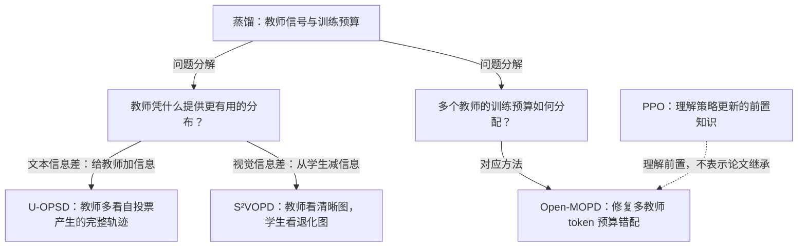

# 蒸馏与训练预算：教师凭什么能教，多个教师又该怎样分配训练预算？

> **一句话本质**：前两篇在自蒸馏里构造师生信息差（U-OPSD 给教师加一条自投票轨迹，S²VOPD 从学生减清晰像素），第三篇回答多个教师同时教时训练预算怎么分（Open-MOPD 证伪教师冲突、定位三层预算错配）。

> 主线论文：3 篇（U-OPSD、S²VOPD、Open-MOPD）｜ 跨专题引用：1 篇（PPO，理解 Open-MOPD 机制三的前置，主归属仍是强化学习与对齐）｜ 更新：2026-09-09

> 状态：本页由三篇已通过费曼复测的论文页整理而成；专题级的组织方式（阅读顺序、地图分叉）尚未做过独立复测，见 [review.md](../../review.md)。所有跨篇解释按证据状态就地标注，个人假说带「待验证」。

## 专题本质

三篇论文围绕 on-policy 蒸馏（OPD，在学生自己采样的轨迹上逐 token 对齐教师分布）分成两个子问题：前两篇在自蒸馏里构造师生信息差（U-OPSD 给教师拼进一条多数投票出的完整解题轨迹，S²VOPD 反过来把学生的输入图退化），第三篇回答多个教师同时教时训练预算怎么分。Open-MOPD 的教师是三个不同的域专家，教师与学生本就是不同模型，不需要靠额外输入制造差异；因此本页不把它当作「信息差来源」谱系的一员。

**自蒸馏里的信息差为什么必要**：U-OPSD 与 S²VOPD 的教师与学生共享参数，若两者上下文也完全相同，分布就一致、逐 token KL 为零、无学习信号（[U-OPSD 关键机制](../papers/2026-u-opsd.md#关键机制)：学生也看了 y+ 则教师=学生 KL 恒 0；[S²VOPD 解决什么问题](../papers/2026-s2vopd.md#解决什么问题)：教师比学生多知道点什么才有信息量）。这条命题只在这类「同模型、同条件」的自蒸馏设置里成立，本页不把它外推为整个 OPD 家族的普适必要条件：教师与学生是不同模型时，分布差异天然存在，但不自动等于蒸馏信号有用。

1. **教师的信息差从哪里来？**（自蒸馏设置）传统答案都要外部资源（更大的模型、GT 答案、GT 区域标注）。U-OPSD 用模型自己多数投票出来的完整解题轨迹给教师加信息；S²VOPD 反过来，把学生的输入图退化，从学生身上减信息。两篇是同一作者线在文本推理域与视觉感知域的两个答案。
2. **多个教师同时教，训练预算怎么分？** Open-MOPD 证伪了「教师冲突」这个流行嫌疑人，把掉分归因到 token 级优化预算在三个时间尺度上的系统性错配，并用三个正交机制修复。

范围说明：本专题不覆盖尚未入库的 OPD 基础工作（DistiLLM 系列、GKD）与 SFT / OPD / OPSD 三个谱系背景节点，它们只作为有来源说明的背景出现，不制造未入库论文的阅读卡。Open-MOPD 的教师是与学生不同的域专家，不属于「自蒸馏信息差来源」这一子问题，本专题只把它作为正交的「多教师预算」切片引用。

## 问题与方法地图

图稿依据三篇论文页的「解决什么问题」与「关联」节组织。连线「问题分解」是库内组织方式；「对应方法」连线来自各论文自述。PPO 到 Open-MOPD 的虚线只表示理解前置，不表示论文继承。

| 边 | 说明 | 证据状态 |
|---|---|---|
| 蒸馏 → 教师凭什么提供更有用的分布 | 自蒸馏子问题：师生共享参数时必须靠额外信息差制造学习信号，否则分布相同、KL 为零 | 库内对照（两篇自蒸馏论文各自陈述，本页归为一个子问题） |
| 蒸馏 → 多个教师的训练预算如何分配 | 多教师 OPD 的独立问题：即便每个教师都合格，合并训练仍会掉分 | 库内对照 |
| 信号来源 → U-OPSD | 教师上下文里多拼进一条多数投票出的完整解题轨迹 y+，学生只看题目与答错前缀 | 原文报告 |
| 信号来源 → S²VOPD | 教师看原图、学生看降采样加噪的退化图，不对称来自减少学生的信息 | 原文报告 |
| 预算分配 → Open-MOPD | 掉分主因是 token 份额、reward 幅度、reward 新鲜度三层预算错配，三个机制逐一修复 | 原文报告 |
| PPO ⇢ Open-MOPD | 机制三 reward refresh 建立在 PPO 的重要性比率与 clip 之上；不理解 clip 就看不出 75.8% 预算被冻结的含义 | 原文报告（Open-MOPD 关联节明确指出） |

## 关系记录

规范记录。导读页的关系表、静态图与搜索条目都是它的投影；论文页既有的关系卡在迁移时逐条核对到这里的关系 ID。

| 关系 ID | 起点 | 类型 | 终点 | 一句主张 | 证据状态 | 依据锚点 | 指纹 |
|---|---|---|---|---|---|---|---|
| rel-distill-asymmetry-source | 2026-u-opsd | compare | 2026-s2vopd | 同一作者线在两个域给出单教师信息差的两种构造：U-OPSD 给教师加信息（伪解轨迹拼进教师上下文），S²VOPD 从学生减信息（输入图退化）；两者共享「师生只差一份信息」的前提 | synthesis | notes/papers/2026-u-opsd.html#relations notes/papers/2026-s2vopd.html#relations | 331065dd |
| rel-distill-divergence-fact | 2026-u-opsd | tension | 2026-s2vopd | 散度消融排序颠倒是两篇各自报告的实验事实：U-OPSD 必须 forward KL（reverse KL 复读塌缩、JSD 掉 13.8），S²VOPD 则 JSD 最好、reverse KL 居中、forward KL 最差；两组实验条件不同，不能说一篇推翻另一篇 | reported | notes/papers/2026-u-opsd.html#qa-fwd-kl notes/papers/2026-s2vopd.html#qa-divergence | 7b1dc6e1 |
| rel-distill-recoverability | 2026-u-opsd | compare | 2026-s2vopd | 「教师多出的信息学生能否恢复」统一解释两篇散度分歧（可恢复则全面模仿方向正确，不可恢复则模仿不可及细节有害）；这是库内假说，不是任一原文结论 | hypothesis | notes/papers/2026-s2vopd.html#open | 741401a2 |
| rel-distill-orthogonal-slices | 2026-u-opsd | complement | 2026-open-mopd | 单教师信号从哪来与多教师预算怎么分账是正交切片：两页各自处理一个，机制上互不依赖 | synthesis | notes/papers/2026-u-opsd.html#relations notes/papers/2026-open-mopd.html#relations | 2d777e3b |
| rel-distill-combine-self-teachers | 2026-u-opsd | possible-combination | 2026-open-mopd | 组合设想（库内无实验）：多个自蒸馏伪教师 + Open-MOPD 三机制；两页关联节都说成立，但只论证机制正交，未验证自投票门控按题跳过训练步会不会改变各域 token 份额 | hypothesis | notes/papers/2026-u-opsd.html#relations notes/papers/2026-open-mopd.html#relations | 2d777e3b |
| rel-distill-divergence-slot | 2026-u-opsd | compare | 2026-open-mopd | 散度的角色不同：U-OPSD 的 forward KL 直接当损失（reverse 方向直接优化会塌缩），Open-MOPD 的 reverse-KL 式 dense reward 只是 PPO 的奖励信号（停梯度、走 clip 兜底）；同方向不同框架，不矛盾 | reported | notes/papers/2026-u-opsd.html#relations notes/papers/2026-open-mopd.html#relations | 2d777e3b |
| rel-distill-self-asymmetry-in-multi | 2026-s2vopd | possible-combination | 2026-open-mopd | 组合设想（库内无实验）：多教师框架里每个教师都可以用 S²VOPD 式自构造不对称（零特权） | hypothesis | notes/papers/2026-s2vopd.html#relations | 631ca39c |
| rel-distill-ppo-prerequisite | 2017-ppo | prerequisite | 2026-open-mopd | Open-MOPD 机制三（reward refresh）的底层载体是 PPO 的重要性比率与 clip：K 次复用同一批 rollout 时若沿用旧 reward，比率过冲触发 clip，75.8% 的 token 预算被冻结；刷新只是顺手用 PPO 本来就要算的当前学生 logprob | reported | notes/papers/2026-open-mopd.html#qa-reward-refresh notes/papers/2017-ppo.html#qa-on-policy-reuse | 98dace7f |

## 分叉与演进

**谱系背景（来自 U-OPSD 页「解决什么问题」，尚无独立页）**：SFT（要 GT 解且教师强制，训练-推理失配）→ OPD（要外部更强教师）→ OPSD（参数自共享，但教师仍多看 GT 解）→ U-OPSD（连 GT 解也不要）。S²VOPD 站在同一位置给出另一种去外部依赖的方式（减学生信息）。这是 U-OPSD 论文自述的谱系，不是本库核实的方法继承链。

每篇的「原先假设或瓶颈 → 本文改变 → 仍留下什么」：

- **U-OPSD**：瓶颈是 OPSD 的教师仍要多看 GT 解，信息仍来自模型之外 → 用模型自己多数投票出的完整解题轨迹当教师特权上下文，只在答错 rollout 上逐 token 前向 KL → 留下：伪标签 13.3% 出错构成性能硬上界；只在可抽取最终答案的竞赛数学上验证（[结果与代价](../papers/2026-u-opsd.md#结果与代价)）。
- **S²VOPD**：瓶颈是特权信号（更强模型、GT 答案、GT 区域）越来越难获得，特权方法还偏科 → 不对称不必给教师加信息，可以从学生减信息：学生看退化图、EMA 教师看原图 → 留下：增益依赖增强调参（gap 大小与 task-consistency 双准则）；OCR 等细粒度任务预期失效是本人推演、论文未验证（[结果与代价](../papers/2026-s2vopd.md#结果与代价)）。
- **Open-MOPD**：瓶颈是 naive 多教师合并只拿回 35.6% 的提升，掉分被归咎于教师冲突 → 三重检验证伪教师冲突，定位到 token 份额、reward 幅度、reward 新鲜度三层预算错配并逐一修复，回收率到 83.4% → 留下：仅 3B 规模、三个域、oracle 真实标签路由，路由有误的场景未验证（[结果与代价](../papers/2026-open-mopd.md#结果与代价)）。

**方法继承**：未核实三篇之间存在明确的借鉴、替换或扩展关系（U-OPSD 与 S²VOPD 是同作者线的域互补，不是一篇改进另一篇），因此图中不画继承箭头。

**首次公开时间（出处：arXiv 编号即首次提交年月）**：PPO 2017-07（1707.06347）；U-OPSD 2026-08（2608.06296）；S²VOPD 2026-08（2608.14144）；Open-MOPD 2026-08（2608.19098）。三篇主线同月公开，入库先后（08-19 / 09-02 / 08-27）只是本库的阅读顺序，不是学术时间线。

## 关键维度比较

每格的依据在括号里，落到对应论文页的完整笔记段落。

| 比较维度 | U-OPSD | S²VOPD | Open-MOPD |
|---|---|---|---|
| 教师额外知道什么 | 多数投票得到的完整解题轨迹 y+；label-only 只给答案值掉 10.3~15.8（卡壳点 qa-y-plus） | 学生输入图的清晰版本；教师冻结在基座只掉 0.40，强完全来自那张图（结果与代价） | 三个域专家各自的能力；本文焦点不在单个教师强在哪，而在预算怎么分（解决什么问题） |
| 学生看到什么 | 题目 x 与错答前缀 y⁻<t，不见 y+（关键机制） | 退化图与问题，自己在坏图上 rollout 8 条（关键机制） | 学生在多域 prompt 上 rollout，各域响应长度差 25 倍（大白话讲解） |
| 监督形式 | 全词表逐 token forward KL，直接当损失（关键机制） | 逐 token 广义 JSD（α=0.5），top-k 截断后只更新学生（关键机制） | reverse-KL 式 dense reward 进 PPO 的奖励槽位，停梯度加 clip 兜底（关键机制） |
| 预算问题在哪 | 单教师，无分账问题；门控自动跳过太难与太简单的题（关键机制） | 单教师，无分账问题；增强强度呈倒 U 型（关键机制） | token 份额（batch 内）、reward 幅度（训练全程）、reward 新鲜度（rollout 周期内）三层（大白话讲解） |
| 最应记住的边界 | 伪标签 13.3% 出错是硬上界；仅竞赛数学（结果与代价） | 增强必须 task-consistent，大 gap 不等于好 gap；OCR 预期失效待验证（卡壳点 qa-crop） | 仅 3B、oracle 路由；反向预算规则会形成正反馈环直到崩溃（卡壳点 qa-feedback-loop） |

散度选择单独说明：三篇对散度的实验结论分别是 forward KL 必选（U-OPSD）、JSD 最好（S²VOPD）、reverse-KL 式 reward（Open-MOPD，角色是奖励不是损失）。这三个数据点来自不同设置，不能读出一条普适的散度选择定律；「信息可恢复性」的统一解释是待验证假说（见关系记录 rel-distill-recoverability）。

## 带着问题读论文

建议顺序：**U-OPSD → S²VOPD → Open-MOPD**，需要时先补 PPO。理由：前两篇构成「信息差从哪来」的一对对照，先读文本域最完整的无监督自蒸馏，再读视觉域的减信息变体，散度排序颠倒这个交叉点只有两篇连着读才看得清；第三篇切到「预算怎么分」，是另一个切片。这是学习路径，不是历史路线（三篇同月公开）。

- **U-OPSD**：为什么把共识当教师的上下文，比把共识当标量奖励（TTRL 一类）好 7~11 个点？为什么必须前向 KL？（[U-OPSD](../papers/2026-u-opsd.md)）
- **S²VOPD**：为什么「从学生减信息」也算不对称？训练看糊图、考试看好图为什么反而变强？散度排序为何与 U-OPSD 颠倒？（[S²VOPD](../papers/2026-s2vopd.md)）
- **Open-MOPD**：掉分为什么不是教师打架？预算错配的三个时间尺度分别是什么？reward refresh 为什么零开销？（[Open-MOPD](../papers/2026-open-mopd.md)）
- **PPO（跨专题前置）**：重要性比率与 clip 在同一批样本多轮复用时各扮演什么角色？读懂它才能理解 Open-MOPD 的「75.8% 被 clip 冻结」（[PPO](../papers/2017-ppo.md)）。

## 跨篇卡壳点

前三条复用论文页的历史问答（保留当时日期），第四条是本专题新提出的问题，标「待讨论」。

**Q：U-OPSD 与 S²VOPD 的散度消融为什么完全相反？（S²VOPD 页 2026-09-02 首验、09-07 复测收敛）**
A：先确认「相反」指什么：U-OPSD 必须 forward KL（reverse KL 复读崩溃、JSD 掉 13.8）；S²VOPD 是 JSD 最好 > reverse KL > forward KL 最差。实验事实到此为止，两组条件不同，不是一篇推翻另一篇。库内解释（待验证）：教师多出的信息学生能否恢复。U-OPSD 教师多的是解题思路，学生原则上自己能推出来，全面模仿（mode-covering 的 forward KL）方向正确；S²VOPD 教师多的是清晰像素，糊图里丢掉的细节拿不回来，forward KL 逼学生模仿接触不到的细粒度分布反而有害。量级佐证：U-OPSD 选错散度是灾难（13 点以上或崩溃），S²VOPD 选错只是小亏（1.3 点）。

**Q：y+ 是伪标签吗？（U-OPSD 页 2026-08-19 首验；S²VOPD 页 09-02 两连犯口误，09-07 复测收敛）**
A：不是。y+ 是拼进教师输入的一条完整解题轨迹（几百到上千 token），整条喂教师、不截断；共识答案 ã(x) 才是单值，只用来投票和分组。消融 label-only（只给教师 boxed 答案值）掉 10.3~15.8，因为只知道答案值无法在每个 token 上指引「怎么走到这个答案」。跨篇高频复发点：读 S²VOPD 对照表时最容易把「教师多看的东西」又说成标签。当前状态：09-07 复测首答即明确，不再是弱项。

**Q：reward refresh 为什么零开销，又为什么修不掉全部陈旧？（Open-MOPD 页 2026-09-07 复测二次深化）**
A：每个 token 的 dense reward 是教师 logprob 减学生 logprob。教师冻结，rollout 时一次算好缓存；学生当前 logprob 是 PPO 每次内更新算重要性比率本来就要 forward 出来的数，refresh 只是把这个已在显存里的数顺手填回奖励公式，不加教师 forward、不加学生 forward、不重新生成。修不掉的部分是轨迹本身仍由旧学生采样，换它要重新 rollout（生成占一步 46.5%，最贵），交给 PPO 的 ratio 与 clip 兜底。不刷新的代价：K=4 时 75.8% 的 token 被 clip 冻结。PPO 前置知识见 [PPO](../papers/2017-ppo.md#卡壳点与解答)。

**Q（待讨论，2026-09-09 本专题新提）：如果把多个 U-OPSD 式的自蒸馏伪教师放进 Open-MOPD 的多教师框架，预算错配会以什么形态出现？**
A：库内没有答案。两页关联节都说组合方案「成立」，但只论证了机制正交（教师从哪来 vs 预算怎么分），没有实验。可以确定的前提：Open-MOPD 的三层错配都以「各域响应长度、收敛速度、K 次复用」为条件，与教师是否自蒸馏无关；不确定的是自投票门控会按题跳过训练步，可能改变各域实际贡献的 token 份额。此问题已记入 questions.md，等有实验或新论文再讨论。

## 证据边界与来源

- **原文报告**：各篇的机制描述与数字（伪标签 13.3%、冻结教师只掉 0.40、回收率 35.6% → 83.4%、75.8% token 被 clip 冻结）均来自论文页「结果与代价」，可按上表括号回查。
- **库内对照**：把三篇分成「信息差来源」与「预算分配」两个子问题、正交切片可组合、建议阅读顺序，都是本库的组织方式，论文没有这样自述。
- **待验证假说**：「信息可恢复性决定散度选择」（S²VOPD 页「还没搞懂」已声明，待 DistiLLM 系列入库验证）；「OCR 等细粒度任务上 S²VOPD 预期失效」（本人推演）；「多个自蒸馏伪教师组合后的预算形态」（本页新提，待讨论）。理解检验通过的假说仍是假说。
- **成员与来源**：[U-OPSD](../papers/2026-u-opsd.md)（Zotero itemKey JD4RZABE，入库 2026-08-19）、[S²VOPD](../papers/2026-s2vopd.md)（AWVKHW9W，2026-09-02）、[Open-MOPD](../papers/2026-open-mopd.md)（S2DP7DZX，2026-08-27）；跨专题引用 [PPO](../papers/2017-ppo.md)（Z6L573AE，2026-09-09）。本页整理日期 2026-09-09。
