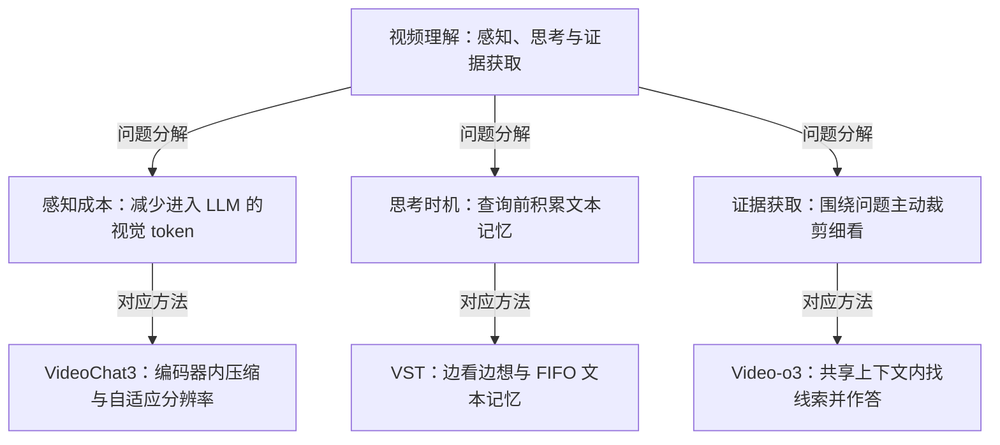

# 视频理解与响应：看多少、何时想、怎样找证据？

> **一句话本质**：长视频与流式视频的三个瓶颈被三篇论文分头处理：进入 LLM 的视觉 token 太多（感知成本）、深度推理与实时响应冲突（思考时机）、稀疏关键证据被均匀采样淹没（证据获取）；三条分支不是一个已验证的组合系统，也不代表三篇按顺序升级。

> 主线论文：3 篇（VideoChat3、VST、Video-o3）｜ 跨专题引用：1 篇（GenLIP，回答 VideoChat3 用的 ViT 怎么预训练，主归属仍是视觉编码器）｜ 更新：2026-09-09

> 状态：本页由三篇已通过费曼复测的论文页整理而成；专题级的组织方式（问题分解、阅读顺序）尚未做过独立复测，见 [review.md](../../review.md)。跨篇解释按证据状态就地标注。

## 专题本质

视频进入多模态大模型后有三笔账要算。第一笔是感知成本：帧率和分辨率一上去视觉 token 爆炸，LLM 注意力随序列长度二次方增长，长视频和实时流几乎跑不动（[VideoChat3 解决什么问题](../papers/2026-videochat3.md#解决什么问题)）。第二笔是思考时机：显式链式推理能提高多跳精度，但离线式「查询到达后再想」让延迟从 0.54s 涨到 8.8s，实时场景不可用（[VST 解决什么问题](../papers/2026-vst.md#解决什么问题)）。第三笔是证据获取：关键 2 秒藏在 10 分钟里，均匀采样把它淹没在冗余中，而「找线索」和「答题」割裂训练又做不了多线索联合推理（[Video-o3 解决什么问题](../papers/2026-video-o3.md#解决什么问题)）。

三篇分别只处理一笔账：VideoChat3 在视觉编码器里把 token 压掉 16 倍并用状态机自适应分辨率；VST 把推理挪到查询前的播放空档，写进 FIFO 文本记忆；Video-o3 拿到问题后在共享上下文里多轮裁剪放大找证据。它们对「何时响应」有各自的机制（状态 token、查询即答、多轮探索后收网），这也是组合时首先要调和的地方。

范围说明：本专题不覆盖视觉编码器本身怎么预训练（GenLIP、LaSt-ViT 属视觉编码器专题，只以跨专题引用出现），也不覆盖检测定位侧的 LocateAnything。

## 问题与方法地图

图稿依据三篇论文页组织，连线「对应方法」表示「这篇处理此问题」。三条分支并列，不表示先后。

| 边 | 说明 | 证据状态 |
|---|---|---|
| 视频理解 → 感知成本 | 视觉编码器开销近似线性、LLM 注意力二次方，压缩越早越划算 | 原文报告（VideoChat3 大白话讲解） |
| 视频理解 → 思考时机 | 显式推理与实时响应冲突：查询后推理延迟 8.8s，不推理 0.54s | 原文报告（VST 解决什么问题） |
| 视频理解 → 证据获取 | 稀疏证据被均匀采样淹没；找线索与答题割裂则多线索无法联合 | 原文报告（Video-o3 解决什么问题） |
| 感知成本 → VideoChat3 | I3D-ViT 在编码器里做 16× 时空压缩，状态 token 兼管响应时机与下一窗口像素预算 | 原文报告 |
| 思考时机 → VST | 推理挪到 clip 之间的空档，写入 FIFO 文本记忆，查询时直接读笔记（0.56s） | 原文报告 |
| 证据获取 → Video-o3 | 模型自己生成工具调用，多轮裁剪放大后在同一上下文里作答（上限 8 轮） | 原文报告 |

## 关系记录

规范记录。导读页的关系表、静态图与搜索条目都是它的投影；论文页既有的关系卡在迁移时逐条核对到这里的关系 ID。

| 关系 ID | 起点 | 类型 | 终点 | 一句主张 | 证据状态 | 依据锚点 | 指纹 |
|---|---|---|---|---|---|---|---|
| rel-video-perception-vs-timing | 2026-videochat3 | complement | 2026-vst | VideoChat3 管感知效率（编码器压 token、状态机自适应分辨率），VST 管认知时机（推理前置、文本记忆），思路正交可互补；VST 论文自述其文本记忆与视觉记忆机制正交 | reported | notes/papers/2026-videochat3.html#relations notes/papers/2026-vst.html#relations | 4e0e4225 |
| rel-video-timing-before-vs-after | 2026-vst | compare | 2026-video-o3 | 推理时机不同：VST 查询前边看边想、查询即答 0.56s；Video-o3 查询后多轮裁剪找线索、MLVU 推理 10.2s；一个解决实时性，一个解决多跳精度 | synthesis | notes/papers/2026-video-o3.html#qa-timing notes/papers/2026-vst.html#relations | 85af28c3 |
| rel-video-how-much-vs-where | 2026-videochat3 | complement | 2026-video-o3 | VideoChat3 靠编码器压缩与状态机决定看多少像素（感知效率），Video-o3 靠推理时工具调用决定看哪里（检索精度） | synthesis | notes/papers/2026-video-o3.html#relations | d0574842 |
| rel-video-combine-feasible | 2026-vst | possible-combination | 2026-video-o3 | 组合设想（库内无实验）：VST 文本记忆 + Video-o3 工具裁剪可互补实时性与多跳精度 | hypothesis | notes/papers/2026-video-o3.html#qa-combine notes/papers/2026-vst.html#relations | aaa025f0 |
| rel-video-combine-timing-conflict | 2026-vst | tension | 2026-video-o3 | 组合的结构性障碍（库内对照，依据两页关联节自述）：「查询即答」与「多轮探索后才答」在响应时机上逻辑冲突，需新的统一调度；VideoChat3 的状态 token 与 VST 组合时是同一个问题 | synthesis | notes/papers/2026-video-o3.html#qa-combine notes/papers/2026-vst.html#relations | aaa025f0 |
| rel-video-encoder-pretraining | 2026-genlip | complement | 2026-videochat3 | VideoChat3 的 I3D-ViT 把图像 ViT 撑成 3D 处理视频，但没讨论这个 ViT 怎么预训练；GenLIP 回答这一层，训出的 ViT 可被 inflate 成 3D 使用 | synthesis | notes/papers/2026-videochat3.html#relations | b8df1d10 |

## 分叉与演进

每篇的「原先假设或瓶颈 → 本文改变 → 仍留下什么」：

- **VideoChat3**：瓶颈是视觉 token 爆炸与稀疏抽帧丢信息，旧做法把每帧当独立图片喂进 LLM → 把时空冗余在视觉编码器里消化（I3D-ViT 16× 压缩），流式场景用状态机按需切换分辨率，状态 token 一身兼响应时机与像素预算两职 → 留下：短视频（256 帧）反而略慢，优势要视频够长才显现；224² 下小尺度证据可能看不见；论文未消融状态 token 合并与拆分（[结果与代价](../papers/2026-videochat3.md#结果与代价)）。
- **VST**：瓶颈是显式推理与实时响应冲突，且离线 CoT 数据带全局 hindsight 信息、直接训会学成作弊 → 推理时机从查询后挪到查询前，自造 100K 严格因果 CoT，流式注意力掩码让训练可见性照推理来 → 留下：FIFO 文本记忆有损（早期证据被淘汰）；思考烧额外后台 token；思考若慢于 clip 间隔只能回退到上一份记忆（[结果与代价](../papers/2026-vst.md#结果与代价)）。
- **Video-o3**：瓶颈是均匀采样淹没稀疏证据，找线索与答题两阶段割裂 → 工具调用由模型自己生成、与推理交替写在同一共享上下文里，TDAM 防注意力分散与 Fake Thinking，VTGR 控效率 → 留下：8 轮与 32k 视觉上下文上限；只有 VideoCrop 一个工具；Fake Thinking 未根治（[结果与代价](../papers/2026-video-o3.md#结果与代价)）。

**方法继承**：未核实三篇之间存在借鉴、替换或扩展关系，图中不画继承箭头；三条分支不是一个已验证的组合系统。

**首次公开时间（出处：arXiv 编号即首次提交年月）**：Video-o3 2026-01（2601.23224）；VST 2026-03（2603.12262）；GenLIP 2026-05（2605.00809）；VideoChat3 2026-07（2607.14935）。注意本页建议的学习顺序（VideoChat3 → VST → Video-o3）与公开顺序正好相反，学习顺序按「先重建成本直觉」排，不是时间线。

## 关键维度比较

每格的依据在括号里，落到对应论文页的完整笔记段落。

| 比较维度 | VideoChat3 | VST | Video-o3 |
|---|---|---|---|
| 本页重点 | 感知压缩与流式响应控制（大白话讲解） | 把思考分摊到播放期（大白话讲解） | 问题驱动的多轮证据获取（大白话讲解） |
| 关键保留或使用的信息 | 压缩后的视频 token 与每窗口一个状态 token（关键机制） | 最近 L 个视觉 token 的短期缓冲，加固定容量的 FIFO 文本记忆（关键机制） | 全局低分辨率视野、局部高分辨率裁剪与推理历史共享一个上下文（关键机制） |
| 推理发生在何时 | 每个时间窗口处理完即决定 Silence / Standby / Response（关键机制） | 查询前：每来一个 clip 就在空档里写想法，查询时直接读笔记（关键机制） | 查询后：思考、调工具、拼回结果循环，证据够了再收网（关键机制） |
| 训练期的掩码在管什么 | state-transition mask：切换点全保留、保持点均匀采样，防学成永远闭嘴或走捷径（关键机制） | 流式注意力掩码：视觉只看最近 L 个、文本全可见，既防泄露又防训练-推理漂移（卡壳点 qa-mask） | TDAM：调工具时禁看局部、答题时禁看全局，只对 10% 数据加，防注意力分散与 Fake Thinking（关键机制） |
| 最应记住的边界 | 感知压缩不等同于文本推理记忆；256 帧反而略慢（结果与代价） | 文本记忆有损；思考速度须适配流式节奏（卡壳点 qa-fifo） | 依赖视频裁剪工具；轮数与上下文有限（结果与代价） |
| 带着什么问题读 | 为什么压缩要尽早发生？（卡壳点 qa-where-compress） | 为何低查询延迟不等于没有思考成本？（大白话讲解） | 为何找到正确线索仍可能答错？（关键机制 Fake Thinking） |

## 带着问题读论文

建议顺序：**VideoChat3 → VST → Video-o3**。理由：先重建「视觉 token 进 LLM 有多贵」的成本直觉，再比较「思考放在查询前还是查询后」，最后理解「为什么要主动去找证据」。这是学习路径；VST 的在线因果约束（只能看到当前与过去）与 Video-o3 的视频裁剪访问条件（拿到问题后可以回看任意区间）必须对照着读，否则容易把两者的「延迟」数字直接比大小。

- **VideoChat3**：为什么压缩要放在视觉编码器里而不是让 LLM 长上下文兜底？状态 token 合二为一有什么隐患？（[VideoChat3](../papers/2026-videochat3.md)）
- **VST**：边看边想凭什么不增加延迟？离线 CoT 为什么不能直接训？流式掩码除了防泄露还解决什么？（[VST](../papers/2026-vst.md)）
- **Video-o3**：共享上下文带来的两个核心问题分别是什么？为什么只对 10% 数据加 TDAM？（[Video-o3](../papers/2026-video-o3.md)）
- **GenLIP（跨专题引用）**：VideoChat3 把图像 ViT 撑成 3D，那个 ViT 本身怎么训出来的？（[GenLIP](../papers/2026-genlip.md)）

## 跨篇卡壳点

前三条复用论文页的历史问答（保留当时日期），第四条是本专题新提出的问题，标「待讨论」。

**Q：VST 和 Video-o3 的推理时机分别放在哪里？（Video-o3 页 2026-08-17 首验漏答半问，09-07 复测首答焊死）**
A：VST 在查询前：播放期边看边想写笔记，查询到直接读笔记秒答（0.56s）。Video-o3 在查询后：拿到问题后在单一上下文里多轮调工具找线索，每轮裁剪与推理交替（MLVU 10.2s）。一句话：VST 是先把笔记做好、问就秒答；Video-o3 是拿到问题才去翻监控放大看。两个延迟数字的前提不同（VST 的思考成本被分摊到播放期），不能直接比大小。

**Q：VideoChat3 的 token 压缩和 VST 的文本记忆是同一件事吗？（VST 页 2026-08-17 首验 Q3）**
A：不是。VideoChat3 在视觉编码器里压 token、用状态机决定看多少像素，管的是感知效率；VST 用文本记录前序片段、把推理挪到查询前，管的是认知时机。用户当时的原话（[VST 我的复述](../papers/2026-vst.md#我的复述)）：「VST 用文本记录流式输入的前序所有片段+前序少数视频帧信息汇总合成回答，而 VideoChat 通过压缩视频帧的token数记更多上下文。两者可以同时进行。」组合后的真实问题是 VideoChat3 的状态 token 与 VST 的「查询即答」在响应时机上要统一调度，双轨记忆冲突时要决定信谁。

**Q：VST 与 Video-o3 组合后除了证据冲突还会引入什么结构性问题？（Video-o3 页 2026-08-17 首验漏答半问，09-07 复测通过）**
A：「查询即答」和「多轮探索后才答」在响应时机上逻辑冲突，需要新的统一调度决定何时秒答、何时探索；这和 VideoChat3 加 VST 组合时的问题是同一个。证据冲突（文本笔记与局部裁剪片段互相排斥时采信谁）是第二层问题。

**Q（待讨论，2026-09-09 本专题新提）：VST 的流式注意力掩码与 Video-o3 的 TDAM 都是训练期掩码，它们解决的是同一类问题吗？**
A：库内只能对照，不能下结论。两页各自的事实：VST 的掩码让训练可见性照推理来（视觉只看最近 L 个、文本全可见），同时堵住未来信息泄露与训练-推理分布漂移；TDAM 是分工掩码，调工具时禁看局部裁剪、答题时禁看全局视频，只对 10% 数据施加，防注意力分散与 Fake Thinking。可对照的差别是：前者把「能看到什么」钉在推理架构上，后者把「该看什么」钉在任务阶段上。是否能归纳成一条共同原理，等复测时讨论。

## 证据边界与来源

- **原文报告**：三篇的机制描述与数字（16× 压缩、2048 帧 20.4s vs 44.4s；StreamingBench 79.5%、QA 延迟 0.56s vs 8.8s；MLVU 72.1%、推理 10.2s、8 轮上限）均来自论文页「结果与代价」，可按上表括号回查。
- **库内对照**：把三篇分成感知成本、思考时机、证据获取三个子问题，以及建议阅读顺序，都是本库的组织方式；三篇论文之间的「互补」「取舍」判断来自各自关联节，Video-o3 与 VST 组合的时机冲突是两页共同指出的。
- **待验证 / 待讨论**：两种训练期掩码是否同一类问题（本页新提，待讨论）；VideoChat3 状态 token 合并与拆分的利弊（论文未消融，论文页卡壳点已标「论文未讨论」）。
- **成员与来源**：[VideoChat3](../papers/2026-videochat3.md)（Zotero itemKey E5RZINH5，入库 2026-07-27）、[VST](../papers/2026-vst.md)（6XPHGT5T，2026-08-17）、[Video-o3](../papers/2026-video-o3.md)（FG746LWN，2026-08-17）；跨专题引用 [GenLIP](../papers/2026-genlip.md)（EAKWJXT8，2026-08-17）。本页整理日期 2026-09-09。
